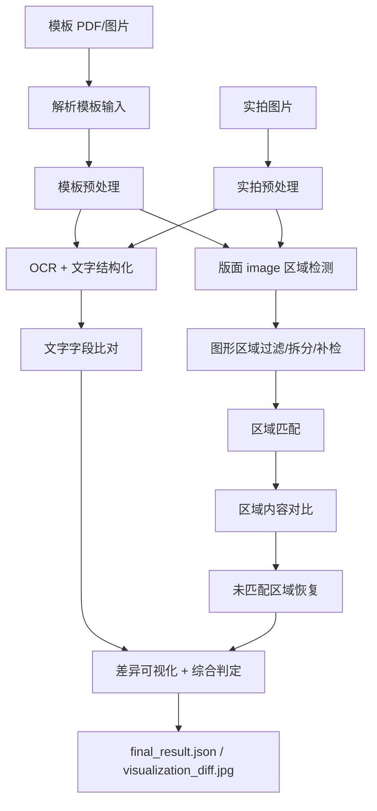

# 当前文字检查和图形检查流程

本文梳理当前代码中的实际检测流程，范围包括 CLI、桌面端和批量样例入口最终调用的统一流程。核心实现入口是 `label_detection.workflows.unified.run_unified_detection`。

更新时间：2026-04-26，当前实验分支 `experiment/graphic-diff-mask`。

## 1. 入口和调用链

当前项目有三个常用入口，最终都落到统一检测流程：

- 根 CLI：`main.py` -> `label_detection.workflows.unified.main()` -> `run_unified_detection(...)`
- 桌面端：`desktop_app.services.detection_service.DetectionService.run(...)` -> `run_unified_detection(...)`
- 批量样例：`scripts/batch_run_samples.py` -> `label_detection.batch_samples` -> `run_unified_detection(...)`

整体流程：



## 2. 预处理流程

### 2.1 模板输入解析

模板支持 PDF 和图片：

- PDF：通过 `label_detection.extraction.template_source.resolve_template_input` 调用 PDF 提取逻辑，把模板页中的标签区域渲染成图片。
- 图片：直接作为模板原图使用。

PDF 提取的优先级大致是：

1. 优先找包含 PDF 图片块的最小绘图容器。
2. 找不到时，回退到红色虚线框区域。
3. 仍找不到则返回失败。

### 2.2 模板图片预处理

模板图片会进入 `preprocess_template_image(...)`：

1. 用 OpenCV 读取模板图片。
2. 通过 `find_template_crop_rect(...)` 查找可靠裁剪区域。
3. 如果找到黑框/候选边界，就裁剪掉外部白边。
4. 如果找不到可靠裁剪区域，就使用原图。
5. debug 模式下保存 `template_preprocessed.jpg`。

### 2.3 实拍图片预处理

实拍图片走 `label_detection.preprocessing.pipeline.preprocess_target(...)`：

1. 如果有模板图，先尝试四角点透视矫正，一步完成矫正和裁剪。
2. 如果透视矫正失败，回退黑框检测。
3. 黑框检测失败，再回退边缘检测。
4. 如果所有边界检测都失败，使用原图。
5. 统一保存 `target_preprocessed.jpg`，后续 OCR 和图形检测都复用这张图。

## 3. 文字检查流程

### 3.1 OCR

模板和实拍图片分别调用 `label_detection.services.ocr_service.get_ocr_with_boxes(...)`：

- OCR 引擎是 PaddleOCR，全局懒加载。
- 返回两类数据：
  - 拼接后的纯文本。
  - OCR 框列表：`(poly, text, confidence)`。

OCR 文本用于字段抽取；OCR 框用于后续字段定位、标签名比对、文字差异可视化，以及图形流程中的条码/文字遮罩。

### 3.2 标签类型识别

通过 `label_detection.schema.infer_label_kind(...)` 判断标签结构：

- 如果 OCR 文本命中紧凑标签关键词不少于 2 个，例如 `CONNECTION PIPES`、`REFRIGERANT`、`N.W`、`G.W`、`COLOR`，则走紧凑标签模型。
- 否则走标准空调铭牌模型。

当前结构化字段：

- 标准标签 `air_conditioner_standard`：`brand`、`product_type`、`model_number`、`voltage`、`frequency`、`heating_capacity`、`cooling_capacity`、`air_volume`、`weight`、`noise`、`mfg_date`、`manufacturer`、`address`、`barcode`
- 紧凑标签 `compact_spec`：`model_number`、`net_weight`、`gross_weight`、`color`、`connection_pipes`、`refrigerant`、`barcode`

### 3.3 结构化字段抽取

结构化抽取由 `run_llm_extraction(...)` 负责，实际是“规则/OCR 锚点 + Ollama 图文模型”的组合。

紧凑标签：

1. 先用 `extract_compact_spec_from_text(...)` 从 OCR 文本中正则提取字段。
2. 如果规则结果字段足够，并且没有缺失/可疑字段，直接返回规则结果。
3. 如果字段缺失或可疑，再调用 Ollama 模型，输入包括原图和 OCR 文本。
4. 最后用 `merge_compact_sources(...)` 合并规则和模型结果，其中 `model_number`、`barcode` 这类锚点优先保留 OCR/规则结果。

标准标签：

1. 先用 `extract_standard_spec_from_text(...)` 从 OCR 文本中提取高置信锚点字段。
2. 再调用 Ollama 模型，输入包括原图和 OCR 文本，要求输出固定 JSON 字段。
3. 最后用 `merge_standard_sources(...)` 合并结果。
4. 对 `model_number`、`voltage`、`frequency`、`capacity`、`weight`、`noise`、`mfg_date`、`barcode` 等锚点字段，当前策略倾向保留 OCR 文本，避免模型把真实印刷缺陷自动纠正成“合理值”。

### 3.4 字段标签名检查

除了字段值，流程还会从 OCR 框中提取字段标签名：

- 实现位置：`label_detection.matching.ocr.extract_field_labels_from_ocr_boxes(...)`
- 例子：`Weight`、`Rated Frequency`、`Connection Pipes`、`Serial No.`
- 如果模板和实拍都识别出同一字段的标签名，会附加一个 `label:<field_name>` 字段参与比对。

这个机制用于发现“字段名本身印错”的情况，例如值一致但标签名大小写或拼写异常。

### 3.5 文字比对规则

文字字段最终用 `text_field_values_match(...)` 比对：

- 普通字段值会做 Unicode NFKC、大小写折叠、空白压缩、单位/标点周围空格归一化。
- 数字和单位之间的空格会被忽略，例如 `50 Hz` 和 `50Hz` 可视为一致。
- 小数点、连字符等有效标点仍保留，避免过度宽松。
- 字段标签名使用更保守的比对，大小写变化不会被完全忽略；同时支持少量合法别名，例如 `Date` 和 `Manufactured Date`。

如果是 debug 输出模式，文字比对会保存 `text_comparison.xlsx`；final 模式只写入最终 JSON，不保存 Excel。

### 3.6 文字差异定位

生成最终可视化时，文字差异会映射回实拍 OCR 框：

1. 字段标签名差异：直接使用前面记录的标签 OCR 框。
2. 字段值差异：用 `find_matching_ocr_boxes(...)` 在实拍 OCR 框中查找对应文本。
3. 找到框后，会先做局部差异证据检查，再在 `visualization_diff.jpg` 上用红色框标注。
4. 如果找不到对应 OCR 框，会尝试字段锚点补框和模板位置映射补框。

当前文字定位不是“有字段差异就画整行”，而是尽量定位到真实变化的位置：

- 重要字段会强制保留差异框：`model_number`、`voltage`、`frequency`、`heating_capacity`、`cooling_capacity`、`air_volume`、`weight`、`noise`、`mfg_date`、`barcode`。
- 非强制字段会经过局部差异过滤：当局部差异比例、模板/实拍未匹配前景比例、最大连通差异都很低时，不画框，避免 OCR 抖动造成误框。
- `air_volume` 这类紧凑数值字段会进一步收缩到局部变化连通块，避免把相邻字段也框进去。
- 重复文字框会按覆盖比例去重；当前阈值偏保守，避免同一位置被 OCR 框、字段锚点和视觉补框重复标注。

### 3.7 字段锚点和对齐视觉补框

针对合成数据或已经大致对齐的图片，当前增加了字段级视觉补框，而不是全图直接像素差分：

1. 只有模板图和目标图尺寸接近时才启用，环境变量 `ENABLE_ALIGNED_TEXT_VISUAL_SCAN=0` 可关闭。
2. 扫描字段限定在重要值字段和 `address`，并跳过 `barcode`。
3. 如果结构化结果或 OCR 归一化把真实变化吞掉，会回到模板 OCR 框位置，把模板框映射到实拍图上，再检查局部视觉差异。
4. 普通字段需要同时满足较强证据：`diff_ratio >= 0.10`、`largest_component_ratio >= 0.04`、`max_unmatched_ratio >= 0.08`。
5. `address` 因为 OCR/LLM 容易把长文本纠正成相同内容，会额外用原始灰度差异兜底；当前阈值是 `raw_diff_ratio >= 0.08`。

这一步的定位目标是“找不同”的框位置，不用于替代文字语义比对。它只在高置信局部证据下补框，避免实拍轻微错位、抗锯齿或压缩噪声导致大量误框。

## 4. 图形检查流程

### 4.1 版面区域检测

图形区域检测基于 PP-DocLayoutV3：

1. 模板预处理图和实拍预处理图分别调用 `detect_layout_regions(...)`。
2. 检测结果包含 `label`、`score`、`coordinate`。
3. 当前只取 `label == "image"` 的区域参与图形比对。

默认检测阈值来自 `LAYOUT_DETECTION_THRESHOLD=0.3`。

### 4.2 条码区域跳过

`image` 区域进入比对前，会先调用 `split_barcode_regions(...)`：

- 结合 OCR 重叠文本、长数字串、区域宽高比、位置、竖向条纹纹理等特征判断条码。
- 判定为条码的区域会被跳过，不进入图形比对。
- 原因是条码数字已经作为文字字段 `barcode` 比对，条码条纹本身不作为图形差异依据。

如果一个大区域里同时包含普通图形和条码，当前会尝试拆出非条码子区域继续比对，并把条码子区域跳过。

最新处理细节：

- `split_barcode_regions(...)` 会把 OCR 框传给混合条码拆分逻辑。
- 如果区域里既有条码数字 OCR，又有条码旁边的图标，会用数字 OCR 的局部位置估算条码子区域，只跳过条码部分。
- 条码左侧或右侧仍有足够前景的区域会保留下来作为普通图形比对，避免“条码过滤把相邻新增图形一起吞掉”。
- 这个逻辑主要修复条码旁新增图标的漏框问题，例如合成样本中 `sample_0085` 这类情况。

### 4.3 复合图形区域拆分

默认启用 `ENABLE_IMAGE_REGION_SPLIT=1`。启用时，流程会进一步处理 PP-DocLayoutV3 合并出来的大 `image` 区域：

1. `split_composite_image_regions(...)` 用二值化、形态学闭运算和轮廓提取，把一排合并图标拆成多个子图形。
2. `merge_fragmented_split_regions(...)` 合并同一个父区域下被切碎的上下片段。
3. `filter_split_image_regions(...)` 过滤条码簇、小碎片、过薄横条等不稳定子框。
4. `recover_uncovered_graphic_regions(...)` 在遮掉 OCR 文本、已检测图形和已跳过条码后，扫描剩余深色连通区域，保守补检漏掉的孤立图形。

当前拆分策略比早期更保守：

- 小的单图形区域不再二次拆分，避免把一个完整图标切成多个误框。
- 二值形态学去噪核使用较小的 `(2, 2)`，避免把细线图标抹掉。
- 未覆盖补检的前景比例阈值降到 `0.012`，用于补回真实但较细的符号。
- 补检仍会遮掉可靠 OCR 文本、已有图形、已跳过条码，并排除长横线、边界、过细噪声和与已有区域高度重叠的候选框。

### 4.4 区域匹配

模板图形区域和实拍图形区域用 `match_regions(...)` 做全局匹配：

- 使用匈牙利算法。
- 匹配代价由四个归一化因子加权组成：
  - 中心点距离：`MATCH_WEIGHT_CENTER=0.35`
  - 面积差异：`MATCH_WEIGHT_AREA=0.25`
  - 宽高比差异：`MATCH_WEIGHT_ASPECT=0.20`
  - IoU 差异：`MATCH_WEIGHT_IOU=0.20`
- 默认代价阈值 `MATCH_COST_THRESHOLD=0.6`，超过阈值的配对会丢弃。

输出三类结果：

- `matched_pairs`：成功匹配的区域对。
- `unmatched1`：模板未匹配区域。
- `unmatched2`：实拍未匹配区域。

### 4.5 匹配区域内容对比

每个匹配区域调用 `compare_region_pair(...)`。

当前默认 `USE_VLM_FOR_GRAPHIC=True`，所以优先走 VLM 图形判断：

1. 从模板和实拍图中裁剪区域。
2. 对每个裁剪图做前景检测、去空白、居中缩放到 `VLM_CANVAS_SIZE=512`。
3. 生成左右拼接画布：左侧模板，右侧实拍。
4. 调用 Ollama 图文模型，要求输出固定 JSON：
   - `decision`: `match` / `mismatch` / `unknown`
   - `confidence`
   - `differences`
   - `summary`
5. 如果模型返回 `barcode_ignored`，直接视为图形匹配。

同时流程还会计算传统图形分数，用于融合判断：

- 对实拍 crop 做 SIFT/ORB 对齐。
- 提取主要轮廓。
- 计算 Hu 矩相似度、凸包相似度、二值 SSIM。
- 综合分数：`shape_score = Hu * 0.5 + hull * 0.3 + SSIM * 0.2`。
- 同时记录两侧前景比例：`foreground_ratio1`、`foreground_ratio2`。

VLM 与传统方法的融合规则：

- 如果 VLM 判 `mismatch`，并且一侧几乎空白、另一侧有明显前景，则保留 `mismatch`，判定来源为 `foreground_presence`。
- `shape_score >= 0.8`：传统方法高置信一致，直接覆盖为 `match`。
- `shape_score <= 0.2` 且 VLM 未判 `match`：覆盖为 `mismatch`。
- `shape_score <= 0.2` 但 VLM 判 `match`：标记冲突，进入 `unknown`/复核。
- VLM 判 `mismatch` 但 `shape_score >= 0.6`：标记冲突，进入复核。
- 其他情况以 VLM 判断为主。

前景存在判定的触发条件是：`min(foreground_ratio1, foreground_ratio2) < 0.08` 且 `max(foreground_ratio1, foreground_ratio2) >= 0.12`。它用于处理“模板为空白、实拍多出图形”或反向缺失的情况，避免传统形状分数把空白和图形错误覆盖成一致。

如果 VLM 模块不可用、请求失败或导入失败，流程会回退到纯传统方法：

- `shape_score >= 0.7`：`match`
- `shape_score <= 0.3`：`mismatch`
- 中间区间：`unknown`，需要人工复核

### 4.6 未匹配区域恢复

如果存在模板或实拍未匹配图形，流程会进入 `_recover_unmatched_regions(...)`：

1. 对实拍未匹配区域，尝试在模板侧推理对应区域。
2. 对模板未匹配区域，尝试在实拍侧推理对应区域。
3. 推理基于归一化坐标；如果已有匹配对，则用匹配对的中位偏移和宽高缩放辅助校正。
4. 如果推理区域前景比例低于 `0.01`，直接判为实拍多出图形或实拍缺失图形。
5. 如果推理区域有效，则再次调用 `compare_region_pair(...)` 做内容对比。
6. 如果无法推理或比较失败，则输出 `unknown`，需要人工复核。

恢复成功的匹配会计入 `recovered_match_count` 和 `resolved_match_count`。

恢复区域进入可视化前仍会做局部图形差异过滤：如果推理框内模板和实拍都没有实际差异，框会被过滤，不作为最终差异框。这一点对合成数据很关键，因为有些 SVG 标注虽然存在于 manifest，但实际渲染区域为空白。

### 4.7 图形结果判定

图形流程最终统计：

- 直接匹配数。
- 恢复补配数。
- 剩余未匹配模板/实拍区域。
- `match` / `mismatch` / `unknown` 数量。

图形整体通过条件大致是：

- 恢复后的模板/实拍有效图形数量一致。
- 不存在剩余未匹配区域。
- 不存在确认的 `mismatch`。

如果存在 `unknown`，不会直接判图形差异，但会进入“需人工复核”的综合判定。

## 5. 最终输出

每次统一检测至少输出：

- `final_result.json`：完整结构化结果。
- `visualization_diff.jpg`：实拍图上的差异标注。

debug 模式还会保留：

- `debug/preprocess/`：预处理图片。
- `debug/template_assets/`：PDF 提取模板资源。
- `debug/text_comparison.xlsx`：文字字段比对表。
- `debug/graphic_comparison/`：图形区域 crop、VLM canvas、区域检测可视化等。

final 模式会把中间过程放到临时目录，只保留最终结果和差异可视化。

批量样例流程会进一步收敛输出，只保留每个 case 的：

- `result.json`
- `visualization_diff.jpg`
- 顶层 `summary.json`

## 6. 综合判定逻辑

综合判定由 `build_final_verdict(...)` 生成，输入包括：

- 文字匹配字段数和总字段数。
- 图形是否整体通过。
- 图形确认不匹配数量。
- 图形待复核数量。
- 图形未恢复数量。

典型结果：

- 文字全一致、图形通过、无复核：`标签完全一致`
- 文字全一致、图形通过、有复核：`标签基本一致，N 处图形需人工复核`
- 文字有差异、图形通过：提示文字差异数量
- 文字一致、图形不通过：提示图形不匹配或未恢复
- 文字和图形都有问题：`标签差异较大`

## 7. 关键配置和外部依赖

主要配置来自 `label_detection.core.config`：

- `OLLAMA_API_BASE`：默认 `http://localhost:11434`
- `OLLAMA_MODEL` / `TEXT_LLM_MODEL` / `GRAPHIC_VLM_MODEL`：默认 `qwen3.5:9b`
- `OCR_DEVICE` / `LAYOUT_DEVICE`：默认继承 `PADDLE_DEVICE=gpu:0`
- `LAYOUT_DETECTION_THRESHOLD`：默认 `0.3`
- `MATCH_COST_THRESHOLD`：默认 `0.6`
- `ENABLE_IMAGE_REGION_SPLIT`：默认开启
- `ENABLE_ALIGNED_TEXT_VISUAL_SCAN`：默认开启，仅在模板/目标尺寸接近时做字段级视觉补框
- `ENABLE_TEXT_LOCAL_DIFF_FILTER`：默认开启，用于过滤局部无视觉证据的文字框
- `VLM_CANVAS_SIZE`：默认 `512`
- `VLM_MAX_RETRIES`：默认 `2`
- `LLM_MAX_RETRIES`：默认 `3`

外部能力依赖：

- PaddleOCR：文字识别和 OCR 框。
- PP-DocLayoutV3：版面 `image` 区域检测。
- Ollama 图文模型：文字结构化补充和图形语义判断。

如果 Ollama/VLM 不可用，文字抽取可能只能依赖规则或空结果；图形对比会尽量回退传统 OpenCV 方法。

## 8. 当前合成数据评测结论

本轮用 `/home/data/数据集/outputs/datasets/label_aug_mixed_20260406_200` 继续验证，保留的主要结果目录如下：

- `results/synthetic_dataset_eval_0021_0050_design_v5`
- `results/synthetic_dataset_eval_0051_0080_design_v3`
- `results/synthetic_dataset_eval_0081_0110_design_v2`
- `results/synthetic_dataset_eval_0111_0140_design_probe`
- `results/synthetic_dataset_eval_regression_guard_v2`

当前结果：

- `0021-0050`：`28/30`，剩余失败为不可见/空白 SVG GT。
- `0051-0080`：`29/30`，剩余失败同样倾向数据 GT 问题。
- `0081-0110`：`28/30`，`expected=50`、`predicted=48`、`matched=48`、`missing=2`、`extra=0`。
- `0111-0140`：`28/30`，`expected=46`、`predicted=44`、`matched=44`、`missing=2`、`extra=0`。
- 回归 guard：`9/9`，`expected=16`、`predicted=16`、`matched=16`、`missing=0`、`extra=0`。

已核查的空白 GT 样本包括：

- `sample_0086` / `shape_0721.svg`
- `sample_0087` / `shape_0718.svg`
- `sample_0123` / `shape_0720.svg`
- `sample_0131` / `shape_0731.svg`

这些样本在 manifest 中标记了图形差异，但映射到图片后的 GT 区域满足：

```text
template_fg=0.0
target_fg=0.0
absdiff>12=0.0
```

因此当前原则是：检测端不为了追空白 GT 强行画框；数据集生成或评测端应该过滤不可见 SVG、空白渲染、或实际无前景差异的图形 GT。

## 9. 当前设计判断

对于这批合成数据，模板和目标基本像素对齐，直接做局部视觉差异确实有效，但不能做成全图裸差分。更稳的策略是：

- 文字差异先走结构化/OCR 语义比对。
- 框位置优先用 OCR 框、字段锚点、模板位置映射。
- 只有在尺寸接近、字段明确、局部差异证据足够时，才启用对齐视觉补框。
- 图形差异仍以 layout image 区域、复合拆分、条码过滤、VLM/传统融合为主。
- 对新增/缺失图形，前景存在比纯形状分数更可靠。
- 对真实拍照图，不能依赖全局像素差；应先做透视矫正/版面匹配，再把视觉差分限制在小区域内。

当前评价标准应按“找不同”理解：

- 该框的位置必须框出。
- 不该框的位置不能多框。
- 多框和少框都算错。
- 如果 GT 对应区域实际不可见，应先从评测集中剔除或标记为无效 GT。

## 10. 后续讨论点

后续如果要优化流程，可以围绕这些点继续拆：

- 数据侧：生成数据时过滤空白 SVG、透明 SVG、实际无前景差异的图形 GT。
- 评测侧：把“内容是否识别出差异”和“框位置是否正确”拆成两个指标，但主指标以框位置为准。
- 文字侧：哪些字段应该绝对信 OCR，哪些字段可以信模型；标签名比对是否应该默认纳入总字段数。
- 图形侧：条码跳过边界、复合区域拆分阈值、未覆盖补检是否过严或过松。
- 判定侧：`unknown` 是否影响最终通过；复核项应该如何在桌面端展示。
- 输出侧：debug/final/batch 三种输出结构是否需要进一步统一。
