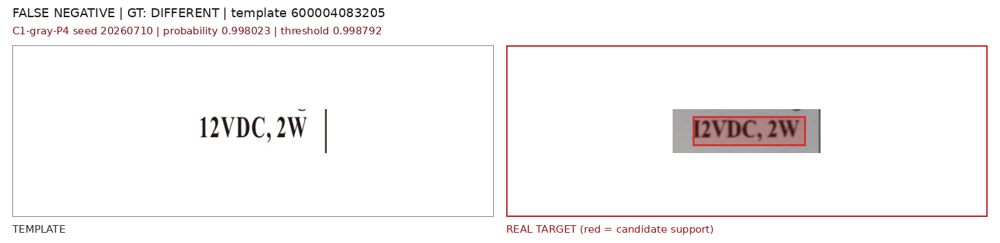
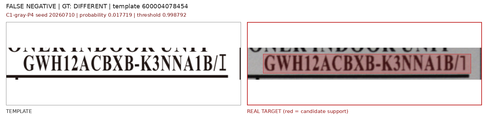
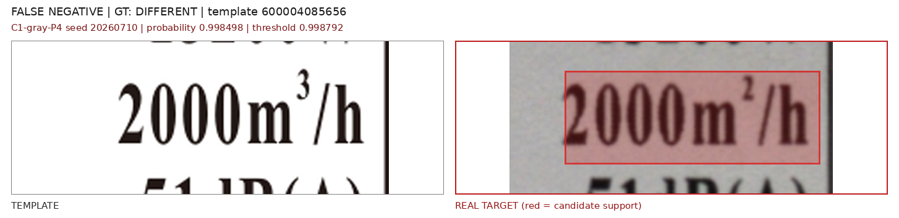
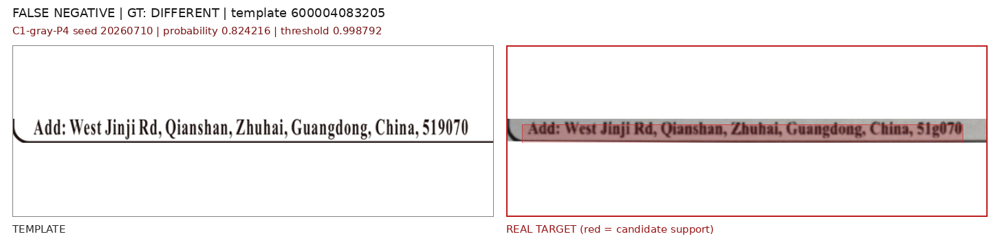
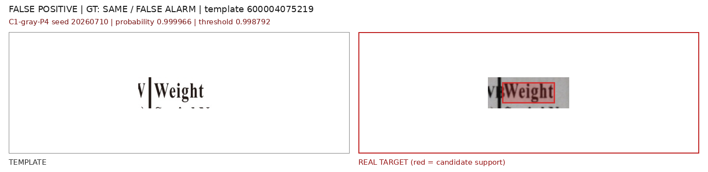
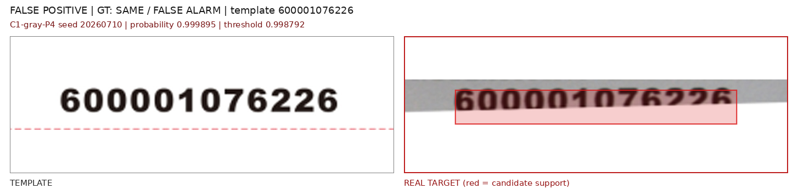
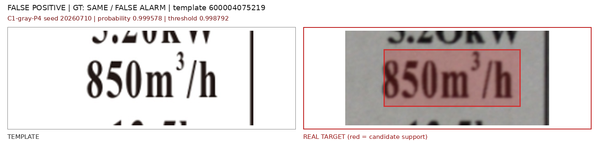
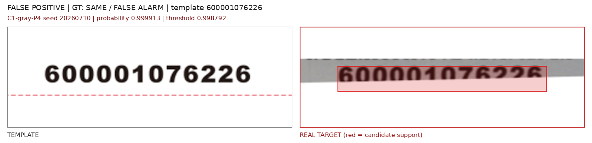

# C0-C3 灰度与轮廓输入消融实验

> 实验日期：2026-07-28  
> 训练数据：D08 symmetric capture，train/val/test = 1400/300/300 pair  
> 模型：DINOv2 ViT-L/14 + P4 Pair Interaction Adapter  
> 重复：seed 20260710、20260711、20260712  
> 真实评估：real50 与 latest15，均为历史开发集，不是最终盲测集

上标变化的同模板合成-实拍复测见 [上标变化合成-实拍对应审计](superscript_synthetic_real_matched_audit.md)。

## 1. 问题与先验检查

本实验验证“只关心文字和图形轮廓时，是否应把 RGB 改为灰度或轮廓输入”。先对 candidate support 内的模板/目标差异做通道统计：

| 数据 | 平均亮度差 Y | 平均色度差 | 原图平均 RGB 通道间差 |
| --- | ---: | ---: | ---: |
| D06 same | 13.42 | 0.95 | 2.096 |
| D08 same | 34.08 | 1.15 | 1.956 |
| real50 same | 79.39 | 1.59 | 1.909 |
| latest15 same | 77.25 | 1.76 | 2.559 |

原始标签几乎是灰度图，真实域差异主要来自亮度、局部阴影、模糊、字重和对齐，不是颜色本身。报告错误图中的红色是后处理叠加的 candidate support，不能视为模型输入中的颜色干扰。

## 2. 实验变量

四组实验只改变输入表示，数据、宽高比分桶、P4 网络、损失、epoch、seed 和阈值规则保持一致。

| 实验 | DINO 输入 | Adapter 输入 | 目的 |
| --- | --- | --- | --- |
| C0 | RGB | DINO token | 已完成的 D08-P4 基线 |
| C1 | 灰度复制为 3 通道 | DINO token | 完全消除色度 |
| C2 | 灰度除以局部高斯背景后复制为 3 通道 | DINO token | 抑制平滑光照和阴影 |
| C3 | 与 C2 相同 | DINO token + ink + gradient | 显式补充笔画区域和边缘 |

C1-C3 都使用 P4 的矩形宽高比分桶 `(672,168)`、`(952,112)`、`(476,238)`、`(336,336)`，无效区域填 ImageNet mean，并保留 valid-aware candidate support。灰度仍复制为三通道，以复用同一个冻结 DINOv2 backbone。

C2 的局部背景为灰度图的 Gaussian blur，半径为 `max(3, min(width,height)*0.08)`，归一化结果为 `gray / max(background, 0.15)`。C3 没有训练第二个 backbone，而是在各矩形分桶对应的 DINO token 网格上追加两个轻量通道：`ink=1-gray` 的平均池化和一阶绝对梯度的最大池化。C3 因此只增加 adapter 输入维度，不增加 DINO 前向次数。

损失保持为：

```text
L = BCE(classification) + 0.5 * localization_loss
```

每个 checkpoint 的阈值只在自身合成 validation 上按 `Recall >= 0.95` 选择；真实集冻结阈值，不做调参。

## 3. 合成测试集结果

三 seed 均值：

| 方法 | Precision | Recall | F1 | ROC-AUC | Pointing | IoU@0.5 |
| --- | ---: | ---: | ---: | ---: | ---: | ---: |
| C0 RGB | 0.9978 | 0.9644 | 0.9807 | 0.9999 | 0.8089 | 0.4721 |
| C1 gray | 1.0000 | 0.9533 | 0.9760 | 0.9999 | **0.8133** | **0.4817** |
| C2 document gray | 1.0000 | 0.9578 | 0.9783 | **1.0000** | **0.8244** | 0.4668 |
| C3 document gray + shape | 0.9977 | **0.9667** | **0.9819** | 0.9999 | 0.7711 | 0.4549 |

合成分类已经接近饱和，C0-C3 的 F1 差异不足 0.006。C1 的 IoU 略高，C2 的 Pointing 略高，但 C3 的显式 ink/gradient 没有改善定位，反而使 Pointing 和 IoU 下降且 IoU seed 标准差增至 0.0333。简单拼接边缘通道并不会自动形成更好的字符差异特征。

## 4. 真实开发集结果

### 4.1 三 seed 均值

| 数据 | 方法 | Precision | Recall | Candidate F1 | ROC-AUC | PR-AUC | Box F1 |
| --- | --- | ---: | ---: | ---: | ---: | ---: | ---: |
| real50 | C0 RGB | 0.6121 | **0.9679** | 0.7497 | 0.9381 | 0.7269 | 0.7308 |
| real50 | C1 gray | **0.6848** | 0.8718 | **0.7650** | **0.9525** | **0.8011** | **0.7437** |
| real50 | C2 document gray | 0.6741 | 0.8526 | 0.7523 | 0.9506 | 0.7827 | 0.7420 |
| real50 | C3 gray + shape | 0.6599 | 0.8590 | 0.7462 | 0.9376 | 0.7497 | 0.7363 |
| latest15 | C0 RGB | 0.8216 | **0.9111** | **0.8628** | 0.9778 | 0.9132 | **0.8628** |
| latest15 | C1 gray | **0.9071** | 0.8222 | 0.8593 | 0.9847 | 0.9444 | 0.8593 |
| latest15 | C2 document gray | 0.8733 | 0.7556 | 0.8094 | **0.9851** | **0.9495** | 0.8094 |
| latest15 | C3 gray + shape | 0.8583 | 0.8222 | 0.8369 | 0.9843 | 0.9364 | 0.8369 |

### 4.2 结果解释

C1 在 real50 上减少了误报：框级 FP 均值由 C0 的 `34.0` 降到 `23.3`，Candidate precision 从 `0.6121` 升到 `0.6848`，ROC-AUC 和 PR-AUC 同时提高。这说明去掉微弱色度后，模型更少把实拍成像差异判断为内容变化。

但代价同样明确：real50 的 recall 从 `0.9679` 降到 `0.8718`，框级 TP 均值从 `48.3` 降到 `43.3`；latest15 的 recall 从 `0.9111` 降到 `0.8222`，最终 F1 没有超过 RGB。灰度不是无损变换，它会进一步压低模糊、小面积、低对比度的真实字符变化。

C2 虽有较好的无阈值排序指标，但固定合成阈值后的召回下降更多，说明当前局部背景除法改变了合成与真实的绝对分数标定。C3 在两个真实集均不如 C1，证明当前 `ink/gradient` 直接拼接方式无效。

### 4.3 C1 逐 seed

| 数据 | Seed | TP/FP/FN/TN | Precision | Recall | Candidate F1 | Box F1 |
| --- | ---: | ---: | ---: | ---: | ---: | ---: | ---: |
| real50 | 20260710 | 44/21/8/191 | 0.6769 | 0.8462 | 0.7521 | 0.7304 |
| real50 | 20260711 | 44/15/8/197 | 0.7458 | 0.8462 | 0.7928 | 0.7706 |
| real50 | 20260712 | 48/28/4/184 | 0.6316 | 0.9231 | 0.7500 | 0.7302 |
| latest15 | 20260710 | 11/2/4/56 | 0.8462 | 0.7333 | 0.7857 | 0.7857 |
| latest15 | 20260711 | 12/0/3/58 | 1.0000 | 0.8000 | 0.8889 | 0.8889 |
| latest15 | 20260712 | 14/2/1/56 | 0.8750 | 0.9333 | 0.9032 | 0.9032 |

不能从历史开发集挑 seed11 或 seed12；这里的波动本身说明灰度方案尚不稳定。

## 5. 错误样本

以下固定展示 seed `20260710`。左侧是模板，右侧是真实 target；红色区域仅表示上游 candidate support。

### 5.1 灰度仍然漏检

`12VDC,2W` 候选在实拍中有明显模糊，C1 概率 `0.998023`，低于冻结阈值 `0.998792`：



另一个低对比候选被压到远低于阈值，说明漏检并非都能靠轻微调阈值解决：



latest15 的 `2000m3/h -> 2000m2/h` 仍然漏检。灰度保留了轮廓，但实拍模糊使上标差异面积太小：



另一个真实小差异也未通过高阈值：



### 5.2 灰度仍然误报

同内容的 `Weight` 在裁剪、对齐和字重变化下仍被判为 different：



另一个 real50 局部文字候选仍超过阈值：



latest15 的两个同内容候选表明剩余误报主要不是色度，而是几何、模糊和笔画宽度：





## 6. 结论

1. **颜色不是当前主要域差异。** 标签原图接近灰度，真实 same pair 的亮度差约为色度差的 45-50 倍。
2. **不建议把 RGB 全面替换为灰度。** C1 降低 real50 误报，但也漏掉更多真实字符变化；latest15 总 F1 没有提升。
3. **C2 和 C3 按当前形式停止。** 光照归一化存在标定漂移，直接拼接 ink/gradient 没有稳定收益。
4. **部署候选仍保留 C0 RGB D08-P4。** 它的召回更符合缺陷检测优先级，且 latest15 F1 略高。
5. 下一步更合理的结构是保留 RGB DINO 主干，把灰度/轮廓作为并行辅助分支或 hard-negative 复核信号，并用可学习门控融合；目标是只在 RGB 高分的 same 候选上抑制误报，不牺牲上标、小字符变化的主干召回。
6. real50/latest15 已反复参与分析，只能作为开发证据。最终结构和阈值必须在新采、未触碰的正常/异常实拍集上验证。

## 7. 代码与产物

```text
/home/jnu/projects/aa_clip_exp/label_pair/shape_input_ablation.py
/home/jnu/projects/aa_clip_exp/label_pair/run_shape_input_ablation.py
/home/jnu/projects/aa_clip_exp/label_pair/evaluate_shape_input_ablation_real.py
/home/jnu/projects/aa_clip_exp/label_pair/test_shape_input_ablation.py
/home/jnu/projects/aa_clip_exp/results/label_pair/shape_input_ablation_c1_c3_d08
/home/jnu/projects/aa_clip_exp/results/label_pair/shape_input_ablation_c1_c3_d08_real_development
/home/jnu/projects/gree-label-detection/docs/report_assets/c1_shape_input_errors
```

两个可复用特征缓存各约 4.4 GiB：

```text
/home/jnu/projects/aa_clip_exp/results/label_pair/feature_cache/d08_shape_gray_tokens.pt
/home/jnu/projects/aa_clip_exp/results/label_pair/feature_cache/d08_shape_document_gray_tokens.pt
```
