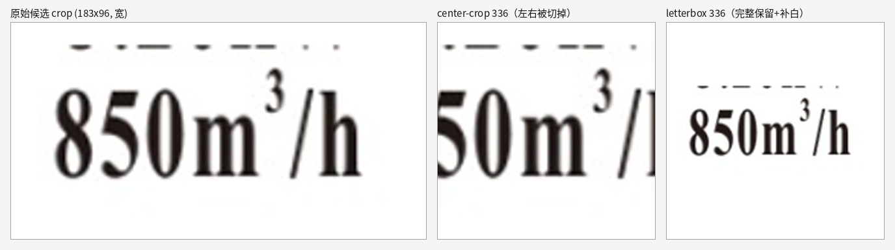
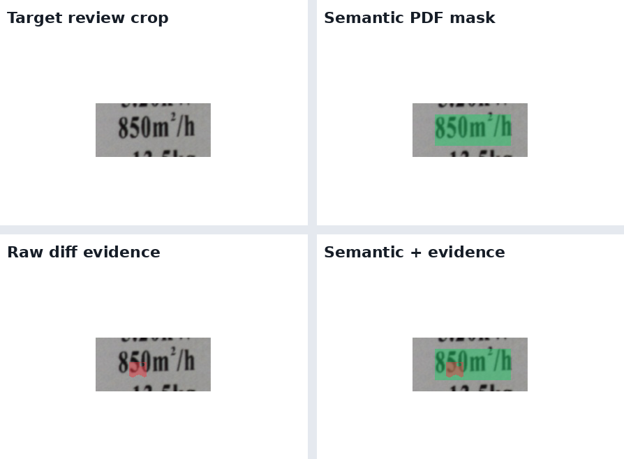
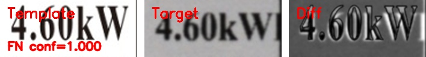
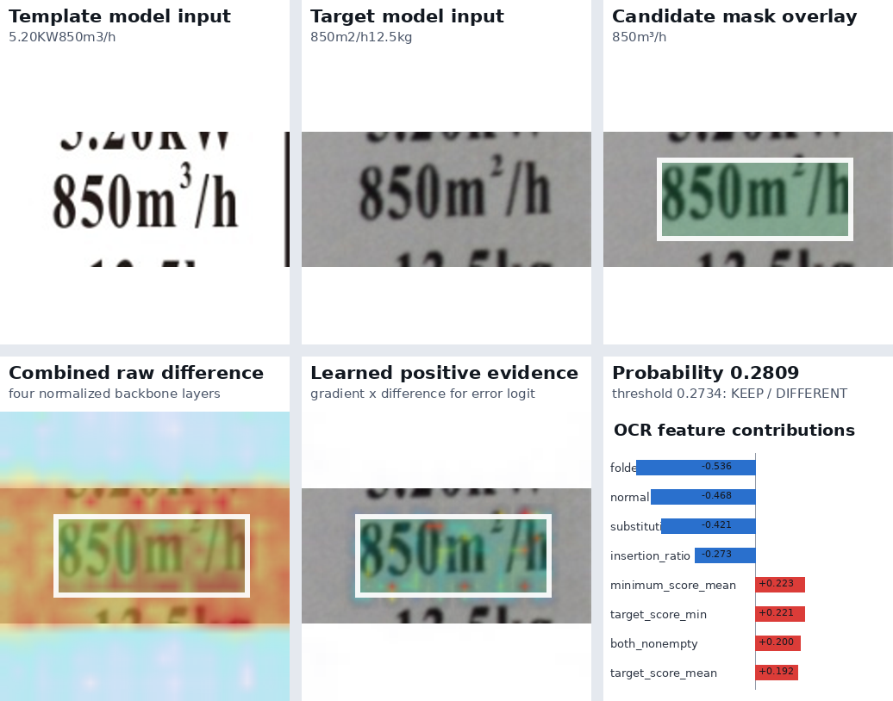

# 实验汇报

> 汇报日期：2026-07-21
> 主项目：`gree-label-detection`　研究项目：`aa_clip_exp`
> 数据生成：`dataset`
> 关联文档：`docs/research/clip_pairwise_label_verification_research_plan.md`（主日志）、`docs/experiments/clip_pair_experiment_recovery_20260713.md`（恢复快照）、`docs/pipeline/current_text_graphic_check_flow.md`（主流程说明）、`docs/datasets/d06_single_mutation_dataset.md`（D06 数据集）、`docs/research/pair_interaction_adapter_model_proposal.md`（下一阶段模型建议）

---

## 0. 一页速览（先看这里）

- **做的事**：主检测流程**不动**，只研究流程最后一步——对每个"疑似差异"的候选，判断它是**真实内容差异（keep）**还是**成像/打印/对齐造成的误报（discard）**。主流程当前用 **VLM** 做这一步；实验在对比 **CLIP / DINOv2 + 轻量分类头** 与 **VLM** 三者在同一判别任务上的表现。
- **为什么**：VLM（`qwen3.6-27b-int4`）判一个候选约 **5 秒**，一张图平均要判 5 次左右，**约 27 秒/图**，太慢；想弄清楚更轻量的 CLIP / DINOv2 判别器能到什么水平。
- **目前三个模型各自的最好成绩**（都在完整主流程最终框、修正 GT、`overlap≥0.3` 下）：

  | 判别器 | real50 最终框 | latest15 最终框 | 单候选耗时 | 特点 |
  | --- | --- | --- | --- | --- |
  | **VLM（V2.2 方案）** | 44/1/6，F1=**0.9263** | 13/0/2，F1=0.9286 | ~5.15s | 精度最高、几乎 0 误报，但慢 |
  | **DINOv2-letterbox（M11 seed10）** | 48/6/2，F1=**0.9231** | 15/1/0，F1=0.9677 | ~0.4s级 | 快、Recall 高，但误报偏多 |
  | **DINOv2 局部定位（E23，最新，三seed均值）** | ~37/4/13，F1=**0.8187** | F1=0.8154，0 FP | ~0.4s级 | real50 误报低于 M11，但 Recall 明显不足 |
  | CLIP（裸 cosine，下限） | — | 3/4/12，F1=0.2727 | ~0.8s | 早期基线，已被 patch 版取代 |

- **一句话结论**：**VLM 精度最高、误报最少但最慢；DINOv2 快一个数量级以上，M11 版在 real50 的 F1 已追平 VLM，但误报偏多；E23 相对 M11 少了一些误报，却损失了较多 Recall。** 实验**还没做完**——`real50` / `latest15` 已被反复用于选配置和调参，属于**开发集**，还需要全新数据才能下最终定论。
- **卡点**：当前还需要分别处理三类问题：（1）缺一个没被反复看过的真实数据集来做最终对比；（2）前处理中的候选生成与 PDF 整行区域扩展需要单独核查；（3）判别模型存在合成→真实的分数域未校准。前处理问题与 CLIP/DINO/VLM 的判别效果分开评价。

---

## 1. 任务定义与输入输出

### 1.1 主流程（不变）

桌面端默认流程 `traditional_full_image_diff`：

```text
模板 PDF/图片 + 实拍图
  → 预处理 + 透视校正
  → 特征匹配(SIFT) + ECC 对齐
  → tolerant diff（容差差分）
  → standard / small-text 候选生成          ← 产生 trigger candidate（触发候选框）
  → review region 构造与合并（文字候选扩展到 PDF 预设文本行）
  → 【keep / discard 判别器】               ← 本研究只替换这一步
  → display box refine / merge
  → 最终 verdict + JSON / Excel / 可视化
```

### 1.2 本研究的任务：Reference-conditioned pairwise label verification

> 给定**同一位置、已经对齐**的模板 crop 和目标 crop，判断二者是**真实内容差异**（keep）还是**误报**（discard）。

它和常见的单图异常检测不同——我们有明确的模板作参考，是**成对**比较：

| 维度 | 单图异常检测（如 AA-CLIP） | 本项目 |
| --- | --- | --- |
| 输入 | 单张待测图 | **模板 + 目标 成对 crop** |
| 参考 | normal/anomaly 概念 | **明确的模板图像** |
| 目标 | 判断单图是否异常 | 判断**同一位置是否发生内容变化** |
| 评估 | image/pixel AUC | **候选级 PR + 最终框 TP/FP/FN** |

### 1.3 判别器的输入到底长什么样

以关键困难样本 `850m³/h → 850m²/h`（风量单位上标由 3 被误改成 2）为例：

- **模板 crop**（PDF 端渲染的正确内容）：

  

- **目标 crop**（实拍，同一位置，已对齐）：

  

- **candidate mask**（traditional diff 触发的差异区域，用于告诉模型"重点看哪里"）：

  

- **OCR 数值特征**：对候选区域再跑一次 PP-OCRv6，得到模板读数 / 实拍读数及字符级差异，编码成 24 维特征。例如这里模板 OCR 读 `850m3/h`、实拍读 `850m2/h`。

- **判别器输出**：`keep`（有差异）或 `discard`（无差异），keep 的候选再回到主流程做 display box refine/merge，得到最终框。

> 关键纪律：**最终评估必须用 replay 主流程后的 display box**，不能直接拿 trigger candidate 框当结果。

### 1.4 实验数据集

本研究的数据单位有两层：**case** 是一张完整目标标签图，**pair** 是主流程从 case 中提出的一个候选区域及其模板/目标 crop。模型实际训练和判别的是 pair；最终 TP/FP/FN 则回到完整 case，经主流程 refine/merge 后按最终框统计。

#### 合成数据集

当前干净基集为 **D05v5 prealigned**，围绕企业现有的 5 个固定 PDF 模板生成：

| 项目 | 数量 / 说明 |
| --- | --- |
| 模板 | 5 个：`600001076226`、`600004075219`、`600004078454`、`600004083205`、`600004085656` |
| 原始变更样本 | 每个模板 60 个，共 300 个独立 mutation |
| 变更类型 | 易混字符、重复、替换、插入、删除、大小写、字符交换、上标变化等 |
| case | 750 个：600 个 defect case + 150 个 clean case |
| candidate pair | 3122 个：772 个 positive + 2350 个 negative |
| train / val / test | 2205 / 490 / 427 pair；三组均覆盖 5 个模板 |

- **positive pair**：候选与程序化变更 GT 重叠，确实包含内容变化。
- **negative pair**：clean 图上的误触发候选，或 defect 图中与真实变更无关的其他候选。
- 每个 defect 保留原图，并生成不改变文字语义的拍摄风格增强；clean 样本还覆盖模糊、亮度/对比度、噪声、JPEG、阴影、笔画粗细和轻微几何扰动，用来模拟打印、拍摄与配准造成的误报。
- 划分按同一底层 source 分组：原始 mutation 及其增强副本只能进入同一个 split，避免同源样本泄漏。部分实验还在 train 中追加 M08 的 120 个上标困难 case（279 个 pair），val/test 保持不变。

> 数据版本说明：D05 在实验中持续迭代。M07/M11 的阶段结果来自较早的 D05v3 + M08；M15 发现并修复合成配准污染后，才形成上表的 D05v5 干净基集。因此文中的历史实验结果保留其当时所用数据，不能理解为所有模型都在 D05v5 上重新训练过。

#### 真实数据集

真实数据均由 **PDF 模板 + 独立实拍标签**组成，经过主流程产生候选，再依据人工修正的最终框 GT 给 candidate pair 标注正负：

| 数据集 | 完整实拍 case | 模板分布 | candidate pair | 用途 |
| --- | --- | --- | --- | --- |
| **real50** | 50 张 | 5 个模板 × 每模板 10 张 | 264 个：52 positive + 212 negative | 主要真实开发对比集 |
| **latest15** | 15 张 | 5 个模板 × 每模板 3 张 | 73 个：15 positive + 58 negative | 较早的真实观察集 |

每张真实图都有 1 个已人工确认的内容差异；一个 GT 有时会对应多个重叠候选，因此 real50 中有 50 个 GT，但有 52 个 positive pair。真实图包含实际拍摄中的透视、模糊、光照、打印形变和局部配准残差，难度明显高于合成图。两套真实数据都已反复用于实验比较，当前作为开发集，不能再视为独立最终测试集。除 M10 专门做过 real50 五折微调消融外，主力模型不使用真实集训练；模型阈值也不在 real50/latest15 上拟合。

---

## 2. 模型结构演进（CLIP → patch → DINOv2）

所有模型的 backbone 都是**冻结**的，只训练上面的轻量 head。演进路线如下。

### 2.0 起点：裸 CLIP cosine（E00，无训练）

```text
template_crop → CLIP image encoder → f_t
target_crop   → CLIP image encoder → f_g
diff_score = 1 - cosine(f_t, f_g)
diff_score ≥ 0.25 → keep，否则 discard
```

三个信息瓶颈：整张 crop 被压成一个全局向量，小字符变化被淹没；cosine 把几百维压成一个标量，学不出"哪些维度代表真实错误"；完全没利用已对齐的 patch 和候选位置。

### 2.1 第一代：Global Pair Head（M01/M02）

冻结 backbone 输出全局向量后，不再用单一 cosine，而是构造显式成对特征喂给一个小 MLP：

```python
# aa_clip_exp/label_pair/model.py :: build_pair_features
pair_feature = concat[ f_t, f_g, |f_t - f_g|, f_t * f_g, cosine ]   # 保留双向 embedding + 差异交互
# GlobalPairHead: Linear(input, hidden) → GELU → Dropout → Linear(hidden, 1)
```

作用：验证 CLIP 表征里**是否本来就含可学习的细粒度差异信息**，只是 cosine 没用好。

### 2.2 第二代：多层 Patch Pair Head（M03，核心结构）

利用"模板/目标 crop 已对齐"这一前提，直接比较**对应位置的 patch token**：

以当前 `L/14@336` 配置为例，处理过程如下：

1. **把图像变成 patch 网格**：336×336 的模板 crop 和目标 crop 都被切成 24×24 个 patch。backbone 在每个 patch 位置输出一个 1024 维向量，因此每一层的特征形状都是 `1024 × 24 × 24`。
2. **比较同一位置**：模板和目标已经对齐，所以直接对同一网格位置做绝对差：`D = |template - target|`。得到的 `D` 仍是 `1024 × 24 × 24`；某个位置的差异越大，说明两张图在该局部的特征变化越明显。
3. **把 candidate mask 映射到 patch 网格**：原始像素级 mask 通过 max-pool 缩成 24×24。只要一个 patch 内有任意像素属于候选区域，该 patch 就被选中；这样极小字符也不会因为缩放而完全消失。
4. **每层提取四个 1024 维摘要**：池化只压缩 24×24 的空间位置，1024 个特征通道仍全部保留。

| 每层摘要 | 在哪些 patch 上计算 | 表示什么 | 维度 |
| --- | --- | --- | --- |
| Candidate mean | mask 选中的 patch | 候选区域各通道的平均变化，表示候选整体差异 | 1024 |
| Candidate max | mask 选中的 patch | 候选区域各通道的最大变化，保留最强局部信号 | 1024 |
| Global mean | 全部 24×24 个 patch | 整个 crop 的平均变化，提供候选周围的上下文 | 1024 |
| Top-change mean | mask 内变化分数最高的一组 patch | 聚焦候选中变化最明显的部分；最多取约 24×24×10%=58 个 patch，若 mask 内不足 58 个则全部使用 | 1024 |

每个 1024 维摘要先分别做 L2 normalize，再在通道方向拼接：

```text
每层：4 种摘要 × 1024 维 = 4096 维
四层：第 6 / 12 / 18 / 24 个 block × 4096 维 = 16384 维
M03：16384 维 → hidden=128 的分类头 → 1 个 keep/discard 概率
M06 以后：16384 维 patch 特征 + 24 维 OCR 特征 → 分类头
```

这里保留多层是为了同时利用不同深度的信息：较浅层偏向笔画、边缘和纹理，较深层包含更完整的字符与语义结构。最终分类头学习这 16384 个数中，哪些组合更像真实内容变化，哪些更像拍摄、打印或配准误差。

结构上就是 **冻结 backbone + candidate-aware 多层 patch pooling + 小分类头**。M03 先验证纯视觉 patch 结构，M06 才通过消融确认追加 OCR 数值特征有效；后续 M07/DINO 等实验沿用“patch + OCR”的骨架。

**24 维 OCR 数值特征怎么来的**：对模板候选区和实拍对应区分别跑一次 PP-OCRv6，得到两串文字和它们的字符置信度，再**逐 pair 计算一组确定性数值**（不使用任何标签，实现见 `aa_clip_exp/label_pair/ocr_features.py`）。它不是把文字塞给模型，而是把"两串文字有多像、差在哪"量化成 24 个有界数值；除有符号长度差位于 `[-1, 1]` 外，其余均在 `[0, 1]`：

| 类别 | 特征（部分） | 含义 |
| --- | --- | --- |
| 是否有文字 | `template_nonempty` / `target_nonempty` / `both_nonempty` | 两侧 OCR 是否读到内容 |
| 是否相等 | `strict_equal` / `folded_equal` | 严格相等 / 忽略大小写与全半角后相等 |
| 相似度 | `sequence_ratio` / `folded_sequence_ratio` / `normalized_distance` / `folded_normalized_distance` | 序列相似度、归一化编辑距离 |
| 编辑构成 | `insertion_ratio` / `deletion_ratio` / `substitution_ratio` | 插入/删除/替换字符各占比 |
| 长度 | `signed_length_delta_ratio` / `absolute_length_delta_ratio` / `template_length_log` / `target_length_log` | 两串长度差与各自长度 |
| OCR 置信度 | `template_score_mean` / `target_score_mean` / `minimum_score_mean` / `score_mean_gap` / `template_score_min` / `target_score_min` | 两侧字符置信度均值/最小值/差距 |
| 与模板先验 | `expected_template_similarity` / `expected_template_contained` | 实拍读数与 PDF 模板真值的相似度/包含关系 |

直觉：`850m3/h` vs `850m2/h` 会让 `substitution_ratio`、`normalized_distance` 变大、`strict_equal=0`，而单纯拍照模糊导致的同一读数则这些特征都指向"相同"。OCR 置信度类特征则让模型知道"这串 OCR 可不可信"，避免被 OCR 自身错误带偏。

> 消融结论（M06）：generic prompt、PDF 文字的 CLIP 文本嵌入都是负增益，**只有这 24 维数值特征稳定有效**（D04 三 seed 均值 F1 0.7345→0.8333）。

### 2.3 第三代：换 backbone + letterbox（M11）

把 backbone 从 CLIP 换成 **DINOv2-L/14@336**，并把 crop 的预处理从 center-crop 改成 **letterbox**。结构其余不变。

**为什么要换 letterbox**：文字候选往往是**宽长条**（型号行、风量行）。center-crop 先把短边缩到 336 再从中心裁 336×336，会把宽 crop 的**左右两端切掉**；letterbox 则等比缩放整张 crop 塞进 336×336、四周补白，**完整保留候选**。下图用 `850m³/h` 候选（原始 183×96）对比——center-crop 直接把开头的 `8` 切没了（变成 `50m³/`），letterbox 完整保留 `850m³/h`：



这也解释了为什么 M11 里"只换 backbone"或"只换 letterbox"都没稳定增益、必须**两者联合**：DINOv2 patch 特征更细，letterbox 又保证细粒度差异不被裁掉。

> 说明：`model.py` 里另有 `ResidualFeatureProjector`（残差 adapter）、`GatedGlobalPatchHead`（门控融合全局+局部）等变体，均在 M05 消融中**未稳定超过 raw patch-only**，故主力模型不使用。

---

## 3. 逐实验记录

> 统一格式：目的 / 输入变化 / 结构 / 结果 / 结论。所有真实指标为**完整主流程最终框、修正 GT、overlap≥0.3**。
> `TP/FP/FN` 记法；real50 = 5 模板×10 张独立实拍；latest15 = 15 张开发观察集。

### E00　裸 CLIP cosine 基线（DONE）
- **目的**：确认"冻结全局 embedding + 单阈值"能否直接替代 VLM。
- **结构**：`ViT-B-32-quickgelu/openai`，冻结，`1-cosine ≥ 0.25 → keep`。
- **结果**：在这次 latest15 同输入对照中，候选框 15/15、review_box 69/69 与 VLM 完全一致，因此该次 CLIP/VLM 结果差异来自判别器。这个结论只适用于 E00 的同输入比较，不代表前处理链路整体不存在问题。

  | 方法 | latest15（TP/FP/FN） | F1 | 耗时 |
  | --- | --- | --- | --- |
  | 裸 CLIP cosine | 3/4/12 | 0.2727 | 0.79s/图 |
  | 同口径 VLM | 13/5/2 | 0.7879 | 23s/图 |
- **结论**：裸 CLIP 不可用，但只否定了"全局向量+单 cosine"，没否定训练后的 pair 模型。→ 进入监督训练。

### D01–D05　合成 pair 数据集（DONE）
- **目的**：造出可训练、可分 train/val/test 的成对数据，且**同模板 source split 零泄漏**。
- **演进**：D01 打通导出（10 case/43 pair）→ D02 加 clean/same 与成像扰动（产生 hard negative，让 cosine 不再轻易满分）→ D03 正负同域安全增强 → D04 diverse 独立 mutation → **D05 五模板 specialist 大样本**：300 独立 mutation、387 行级 GT、750 case、3948 pair（修正后 764 正/3184 负），5 模板均进 train/val/test。
- **定位**：交付目标是 **closed-template specialist**（只服务企业固定的 5 个 PDF 模板，允许它们参与训练），不是 zero-shot 泛化。

### M01/M02　Global Pair Head（DONE）
- **结构**：§2.1，冻结 B/32 或 L/14@336 + GlobalPairHead。
- **结果**：pilot 上 L/14@336 head F1=1.0（test 仅 3 正例，样本太小）。证明 pair head 概念成立，但需要更难的数据。

### M03　多层 Patch Pair（DONE）
- **结构**：§2.2，核心骨架诞生。
- **结果**：D04 独立 mutation，patch 三 seed 均值 F1=0.7009，global 仅 0.5191。**局部 patch 对应显著优于全局向量**，验证 RQ2。

### M05　Residual/feature adapter 消融（DONE，负结果）
- **目的**：加 64/256 维投影 + vector/scalar gate 能否提升。
- **结果**：均未稳定超过 raw patch-only。→ **否定复杂化**，主力保持简单结构。

### M06　文字分支消融（DONE）
- **目的**：generic prompt / PDF 模板文字 / OCR 数值特征分别是否有用。
- **结果**：generic 和 PDF CLIP-text 均为**负增益**；只有 **OCR 数值特征**把 D04 三 seed 均值 F1 从 0.7345 提到 **0.8333**。→ 保留 OCR 数值分支，丢弃 prompt 分支。

### M07　五模板 specialist patch/OCR（DONE，曾长期推荐）
- **结构**：D05 + 多层 patch + OCR，h128。
- **结果**：

  | 数据集 | 三 seed（TP/FP/FN 或 F1） | 说明 |
  | --- | --- | --- |
  | latest15 | 均 14/0/1，F1=0.9655 | 修正 line-GT 后完整重放 |
  | real50 | F1=0.8247 / 0.7961 / 0.8421 | 三 seed |
- **结论**：一段时间的推荐模型。

### M09　高风险 PDF 文本行候选恢复（DONE，前处理修复）
- **目的**：修复 3 个前处理阶段未产生有效候选的问题。它发生在判别器之前，不属于 CLIP/DINO/VLM 的模型 FN。
- **做法**：对高风险 PDF 文本行默认补候选（`ENABLE_SENSITIVE_PDF_LINE_RECOVERY=1`）。
- **结果**：

  | 数据集 | seed10 | seed11 | seed12 |
  | --- | --- | --- | --- |
  | real50（TP/FP/FN） | 42/7/8，F1=0.8485 | 43/12/7，F1=0.8190 | 42/5/8，F1=0.8660 |
  | latest15 | 15/0/0 | 15/0/0 | 15/0/0 |

  相比无恢复的 corrected M07，三 seed 均 **+2 TP / +0 FP**，平均 F1 0.8210→0.8445。→ **corrected M07 + M09 成为当时推荐组合**。

### M10　真实困难样本微调（DONE，负结果）
- **目的**：在 real50 上按 case 分组 5 折微调 head 能否救回稳定 FN。
- **结果**（OOF 折外预测，real50，seed10/11/12）：

  | 路径 | seed10 | seed11 | seed12 | F1 均值 |
  | --- | --- | --- | --- | --- |
  | M09 baseline | 42/7/8 | 43/12/7 | 42/5/8 | 0.8445 |
  | real-validation 校准 | 40/12/10 | 41/13/9 | 42/8/8 | 0.8043 |
  | 强制微调 | 40/12/10 | 41/13/9 | 40/8/10 | 0.7964 |

  15 折全部由 validation 选中 epoch 0（首次更新后就不再改善）。
- **结论**：**不要在这 50 张上继续调学习率/epoch/阈值**；严格改进需要独立真实 train/val/test（R02，尚未做）。

### M11　DINOv2 + letterbox 2×2 消融（DONE，开发集最佳配置）
- **目的**：backbone（CLIP/DINOv2）× 预处理（center/letterbox）四组对照。
- **结果**（real50，seed10/11/12 的 TP/FP/FN 与 F1 均值）：

  | 配置 | seed10 | seed11 | seed12 | F1 均值 |
  | --- | --- | --- | --- | --- |
  | CLIP center | 44/2/6 (0.9167) | 45/12/5 (0.8411) | 50/36/0 (0.7353) | 0.8310 |
  | CLIP letterbox | 45/11/5 (0.8491) | 45/9/5 (0.8654) | 48/33/2 (0.7328) | 0.8158 |
  | DINOv2 center | 45/7/5 (0.8824) | 46/10/4 (0.8679) | 47/29/3 (0.7460) | 0.8321 |
  | **DINOv2 letterbox** | 48/4/2 (0.9412) | 39/0/11 (0.8764) | 42/2/8 (0.8936) | **0.9037** |

  DINO-letterbox 三 seed 平均 P=0.959、R=0.860、FP=2.0（CLIP-center 为 P=0.776、R=0.927、FP=16.67）。主要收益是**大幅压低边界/邻行误报**，代价是 Recall 略降。
- **结论**：**DINOv2+letterbox 是这一步里效果最好的配置**；backbone 和"保持完整候选"必须联合考虑，只换一个都没稳定增益。但 real50/latest15 已用于选配置/选 seed，不能当作最终对比数据。

### M12　candidate-only OCR 消融（DONE，负结果）
- 局部 OCR 能稳定救回上标 case、消除邻行污染，但丢上下文导致总体 Recall 明显下降。→ 不替换 review-OCR，改留待做 review+candidate 双路。

  | OCR 方式 | real50 seed10/11/12（TP/FP/FN） | F1 均值 |
  | --- | --- | --- |
  | review OCR（基线） | 48/4/2、39/0/11、42/2/8 | 0.9037 |
  | candidate OCR | 42/3/8、40/3/10、41/3/9 | 0.8722 |

### M13　PDF 型号整行候选修复（几何修复保留，重训负结果）
- **发现并修复**：`GWH...A` 与后缀 `/I` 被 PDF 文本层拆成两个 region，导致型号变化候选不完整。已在 PDF 语义 region 阶段**合并型号主体+后缀为整行**。
- **结果**：整行几何本身有效，但用新数据重训后 Recall 明显下降；旧 M11 seed10 接入新整行几何后仍保持较高效果。

  | 模型与数据集 | seed10 | seed11 | seed12 |
  | --- | --- | --- | --- |
  | M13 重训，real50 | 38/0/12，F1=0.8636 | 41/2/9，F1=0.8817 | 37/0/13，F1=0.8506 |
  | M13 重训，latest15 | 10/0/5，F1=0.8000 | 13/0/2，F1=0.9286 | 10/0/5，F1=0.8000 |

  对照 M11 seed10 接入新整行几何：real50 为 **48/6/2，F1=0.9231**，latest15 为 **15/1/0，F1=0.9677**。

- **结论**：保留整行候选几何，后续对比仍用 M11 seed10 checkpoint。跨 PDF 行 display-box 误合并修复后，原 `48/4/2` 实际为 `48/6/2`，此前隐藏了 2 个跨行 FP。

### M14　review + candidate 双路 OCR（DONE，seed10 改善但不稳）
- 双路 OCR 拼成 48 维。seed10 改善明显（FP 6→1），但另两 seed 掉 Recall，三 seed 不稳。→ 保留实现，待盲测集再定。

  | 数据集 | seed10 | seed11 | seed12 |
  | --- | --- | --- | --- |
  | real50（TP/FP/FN） | 45/1/5，F1=0.9375 | 38/0/12，F1=0.8636 | 41/0/9，F1=0.9011 |
  | latest15 | 14/0/1，F1=0.9655 | 10/0/5，F1=0.8000 | 13/0/2，F1=0.9286 |

  对照当前主力 M11 seed10 = 48/6/2（F1=0.9231）。

### M15　合成配准污染修复（DONE，重要数据修复）
- **根因**：已正视、尺寸接近模板的合成图被再次做透视检测，内部**条码仅约 6% 面积却被当成整张标签**，SIFT 用条码局部匹配接受了约 0.2× 的错误单应缩放，ECC 相关性仅 0.196 仍标记成功 → 模板文字行常对应 target 空白/条码。
- **影响**：D05v3/v4 各 750 case 中有 77 个灾难性尺度，说明旧模型也曾在污染数据上训练。
- **修复**：同画布 target 跳过重复透视；SIFT 加投影面积/双轴尺度门禁；ECC<0.3 回退。产出干净的 **D05v5 prealigned**（OCR test 负例双侧非空 293/382→311/311，编辑距离 0.338→0.033）。
- **结果**：修复后 synthetic test 明显变干净，但 synthetic validation 近乎可分，Recall95 阈值被推高，真实 Recall 明显不足。

  | 数据集 | seed10 | seed11 | seed12 |
  | --- | --- | --- | --- |
  | synthetic test（dual，seed10） | 112/1/4，F1=0.9782 | — | — |
  | real50（fixed dual） | 36/0/14 | 35/0/15 | 35/0/15 |
  | latest15（fixed dual） | 11/0/4 | 9/0/6 | 10/0/5 |

  → 数据修复保留，D05v3/v4 指标全部标记 superseded，但暴露出**分数域未校准**问题。

### M16　semantic / evidence 双 mask 消融（DONE，合成改善真实负结果）
- 新增原始差分 evidence mask。synthetic test 稳定小幅提升（evidence F1≈0.9826），但真实完整回放**净退化**（seed10 evidence 相对 semantic 找回 2 TP 却丢 4 TP）。
- **结果**：

  | mask / 数据集 | seed10 | seed11 | seed12 |
  | --- | --- | --- | --- |
  | semantic，real50 | 36/0/14 | 35/0/15 | 35/0/15 |
  | semantic，latest15 | 11/0/4 | 9/0/6 | 10/0/5 |
  | evidence，real50 | 34/0/16 | 17/0/33 | 17/0/33 |
  | evidence，latest15 | 10/0/5 | 5/0/10 | 5/0/10 |
  | dual，real50 | 33/1/17 | 29/0/21 | 31/1/19 |
  | dual，latest15 | 10/0/5 | 10/0/5 | 9/0/6 |

- **结论**：合成 raw diff ≈ 真实变更；真实 raw diff 混入配准残差。evidence mask 保留为审计资产和后续软引导输入，不作为当前主力对比方案。

  

### E21–E24　DINO 局部定位 + real-like 正样本平衡（DONE，当前研究候选）

#### 这一组实验要解决什么

前面的 patch pooling 会把整条候选文字行汇总成一个向量，但真实变化通常只占其中一个字符。与此同时，模板与实拍即使经过对齐，字符笔画仍可能偏移一两个 patch。直接比较同坐标 patch，容易把这种小错位当成内容变化。

因此这一组实验改成“**先在局部范围重新找对应位置，再学习变化发生在哪里**”：

```text
模板/目标 crop
  → 冻结 DINOv2-L/14，提取第 6/12/18/24 个 block 的 24×24 token 特征
  → 局部双向匹配：每个 token 在另一张图附近寻找最相似 token
  → 计算匹配后的残差，四层残差取平均
  → 只在 candidate 整行范围内预测一张变化热力图
  → 用热力图加权汇总 128 维视觉特征
  → 拼接 review OCR 24 维 + candidate OCR 24 维
  → 分类头输出 keep/discard
```

- **局部双向匹配**：`radius=2` 表示每个 token 可以在另一张图以原位置为中心的 5×5 窗口内找最相似位置；模板找目标、目标也找模板，两个方向的残差取较大值。这样可容忍轻微错位，又尽量不掩盖真实字符变化。
- **整行 candidate mask**：只规定模型允许在哪条文字行内寻找变化，不直接告诉模型具体哪个字符错了。
- **合成 evidence mask**：仅在训练时作为热力图监督，告诉定位器程序化变更实际落在哪些 token；推理时不把 evidence mask 输入模型。
- **最终分类**：热力图对视觉特征做加权平均，再与双路 OCR 共 48 维特征拼接。训练同时优化 keep/discard 分类损失和热力图定位损失。

#### E21：统一合成与真实残差的数值尺度

同一特征通道在合成图和真实照片上的残差强度差别较大，定位器可能只记住“残差有多强”，而不是“残差出现在哪里”。E21 在 candidate 范围内，对每个残差通道分别减均值、除标准差，再送入定位器；模型结构和训练数据其余部分不变。

- real50 三 seed 的 F1 均值由上一阶段 M18 的 0.7072 提升到 **0.7945**。
- 定位指标也改善：pointing accuracy（热力图峰值落在 evidence 内的比例）由 0.4615 升到 0.6474，IoU 由 0.0098 升到 0.1835。

#### E22/E23：修正“拍摄风格只出现在负样本”的数据捷径

这里的 **print-scan（代码名 `print_scan`）**不是把图片真实打印后再扫描，而是一种不改变文字内容的合成增强：先随机把深色文字笔画加粗或变细，再随机调整亮度和对比度，并加入轻微高斯模糊、传感器噪声和 JPEG 压缩。它不移动字符，也不修改内容差异或 GT mask，用来近似标签经过印刷后又被相机/扫描设备采集时的外观退化。

审计训练集后发现，最接近真实拍摄的 `print_scan` 增强有 **230 个 negative、0 个 positive**，`geometry/mixed` 也只出现在 negative。模型可能学到“出现 print-scan 风格就判无差异”，而不是比较字符内容。

- **E22（全量补齐）**：给训练集全部 308 个原始 positive pair 各增加一个无几何位移的 print-scan 目标图副本。内容差异和 mask 均不变，只改变笔画、模糊、噪声和压缩风格。结果 synthetic validation 阈值升到约 0.99，real50 Recall 降到 0.6267，三 seed F1 均值降为 **0.7312**。说明全量增强过强，模型变得过于保守。
- **E23（部分补齐）**：不再增强全部 positive，而是用固定 hash 选中 77/308 个（25%）增加同样的 print-scan 副本。这样既打破“print-scan=negative”的捷径，又不过度改变正样本分布。real50 三 seed F1 均值回升到 **0.8187**，是这一分支当前最好的折中。

#### E24：扩大局部匹配窗口

E24 只把 E23 的 `radius=2` 改为 `radius=4`，即搜索窗口由 5×5 扩大到 9×9，其他设置不变。窗口变大后，真实变化字符更容易在较远位置找到一个外观相似的 token，从而被匹配过程“解释掉”。seed10 real50 从 E23 的 36/3/14、F1=0.8090 降为 34/4/16、F1=0.7727，因此停止其余 seed。

#### 结果汇总

| 实验 | 相对上一版只改变什么 | real50 seed10/11/12（TP/FP/FN） | real50 F1 均值 | latest15 seed10/11/12 |
| --- | --- | --- | --- | --- |
| E21 | candidate 内逐通道残差标准化 | 37/9/13、38/4/12、35/4/15 | 0.7945 | 10/0/5、10/0/5、11/0/4（均值 0.8154） |
| E22 | E21 + 全部 308 个 positive 加 print-scan 副本 | 30/4/20、34/3/16、30/6/20 | 0.7312 | 10/0/5、9/0/6、9/0/6（均值 0.7667） |
| **E23** | E21 + 仅 77/308 个 positive 加 print-scan 副本 | 36/3/14、37/3/13、40/7/10 | **0.8187** | 10/0/5、10/0/5、11/0/4（均值 0.8154） |
| E24 | E23 + radius 2→4 | 34/4/16（仅 seed10） | 0.7727 | 10/0/5（仅 seed10） |

**结论**：E23 在 real50 上平均 P/R/F1=0.900/0.753/0.8187，平均约 4.3 FP；latest15 三 seed 均为 0 FP。它比 E21/E22 更均衡，但 Recall 仍明显低于 M11 seed10，不能作为最终结论。real50/latest15 已反复用于研究比较，仍需新数据验证。

### VLM 复测 V1 / V2.2 / V2.3（DONE，当前判别效果最强）
用修复后的候选/crop 冻结主流程，复测主流程使用的 `qwen3.6-27b-int4`（temperature=0）：

| 方案 | 视觉输入 | real50 最终框 | latest15 最终框 |
| --- | --- | --- | --- |
| V1（旧三图） | 模板+目标+diff 三图 | 44/5/6，F1=0.8889 | 14/1/1，F1=0.9333 |
| **V2.2（当前最优）** | 两张 candidate-focus 精细 crop + PDF文字 + 实拍OCR | **44/1/6，F1=0.9263** | **13/0/2，F1=0.9286** |
| V2.3（回退 review crop 消融） | 完整 review crop + OCR | 44/2/6，F1=0.9167 | 13/0/2 | 

- **V2.2 亮点**：两集合计 57/1/8（唯一 1 个框级 FP 还是某 GT case 保留了两个框，并非负候选误判）；相比旧三图（58/6/7）是"少 1 TP 换少 5 FP"，更适合误报成本高的场景。
- **共性问题**：VLM 自报 confidence 大量固定 0.95，正确错误都一样，**无校准价值**；剩余 FN 集中在极小字形变化（多个数值行/长型号行被高置信解释为"相同+模糊"）。
- **耗时**：约 5.15s/候选、5.28 次请求/图 → **约 27s/图**，缓存重放的 0.4s/图不代表实际逐候选调用耗时。

  一个 V2.2 漏检（FN）示例（型号/数值行细微变化被判"相同"）：

  

---

## 4. 端到端样本走查：`850m³/h → 850m²/h`

以下仅展示该样本从输入到模型输出的结果。

1. **模板输入**

   

2. **目标输入**

   

3. **Candidate mask**

   

4. **逐层 patch 差异**

   

5. **层归因结果**

   

6. **输出总览**

   

---

## 5. 三个模型横向对比与评价纪律

### 5.1 最终框对比（real50 + latest15，完整主流程，overlap≥0.3）

| 判别器 | real50 | latest15 | 平均 FP（real50） | 单候选耗时 | 一句话 |
| --- | --- | --- | --- | --- | --- |
| VLM（V2.2） | 44/1/6，F1=0.9263 | 13/0/2，F1=0.9286 | ~1 | ~5.15s | 精度最高、几乎零误报，慢 |
| DINOv2-letterbox（M11 seed10） | 48/6/2，F1=0.9231 | 15/1/0，F1=0.9677 | 6 | ~0.4s级 | 快、Recall 高，误报偏多 |
| DINOv2 局部定位（E23，三seed均值） | ~37/4/13，F1=0.8187 | F1=0.8154，0 FP | ~4.3 | ~0.4s级 | real50 误报低于 M11，但 Recall 明显不足 |
| CLIP（裸 cosine，下限） | — | 3/4/12，F1=0.2727 | — | ~0.8s | 早期基线，已被 patch 版取代 |

一句话读法：**DINOv2 的 M11 版在 real50 上和 VLM 打平（F1 0.9231 vs 0.9263），单候选耗时低一个数量级以上，但误报多 5 个；VLM 胜在几乎零误报；E23 把 real50 平均 FP 降到约 4.3，但 Recall 也从 M11 seed10 的 0.96 降到三 seed 均值 0.753。CLIP 裸 cosine 只是起点基线。**

### 5.2 评价口径（保证各实验可比、结论不虚高）

1. **阈值只在 synthetic validation 用 `Recall≥0.95` 规则选**，不用 real50/latest15 调阈值。
2. real50 / latest15 已被反复用于选配置、调参，属于**开发集**；实验尚未结束，任何"哪个最终更好"的定论都需要**全新数据**。
3. 指标一律用**修正 GT + PDF 预设最终框 + 完整主流程 replay**；旧的离线 trigger-box 指标已作废。
4. 多 seed 一起报，**不只挑最好的一个 seed** 当结论。
5. 型号主体与 `/I` 必须整行候选；DINOv2 目前以 M11 seed10 为主力对照，重训 checkpoint 只作实验记录。

---

## 6. 当前瓶颈与下一步

当前需要分开处理以下三处问题：

- **前处理：候选生成与区域扩展**。按当前规则，PDF 文字候选应从局部 trigger candidate 扩展为对应的 PDF 预设整行 review region，再送入判别器。如果最终只保留单个字母的小框，应先检查 trigger candidate 到整行 review region 的映射、合并和 display-box refine，而不能把它记为模型漏检。此前使用的单字母 candidate/OCR 边界图属于旧的局部中间结果，与当前整行候选规则不一致，因此不再作为例图。

- **合成→真实分数域未校准**：合成 validation 近乎可分把阈值推高，真实 Recall 掉。需要独立真实 validation 校准或更贴近真实的合成 validation。
- **非刚性/尺度残差**：真实拍照的局部配准残差会被误当差异（E23 的 FP 多来自全局残余配准误差）。

**下一步（优先级）**：

1. **采集全新真实盲测集**（R02：独立 real train/val/final-test），重点覆盖 `600001076226` 型号行和 `m³/h` 上标——这是得出最终对比结论的前提。
2. 单独审计前处理的 `trigger candidate → PDF 整行 review region → display box` 链路，确认文字候选始终遵守整行规则；这项检查不与模型调参混在一起。
3. **正在进行 4B VLM 的 LoRA 微调实验**：保持与 27B VLM 相同的候选输入、判别任务和评价口径，验证经过 LoRA 微调的 4B VLM 能否完成同样的 keep/discard 判别任务，并对比两者的 TP/FP/FN、F1 与推理耗时。

---

## 附录 A：关键路径速查

- 主日志：`docs/research/clip_pairwise_label_verification_research_plan.md`
- 恢复快照：`docs/experiments/clip_pair_experiment_recovery_20260713.md`
- 模型代码：`aa_clip_exp/label_pair/{model.py, train_patch.py, ocr_features.py, token_localizer.py}`
- 数据集：`results/clip_pair_datasets/synthetic_d05_specialist_linegt_v5_prealigned_pdf_semantic_modelrow`（当前唯一可用合成）、`real_single10_20260712_v9_...`、`real_latest15_v6_...`
- M11 seed10 checkpoint：`aa_clip_exp/results/label_pair/synthetic_d05v3_m08_dinov2_letterbox_patch_ocr_h128_seed20260710/best_checkpoint.pt`
- VLM V2.2 复测结果：`results/evaluation/` 下 real50/latest15 的 V2.2 candidate-focus OCR 实验目录（日期 `20260717`）
- 本文图片：`docs/report_assets/`

## 附录 B：术语

- **trigger candidate（触发候选框）**：traditional diff 发现局部像素差异后产生的小框，未经判别器确认，也不是最终框。
- **candidate-stage FN（候选阶段漏检）**：GT 确有错，但前处理没有生成覆盖它的有效候选；它属于候选生成/区域扩展问题，不计为判别模型 FN。
- **review crop（复核裁剪）**：围绕候选构造、送判别器的模板/目标成对局部图，文字候选通常扩展到 PDF 预设文本行。
- **replay（决策重放）**：把缓存的 keep/discard 预测送回主流程执行 refine/merge，指标取重放后的显示框。
- **closed-template specialist**：只服务固定 5 个 PDF 模板、允许其参与训练的专用模型，不追求 zero-shot。
- **seed**：训练随机种子，多 seed 同报用于看方差，不许只挑最好一次。
