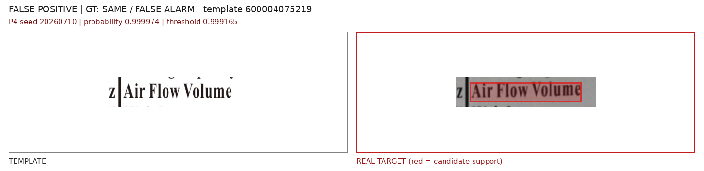
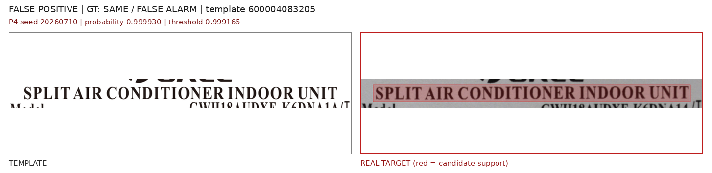
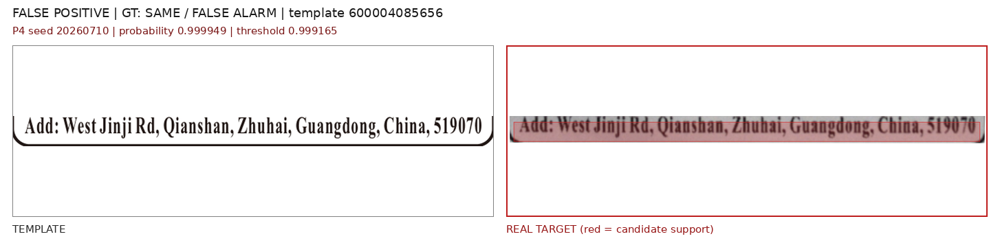
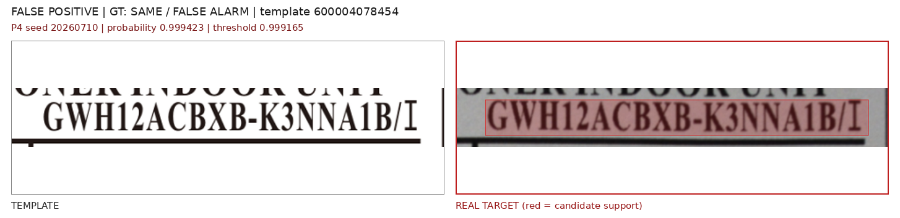
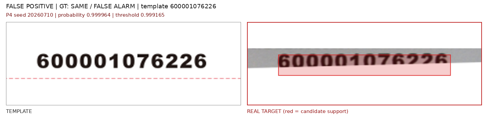
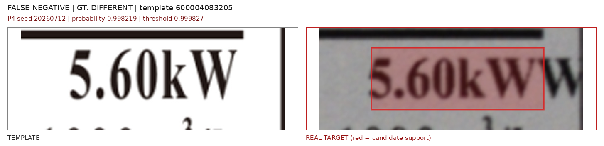
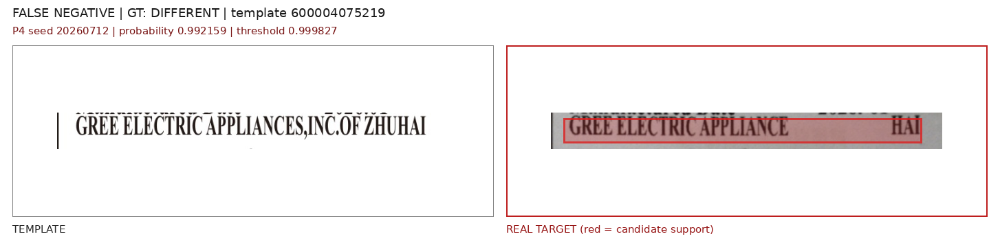
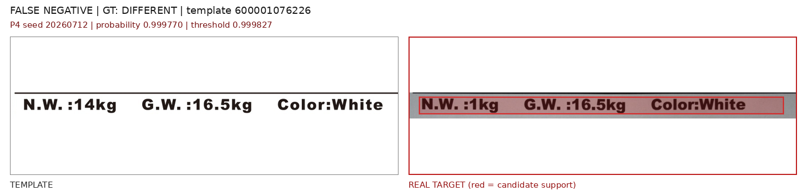
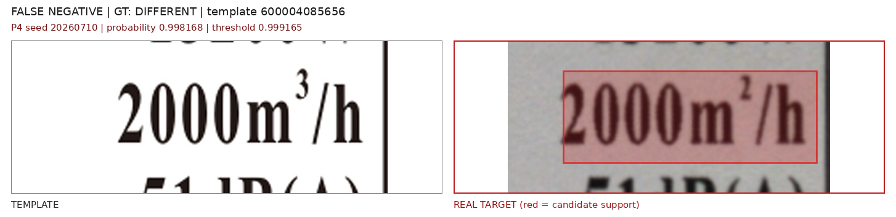

# D06 P0/P4 真实开发集评估

> 后续实验：基于本报告错误类型构建的 D07/D08 增强实验见
> [D07/D08 真实风格增强实验](d07_d08_symmetric_capture_augmentation_experiment.md)。

> 评估日期：2026-07-28  
> 模型：D06 合成数据训练的 P0 与 P4，各三个 seed  
> 阈值：完全冻结自 D06 validation，真实数据不重新选阈值  
> 数据性质：历史开发集，不是未触碰盲测集

## 1. 评估目的

合成 D06 上 P4 的平均 F1 略高于 P0，但任务接近饱和。本轮检查这种收益能否迁移到真实打印、拍摄和配准残差，并重点观察假阳性。

只比较：

- P0：336×336 白色 letterbox + M11 统计池化；
- P4：恒定 token 预算矩形分桶 + Pair Interaction Adapter。

没有训练、微调、温度缩放或真实阈值搜索。每个 checkpoint 使用自己在 D06 validation 上按照 `Recall >= 0.95` 规则得到的原始阈值。

## 2. 真实数据审计

| 数据集 | 实拍 case | Pair | Different | Same/false alarm |
| --- | ---: | ---: | ---: | ---: |
| real50 | 50 | 264 | 52 | 212 |
| latest15 | 15 | 73 | 15 | 58 |

评估前检查：

- 337 个 `pair_id` 全部唯一；
- 两个集合之间没有重复 case，也没有相同 target crop 哈希；
- 1011 个模板 crop、目标 crop 和 candidate mask 文件全部存在；
- 每个 pair 的模板、目标和 mask 尺寸一致；
- D06、real50、latest15 的 candidate mask 平均覆盖率分别为 43.7%、47.3%、48.0%，support 语义可直接复用。

真实 manifest 没有字符级 `changed_bbox`，因此本轮只能评价候选分类和候选框命中，不能评价 P4 的 pointing accuracy 或定位 IoU。

数据路径：

```text
/home/jnu/projects/gree-label-detection/results/clip_pair_datasets/real_single10_20260712_v9_gtcorrected_dualmask_modelrow/manifest.jsonl
/home/jnu/projects/gree-label-detection/results/clip_pair_datasets/real_latest15_v6_dualmask_modelrow/manifest.jsonl
```

## 3. 三 seed 候选级结果

均值与标准差基于三个 seed：

| 数据 | 方法 | Precision | Recall | F1 | ROC-AUC | PR-AUC |
| --- | --- | ---: | ---: | ---: | ---: | ---: |
| real50 | P0 | 0.2674 ± 0.0014 | 0.9615 ± 0.0000 | 0.4184 ± 0.0018 | **0.8753** | **0.6362** |
| real50 | P4 | **0.3369 ± 0.0931** | 0.9231 ± 0.1332 | **0.4902 ± 0.1092** | 0.8362 | 0.5889 |
| latest15 | P0 | 0.2634 ± 0.0092 | **1.0000 ± 0.0000** | 0.4169 ± 0.0116 | 0.9207 | 0.8290 |
| latest15 | P4 | **0.4999 ± 0.2052** | 0.9556 ± 0.0385 | **0.6392 ± 0.1599** | **0.9579** | **0.8860** |

P4 的逐 seed 结果：

| 数据 | Seed | TP/FP/FN/TN | Precision | Recall | F1 |
| --- | ---: | ---: | ---: | ---: | ---: |
| real50 | 20260710 | 52/65/0/147 | 0.4444 | 1.0000 | **0.6154** |
| real50 | 20260711 | 52/132/0/80 | 0.2826 | 1.0000 | 0.4407 |
| real50 | 20260712 | 40/101/12/111 | 0.2837 | 0.7692 | 0.4145 |
| latest15 | 20260710 | 14/5/1/53 | 0.7368 | 0.9333 | **0.8235** |
| latest15 | 20260711 | 15/24/0/34 | 0.3846 | 1.0000 | 0.5556 |
| latest15 | 20260712 | 14/23/1/35 | 0.3784 | 0.9333 | 0.5385 |

P0 在 real50 的三个 seed 都是 50 TP、2 FN、136-138 FP；在 latest15 都是 15 TP、0 FN、40-44 FP。它保留了高 Recall，但没有学会抑制真实成像残差。

## 4. 框级结果

按 `overlap coefficient >= 0.3` 将保留的候选框与每张实拍的 GT 贪心一一匹配。该指标使用 display refinement/merge 前的候选框，因此用于比较确认器，不等同于最终桌面端显示框。

| 数据 | 方法 | TP | FP | FN | F1 |
| --- | --- | ---: | ---: | ---: | ---: |
| real50 | P0 | 48.0 ± 0.0 | 139.0 ± 1.0 | 2.0 ± 0.0 | 0.4051 ± 0.0017 |
| real50 | P4 | 46.3 ± 6.4 | 101.0 ± 33.5 | 3.7 ± 6.4 | **0.4782 ± 0.1049** |
| latest15 | P0 | 15.0 ± 0.0 | 42.0 ± 2.0 | 0.0 ± 0.0 | 0.4169 ± 0.0116 |
| latest15 | P4 | 14.3 ± 0.6 | 17.3 ± 10.7 | 0.7 ± 0.6 | **0.6392 ± 0.1599** |

## 5. 关键发现

1. **P4 确实比 P0 更能过滤部分真实假候选。** latest15 的平均 FP 从 42.0 降至 17.3，real50 从 139.0 降至 101.0，因此平均 F1 均有提高。
2. **收益不稳定。** P4 real50 F1 在 0.4145-0.6154 之间，latest15 在 0.5385-0.8235 之间；合成 test 最好的 seed11 并不是实拍最好的 seed。不能根据这两个开发集回头选择 seed10。
3. **real50 的排序能力没有改善。** P4 的 ROC-AUC/PR-AUC 都低于 P0，说明平均 F1 提升主要来自冻结阈值下的决策位置，而不是正负样本整体分离更好。
4. **概率仍严重饱和。** P4 正负样本大量集中在 0.999 附近，阈值微小变化就会产生几十个 FP 或多个 FN。seed12 的 real50 阈值为 0.999827，导致 12 个 FN；seed10 阈值为 0.999165，Recall 为 1.0，但仍有 65 个 FP。
5. **错误集中于模板和真实域差异。** P4 seed10 的 65 个 real50 FP 中，48 个来自模板 `600004075219`。这说明 D06 每模板 200 个合成变更和简单光度 same pair 没有覆盖该模板在真实拍摄中的主要配准/纹理残差。
6. **latest15 仍有已知候选覆盖限制。** 它只有含异常的图片，没有独立正常照片；pair 确认器也无法恢复 traditional 阶段完全未产生的候选。因此这些指标只能描述候选确认阶段。

## 6. 错误样本观察

下图左侧均为模板 crop，右侧为对应实拍 crop。右图红色半透明区域表示模型实际使用的 candidate support，不是模型 heatmap；标题中的 probability 和 threshold 是该 seed 的原始输出与冻结阈值。

### 6.1 False positive：同内容被判为有差异

模板 `600004075219` 的 `Air Flow Volume`。实拍存在模糊、字重变化和局部对齐残差，但业务内容没有变化；P4 seed10 输出 0.999974。



模板 `600004083205` 的标题行。同内容在实拍中整体变粗且上下邻行进入 crop，模型将拍摄与裁剪差异判成内容变化。



模板 `600004085656` 的地址行。实拍文字模糊、基线与模板不完全一致，长文本累积的小差异触发了极高分。



模板 `600004078454` 的型号行。可见内容一致，主要差异来自模糊、字形变粗和下划线位置偏移。



模板 `600001076226` 的条码数字。实拍数字发生垂直位移和模糊，但没有字符内容变化。



这些 false positive 说明当前 D06 same pair 的亮度、对比度、轻度模糊和 JPEG 增强仍然太简单，没有覆盖真实文字笔画变粗、整行错位、邻行侵入和长文本累计残差。

### 6.2 False negative：真实变化未超过阈值

模板 `600004083205` 的 `5.60kW → 5.60kWW`。差异明显，但 P4 seed12 只输出 0.998219，低于其 0.999827 阈值。



模板 `600004075219` 的制造商文字变化。实拍末尾内容与模板不同，但概率只有 0.992159，说明长行中的局部变化可能被其余相同 token 稀释。



模板 `600001076226` 的 `N.W.:14kg → N.W.:1kg`。虽然字符删除清晰可见，概率 0.999770 仍略低于 seed12 阈值。



latest15 中模板 `600004085656` 的 `2000m³/h → 2000m²/h`。这是小面积上标变化，seed10 输出 0.998168，低于 0.999165 阈值。



false negative 中既有上标小变化，也有肉眼明显的删除和追加字符。这说明问题不能只归因于输入分辨率；P4 输出集中在 0.99-1.00 的窄区间，分类分数饱和和阈值跨域失配同样关键。

## 7. 结论

真实开发集支持“P4 的方向比 P0 更有希望”，但当前 P4 **不能部署**：

- 最好 seed 的提升不能用于选模型，因为 real50/latest15 已经被反复观察；
- 三 seed 方差很大；
- real50 排序指标退化；
- 当前仍有大量 FP，且概率不可校准。

下一轮的重点不应继续调真实阈值，而应补训练数据：

1. 为五个模板分别加入真实或逼真的 same pair，包括局部错位、透视、弯曲、阴影、反光和印刷纹理；
2. 优先加入 `600004075219` 的 hard negative，但按 case 分组，不能把本 real50 的同一照片拆到训练和测试；
3. 保留一个全新真实 validation 做校准，再另采未触碰 final test；
4. 同时解决 P4 logits 饱和，可尝试减小分类损失权重、label smoothing 或在独立 validation 上做温度缩放。

## 8. 代码与产物

```text
/home/jnu/projects/aa_clip_exp/label_pair/evaluate_padding_ablation_real.py
/home/jnu/projects/aa_clip_exp/results/label_pair/padding_ablation_p0_p4_real_development/comparison.json
/home/jnu/projects/gree-label-detection/scripts/render_padding_real_error_samples.py
/home/jnu/projects/gree-label-detection/docs/report_assets/d06_padding_real_errors/
```

结果目录只保存 JSON，约 1.1 MB；没有复制真实图片，也没有保存新的 DINO 特征缓存。
