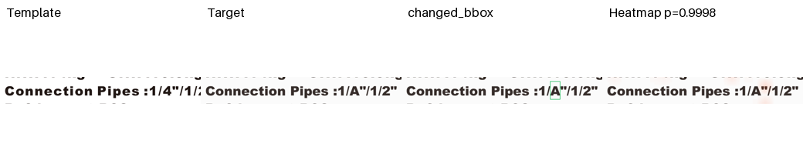
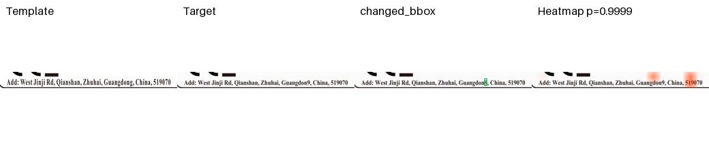
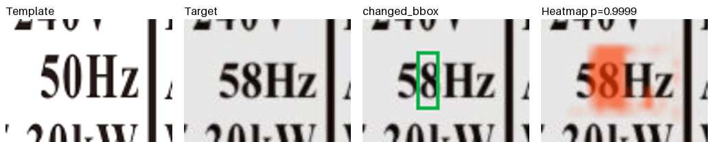

# D06 Pair Interaction A0/A1 首轮实验

> 实验日期：2026-07-28  
> 数据：`D06_pair_training_v1`  
> Backbone：冻结 DINOv2-L/14，输入 336，letterbox  
> 随机种子：20260710、20260711、20260712

## 1. 实验目的

在相同数据和 split 上比较：

- A0：M11 的四层 patch 绝对差统计池化 + 128 维 MLP，不使用 OCR；
- A1：Pair Interaction Adapter + `changed_bbox` 定位监督，不使用 OCR。

本轮只验证新结构能否同时完成二分类和字符级定位。它不是实拍泛化结论。

## 2. 派生训练数据

来源：

```text
/home/jnu/projects/dataset/outputs/datasets/D06_single_mutation_1k_v2_boxes
```

训练派生集：

```text
/home/jnu/projects/dataset/outputs/datasets/D06_pair_training_v1
```

组成如下：

| Split | Different | Same | 合计 |
| --- | ---: | ---: | ---: |
| Train | 700 | 700 | 1400 |
| Validation | 150 | 150 | 300 |
| Test | 150 | 150 | 300 |

每条 D06 变更样本产生两个 pair：

- `different`：模板 value crop 对变更后的 value crop；
- `same`：模板 value crop 对独立光度增强后的同内容模板 crop。

正负样本使用同分布的亮度、对比度、轻度高斯模糊和 JPEG 增强。增强不改变几何位置。`value_bbox` 生成候选 support，正样本 `changed_bbox` 生成定位 mask，负样本定位 mask 全零。同一 `source_sample_id` 的正负 pair 固定在同一个 split。

## 3. A1 结构与损失

A1 缓存四层归一化 DINO token 的平均特征，模板与目标分别保留。可学习部分为：

```text
共享 1024→128 projection
→ 双向局部 soft correspondence（半径 2）
→ [Pt, Px, symmetric residual, Pt*Px, confidence]
→ 1×1 interaction projection
→ depthwise 3×3 residual adapter
→ change heatmap
→ heatmap 加权池化
→ LayerNorm + Linear(1)
```

损失固定为：

```text
L = weighted BCE + 0.5 * (focal localization + Dice)
```

验证阈值规则为：在 `Recall >= 0.95` 的候选阈值中取 Precision 最高者。checkpoint 先按验证分类 Precision/F1，再按 pointing accuracy/IoU 选择。

## 4. 三 seed 结果

为公平比较，下表对 A0 也使用和 A1 相同的 `validation Recall >= 0.95` 阈值规则重新计算。

| 方法 | Test Precision | Test Recall | Test F1 | Pointing accuracy | IoU@0.5 |
| --- | ---: | ---: | ---: | ---: | ---: |
| A0 M11 visual | 1.0000 ± 0.0000 | 0.9511 ± 0.0038 | 0.9749 ± 0.0020 | - | - |
| A1 Pair Adapter | 1.0000 ± 0.0000 | 0.9444 ± 0.0454 | 0.9711 ± 0.0243 | 0.7756 ± 0.1118 | 0.5125 ± 0.0858 |

A1 各 seed：

| Seed | Threshold | Test Recall | Test F1 | Pointing | IoU@0.5 |
| --- | ---: | ---: | ---: | ---: | ---: |
| 20260710 | 0.999764 | 0.9600 | 0.9796 | 0.8333 | 0.5722 |
| 20260711 | 0.999209 | 0.9800 | 0.9899 | 0.6467 | 0.4142 |
| 20260712 | 0.999765 | 0.8933 | 0.9437 | 0.8467 | 0.5512 |

## 5. 定位可视化

下图依次为模板、目标、绿色 `changed_bbox` 和 A1 seed20260710 的红色 heatmap。热图只用于展示模型输出，`changed_bbox` 没有作为模型输入。







完整五模板示例位于 `docs/report_assets/d06_pair_interaction/`。

## 6. 结论

1. A1 尚未超过 A0 的分类基线。统一阈值后平均 F1 接近，但 A1 的跨 seed 波动明显更大。
2. A1 确实获得了 M11 不具备的字符级定位能力，测试 peak 落入 `changed_bbox` 的比例平均为 77.6%。
3. A1 输出概率接近 0/1，三个阈值都约为 0.999，说明分类分数过度饱和；A0 的阈值跨 seed 从 0.0014 到 0.7867，校准同样不稳定。
4. 本数据中的 negative 是合成的同模板光度增强，不包含真实配准误差、打印扫描形变和主流程 hard negative，所以分类任务过于容易，不能据此判断生产效果。
5. seed11 的分类最优 checkpoint 出现在定位尚未充分收敛的阶段，说明单 checkpoint 的分类优先选择会牺牲定位。下一轮应明确使用联合验证评分，或分别保存 classification-best 与 localization-best。

## 7. 下一步

下一轮不应立即增加 OCR 或更复杂 cross-attention。优先事项是：

1. 加入真实 print-scan same pair、轻微透视/配准残差和主流程 hard negative；
2. 保存 classification-best 和 localization-best 两个 checkpoint，比较二者的真实迁移；
3. 在不改变模型的前提下比较 `lambda_loc = 0.25/0.5/1.0`；
4. 完成后再将最佳配置送入新的真实盲测集。

## 8. 产物

```text
/home/jnu/projects/aa_clip_exp/results/label_pair/d06_a0_a1_three_seed_comparison.json
/home/jnu/projects/aa_clip_exp/results/label_pair/a0_d06_m11_visual_seed20260710_repro
/home/jnu/projects/aa_clip_exp/results/label_pair/a0_d06_m11_visual_seed20260711
/home/jnu/projects/aa_clip_exp/results/label_pair/a0_d06_m11_visual_seed20260712
/home/jnu/projects/aa_clip_exp/results/label_pair/a1_d06_pair_interaction_seed20260710
/home/jnu/projects/aa_clip_exp/results/label_pair/a1_d06_pair_interaction_seed20260711
/home/jnu/projects/aa_clip_exp/results/label_pair/a1_d06_pair_interaction_seed20260712
```
