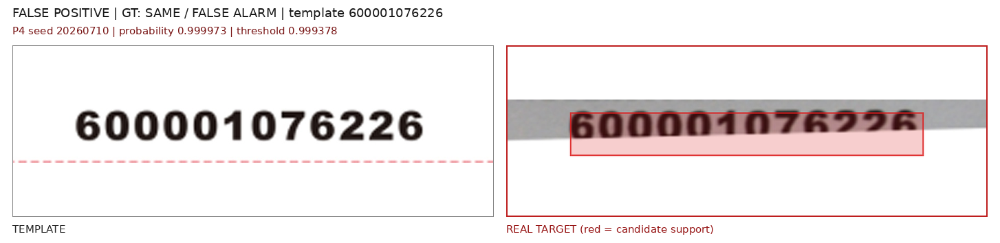
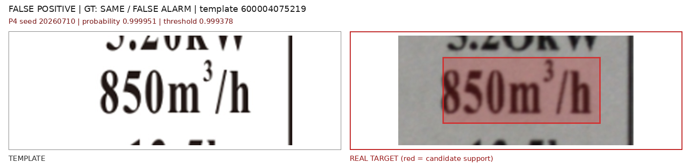
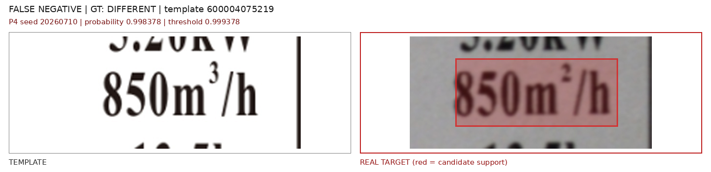
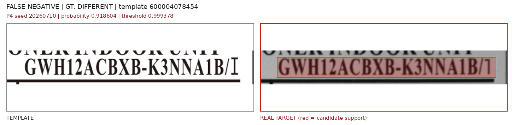
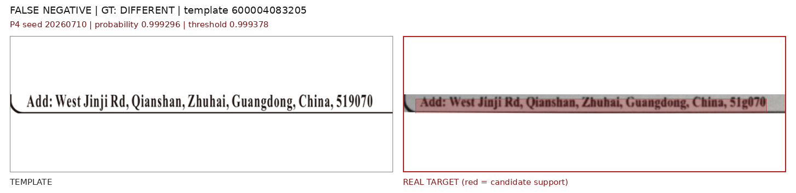

# D07/D08 真实风格增强实验

> 实验日期：2026-07-28  
> 基础数据：D06 pair training，1000 个 source group、每组一正一负  
> 模型：P0-P4，各 3 个 seed  
> 真实评估：real50 与 latest15，均为历史开发集，不是未触碰盲测集

后续 RGB/灰度/轮廓输入消融见 [C0-C3 灰度与轮廓输入消融实验](c0_c3_shape_input_ablation_experiment.md)。

## 1. 目的

D06 在合成 test 上接近饱和，但真实候选仍有大量由模糊、印刷字重、阴影和压缩造成的假阳性。本轮测试两种训练数据策略：

1. D07：只把 `same` 样本换成更强的真实风格 hard negative；
2. D08：对 `different` 和 `same` 使用标签无关、分布对称的真实风格增强。

两轮均保持网络、训练参数、D06 的 group split 和三个 seed 不变。每个 checkpoint 的阈值只由自身合成 validation 按 `Recall >= 0.95` 规则确定，真实集不调阈值。

## 2. 数据结构

### 2.1 共同结构

```text
1000 source_sample_id
├── different: 模板 vs 单处字符改动，label=1
└── same:      模板 vs 内容不变目标，label=0

train: 1400 pair = 700 different + 700 same
val:    300 pair = 150 different + 150 same
test:   300 pair = 150 different + 150 same
```

同一 `source_sample_id` 的正负 pair 始终处于同一 split；D06、D07、D08 都没有跨 split 重新抽样。

### 2.2 D07：错误的单边增强设计

D07 保留 1000 个 D06 `different` 不变，只将 1000 个 `same` 换成更强的 `soft_capture`、`print_scan`、`shadow`、`geometry`、`mixed` 变体。五种 profile 各 200 个。

该设计事后证明存在类别泄漏：强真实风格只出现在 `same`，清晰 D06 风格只出现在 `different`。模型可以通过成像风格判断标签，而不必判断字符内容。

数据：

```text
/home/jnu/projects/dataset/outputs/datasets/D07_realistic_same_v1
```

### 2.3 D08：正负对称增强

D08 从 D06 的正负目标图分别出发，给同一 source group 的两个标签分配同一种 profile，但使用独立随机参数。增强类型及数量严格按标签平衡：

| Profile | Different | Same |
| --- | ---: | ---: |
| soft_capture | 334 | 334 |
| print_scan | 333 | 333 |
| shadow | 333 | 333 |

增强包括亮度、对比度、模糊、传感器噪声、JPEG、阴影和轻度笔画膨胀/收缩。D08 有意排除旋转、平移和透视，因为当前 mutation/candidate mask 没有同步几何变换能力；这样 `changed_bbox`、`value_bbox` 和两个 mask 仍与目标图严格对齐。

构建后审计：

- 2000 pair，正负各 1000；
- 1000 个 group 均为一正一负，split 一致；
- 所有 template、target、candidate mask、mutation mask 文件存在；
- template 与 target 尺寸全部一致；
- 没有 target 与 template 文件哈希完全相同的退化样本；
- 抽查 `different` 保留原字符变化，`same` 只改变成像风格。

数据：

```text
/home/jnu/projects/dataset/outputs/datasets/D08_symmetric_capture_v1
```

## 3. D07 失败结果

D07 合成 test 仍近乎满分，P4 F1 为 `0.9795 +/- 0.0125`，但这是假象。P4 validation 阈值饱和到 `0.99963 +/- 0.00028`，冻结后在两个真实开发集上三个 seed 均没有保留任何正候选：

| 数据 | 方法 | Precision | Recall | F1 | ROC-AUC | PR-AUC |
| --- | --- | ---: | ---: | ---: | ---: | ---: |
| real50 | D07-P0 | 0 | 0 | 0 | 0.8616 | 0.6574 |
| real50 | D07-P4 | 0 | 0 | 0 | 0.5745 | 0.3117 |
| latest15 | D07-P0 | 0 | 0 | 0 | 0.8483 | 0.7429 |
| latest15 | D07-P4 | 0 | 0 | 0 | 0.5916 | 0.2899 |

P0 仍保留一定排序能力，但绝对分数整体低于合成阈值；P4 连排序能力也明显退化。结论是：**不能只增强 negative，更不能让增强 profile 与标签绑定。D07 不应继续使用。**

## 4. D08 合成结果

三 seed test 均值：

| 方法 | Precision | Recall | F1 | ROC-AUC | Pointing | IoU@0.5 |
| --- | ---: | ---: | ---: | ---: | ---: | ---: |
| P0 | 1.0000 | 0.9400 | 0.9691 | 0.9991 | - | - |
| P1 | 1.0000 | 0.9444 | 0.9714 | 0.9991 | - | - |
| P2 | 1.0000 | 0.9444 | 0.9714 | 0.9991 | - | - |
| P3 | 0.9930 | 0.9467 | 0.9693 | 0.9980 | - | - |
| P4 | 0.9978 | 0.9644 | **0.9807** | **0.9999** | **0.8089** | **0.4721** |

P4 分类与 D06 基本持平；定位比 D06 的 Pointing `0.9044`、IoU `0.5913` 下降。这说明重度成像增强有助于分类域泛化，但会模糊小字符定位监督，后续需要降低定位分支的增强强度或对定位样本使用 clean/augmented 混合训练。

## 5. D08 真实开发集结果

### 5.1 三 seed 均值

| 数据 | 方法 | Precision | Recall | Candidate F1 | ROC-AUC | PR-AUC | Box F1 |
| --- | --- | ---: | ---: | ---: | ---: | ---: | ---: |
| real50 | D08-P0 | 0.6211 +/- 0.0189 | 0.8077 +/- 0.0000 | 0.7021 +/- 0.0121 | 0.9240 | 0.7244 | 0.6800 |
| real50 | D08-P4 | 0.6121 +/- 0.0252 | **0.9679 +/- 0.0111** | **0.7497 +/- 0.0175** | **0.9381** | **0.7269** | **0.7308** |
| latest15 | D08-P0 | 0.7802 +/- 0.0095 | 0.7111 +/- 0.0385 | 0.7438 +/- 0.0256 | 0.9575 | 0.8783 | 0.7438 |
| latest15 | D08-P4 | **0.8216 +/- 0.0520** | **0.9111 +/- 0.0770** | **0.8628 +/- 0.0484** | **0.9778** | **0.9132** | **0.8628** |

### 5.2 相对原 D06-P4

| 数据 | 指标 | D06-P4 | D08-P4 | 变化 |
| --- | --- | ---: | ---: | ---: |
| real50 | Candidate F1 | 0.4902 | 0.7497 | **+0.2595** |
| real50 | ROC-AUC | 0.8362 | 0.9381 | **+0.1019** |
| real50 | Box F1 | 0.4782 | 0.7308 | **+0.2526** |
| latest15 | Candidate F1 | 0.6392 | 0.8628 | **+0.2236** |
| latest15 | ROC-AUC | 0.9579 | 0.9778 | **+0.0199** |
| latest15 | Box F1 | 0.6392 | 0.8628 | **+0.2236** |

D08 不只是移动了阈值：real50 的 ROC-AUC 和 PR-AUC 也提高，三个 seed 的 F1 方差显著小于 D06。这支持“标签对称的真实风格增强”确实改善了真实正负分离。

### 5.3 P4 逐 seed

| 数据 | Seed | TP/FP/FN/TN | Precision | Recall | F1 |
| --- | ---: | ---: | ---: | ---: | ---: |
| real50 | 20260710 | 50/28/2/184 | 0.6410 | 0.9615 | 0.7692 |
| real50 | 20260711 | 51/34/1/178 | 0.6000 | 0.9808 | 0.7445 |
| real50 | 20260712 | 50/34/2/178 | 0.5952 | 0.9615 | 0.7353 |
| latest15 | 20260710 | 13/2/2/56 | 0.8667 | 0.8667 | 0.8667 |
| latest15 | 20260711 | 15/3/0/55 | 0.8333 | 1.0000 | 0.9091 |
| latest15 | 20260712 | 13/4/2/54 | 0.7647 | 0.8667 | 0.8125 |

不能根据上述历史开发集选择 seed11。三个 seed 应视为稳定性证据，最终 checkpoint 选择仍需独立 validation 规则。

## 6. 错误样本

以下均固定展示 seed `20260710`，不是从三个 seed 中挑最好结果。左侧为模板，右侧为真实 target；红色区域是 candidate support，不是 P4 heatmap。

### 6.1 False positive

模板 `600004075219` 的 `Weight` 内容一致，但实拍字重、裁剪边界和对齐存在差异：


模板 `600001076226` 的局部文字仍因实拍模糊和位置残差触发：



latest15 中仍有少量同内容候选超过高阈值：



### 6.2 False negative

`850m3/h -> 850m2/h` 的上标变化低于冻结阈值：



另一个 real50 变化也未被保留：



latest15 的 `2000m3/h -> 2000m2/h` 是最明显失败样本，概率仅 `0.000367`。这不是轻微阈值问题，而是小面积上标差异被真实模糊和笔画增强完全压制：


长地址行中的局部字符变化仍接近阈值下方：



## 7. 结论与下一步

1. D07 是明确的负实验，根因是增强与标签绑定，必须废弃。
2. D08 是当前真实开发集上最好的 P0/P4 训练数据方案。P4 同时获得更高 F1、ROC-AUC 和更低 seed 方差。
3. D08 尚不能直接作为部署结论。real50/latest15 已被反复观察，且 D08 的合成定位指标退化、真实上标小变化仍有漏检。
4. 下一轮应保留 D08 的标签对称原则，同时将训练样本改成 clean 与 augmented 混合，降低 `print_scan` 对 positive 小字符区域的笔画强度。
5. 几何、透视和弯曲增强必须先实现图像与 `candidate_mask`/`mutation_mask` 的同步变换，再加入训练。
6. 最终验证需要新采且未触碰的正常/异常实拍集；不能继续用 real50/latest15 选 seed、调阈值或决定部署。

## 8. 代码与产物

```text
/home/jnu/projects/dataset/scripts/build_d07_realistic_same_dataset.py
/home/jnu/projects/dataset/scripts/build_d08_symmetric_capture_dataset.py
/home/jnu/projects/dataset/outputs/datasets/D07_realistic_same_v1
/home/jnu/projects/dataset/outputs/datasets/D08_symmetric_capture_v1
/home/jnu/projects/aa_clip_exp/results/label_pair/padding_ablation_p0_p4_d07_realistic_same
/home/jnu/projects/aa_clip_exp/results/label_pair/padding_ablation_p0_p4_d07_real_development
/home/jnu/projects/aa_clip_exp/results/label_pair/padding_ablation_p0_p4_d08_symmetric_capture
/home/jnu/projects/aa_clip_exp/results/label_pair/padding_ablation_p0_p4_d08_real_development
/home/jnu/projects/gree-label-detection/docs/report_assets/d08_symmetric_real_errors
```

D08 特征缓存约 4.9 GiB：

```text
/home/jnu/projects/aa_clip_exp/results/label_pair/feature_cache/d08_padding_ablation_constant_tokens.pt
```
