# D09 微小字符保真数据与 P4 复现实验

> 日期：2026-07-29  
> 结论：D09 修复了 D08 中被增强抹除的 `m³/h -> m²/h` 视觉语义，但没有提升总体 synthetic/real F1，暂不替换 D08。

## 1. 为什么构建 D09

D08 的 `print_scan` 会随机使用 3×3 `MaxFilter/MinFilter`。对于只有约 2 px 宽的上标字符，`MaxFilter` 会直接擦除暗色笔画。旧数据中：

| 样本 | D08 changed contrast | D09 changed contrast | D09 foreground fraction |
| --- | ---: | ---: | ---: |
| `B_0027`, `850m³/h -> 850m²/h` | 15.2 | 137.2 | 0.319 |
| `E_0042`, `2000m³/h -> 2000m²/h` | 15.0 | 144.8 | 0.361 |

D09 对 250 个微小 changed region 使用相同的 label-symmetric 策略：错误图和配对正确图都禁用 3×3 stroke filter，并把 blur、noise、JPEG 范围分别收紧为 `0.05–0.25`、`2–6`、`78–92`。增强策略由 source group 决定，不由 label 决定，因此没有引入 D07 式的标签泄漏。

可见性门禁只用于 8 个 `superscript` positive。删除字符的 changed region 合法地没有前景，不能使用同一门禁。上标必须同时满足：局部前景对比度不少于 60、前景面积比例不少于 0.15。8/8 全部通过。

### 修复前后

| 样本 | 模板 | D08 错误增强 | D09 修复增强 |
| --- | --- | --- | --- |
| `B_0027` |  |  |  |
| `E_0042` | 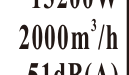 | 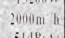 | 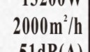 |

## 2. 数据完整性

数据目录：`/home/jnu/projects/dataset/outputs/datasets/D09_micro_preserved_capture_v1`

- 1000 个 source group、2000 个 pair，正负各 1000；
- train/val/test 为 1400/300/300，完全沿用 D06 group split；
- 每组恰好一个 different 和一个 same；profile、micro-safe policy 和 split 在两种 label 间一致；
- 2000 行引用的 template、target、candidate mask、mutation mask 共 8000 个文件均存在；
- soft/print-scan/shadow 每种 profile 的正负数量严格相等；
- 数据体积约 34.6 MB。

## 3. 训练设置

- 模型：P4，矩形宽高比分桶 + valid mask + Pair Interaction Adapter；
- backbone：冻结 DINOv2 ViT-L/14，层 `5,11,17,23`；
- loss：`BCEWithLogitsLoss + 0.5 × localization_loss`；
- epoch：30；seed：20260710、20260711、20260712；
- threshold：各 seed 在 D09 validation 上按 Recall >= 0.95 冻结，然后原样用于 synthetic test 和真实集；
- 只运行 P4，没有重复 P0–P3。训练脚本新增向后兼容的 `--variants` 参数，默认仍运行 P0–P4。

结果目录：`/home/jnu/projects/aa_clip_exp/results/label_pair/padding_ablation_p4_d09_micro_preserved`

## 4. Synthetic 总体结果

| 训练数据 | Precision | Recall | F1 | Pointing accuracy | IoU@0.5 |
| --- | ---: | ---: | ---: | ---: | ---: |
| D08-P4，3 seed mean | 0.9978 | 0.9644 | 0.9807 | 0.8089 | 0.4721 |
| D09-P4，3 seed mean | 1.0000 | 0.9578 | 0.9783 | 0.8067 | 0.4751 |

D09 的总体 F1 没有超过 D08。三个 seed 的 D09 test Recall 分别为 0.9800、0.9333、0.9600。主要不稳定类型是 `confusable`，三个 seed 分别检出 37/39、32/39、34/39；并非所有总体波动都来自上标。

## 5. 上标定向结果

### 5.1 精确业务值

| Positive pair | D08 seed10/11/12 | D09 seed10/11/12 | 结论 |
| --- | --- | --- | --- |
| `B_0027`, 850 的 `3 -> 2` | 0/3 | 0.999960 / 0.999783 / 0.999932，3/3 | 稳定漏检已修复 |
| `E_0042`, 2000 的 `3 -> 2` | 3/3，但属于 train | 0.999961 / 0.999724 / 0.999912，3/3 | 仍为 3/3 |

### 5.2 全部 8 个 superscript source group

该集合覆盖 train 4 组、val 3 组、test 1 组，用于逐样本审计增强语义和模型响应，不是独立泛化指标；独立 test 中只有 `B_0008` 一个 superscript positive。

| Seed | TP/FP/FN/TN | Precision | Recall | F1 |
| ---: | ---: | ---: | ---: | ---: |
| 20260710 | 8/0/0/8 | 1.000 | 1.000 | 1.000 |
| 20260711 | 5/0/3/8 | 1.000 | 0.625 | 0.769 |
| 20260712 | 8/0/0/8 | 1.000 | 1.000 | 1.000 |

三 seed 平均 Recall 仍为 0.875，与 D08 离散均值相同；区别是 D08 的 `B_0027` 三次稳定失败，D09 已三次稳定通过，而 seed11 在 `B_0008/C_0021/E_0025` 上低于其 0.999399 阈值。三者概率为 0.998919、0.999123、0.999375，后两者尤其接近阈值，说明还存在 seed 与阈值校准问题。

| seed11 漏检 | 模板 | D09 错误图 |
| --- | --- | --- |
| `B_0008` | 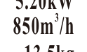 | 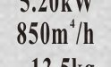 |
| `C_0021` | 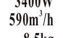 | 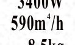 |
| `E_0025` |  | 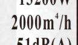 |

## 6. 真实集结果

| 数据集 | 训练数据 | Precision | Recall | Candidate F1 | Box F1 |
| --- | --- | ---: | ---: | ---: | ---: |
| real50 | D08 | 0.6121 | 0.9679 | 0.7497 | 0.7308 |
| real50 | D09 | 0.6409 | 0.8462 | 0.7279 | 0.7065 |
| latest15 | D08 | 0.8216 | 0.9111 | 0.8628 | 0.8628 |
| latest15 | D09 | 0.8567 | 0.8000 | 0.8267 | 0.8267 |

D09 在两个真实集上都是 Precision 上升、Recall 明显下降，最终 F1 下降。因此不能只根据 `B_0027` 修复就将 D09 作为新默认模型。

两个业务上标实拍的 D09 结果：

- 850：三个 seed 均正确，概率 0.999957、0.999891、0.999956；
- 2000：seed10/11 失败、seed12 正确，概率 0.998458、0.998747、0.999215；对应阈值为 0.999624、0.999399、0.998186。

### 真实稳定漏检样本

| 数据集与 pair | 模板 | 实拍 target | 三 seed 概率 |
| --- | --- | --- | --- |
| latest15 `600004083205...pair_001` |  | 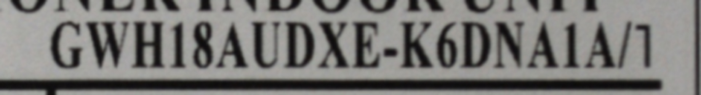 | 0.999152 / 0.694472 / 0.996355 |
| latest15 `600004078454...pair_004` |  | 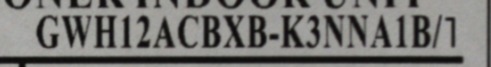 | 0.998724 / 0.800271 / 0.996350 |
| latest15 2000 上标 | 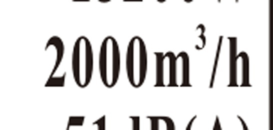 | 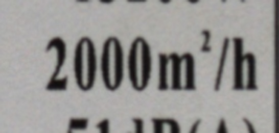 | 0.998458 / 0.998747 / 0.999215 |
| real50 `600004078454...164613...pair_001` |  | 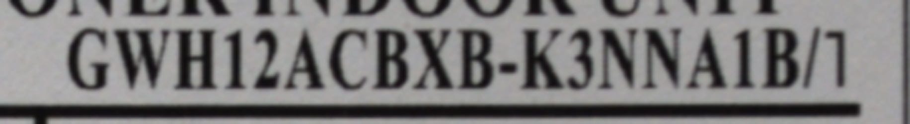 | 0.990762 / 0.008218 / 0.995401 |
| real50 `600004078454...164604...pair_004` | 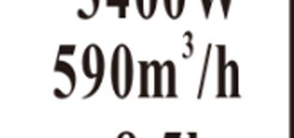 | 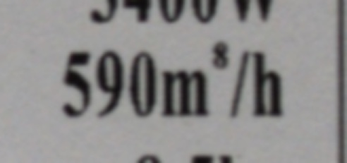 | 0.999019 / 0.994017 / 0.081356 |

## 7. 结论与下一步

1. mutation preservation gate 是必要的数据质量约束；它确实修复了 D08 的语义损坏，而不是靠换颜色空间掩盖问题。
2. 目前只有 8 个 superscript source group，其中 test 只有 1 个，样本量不足以稳定学习 subtype；D09 不能证明上标问题已解决。
3. 阈值普遍在 0.998–0.9996，许多 false negative 与阈值仅差 `1e-4–1e-3`。下一轮应在不触碰 real test 的前提下，使用独立 synthetic/real validation 做校准，并同时报告阈值无关的 PR-AUC。
4. 下一版 D10 应增加单一上标变化的 clean/soft/print-scan 强度阶梯，并按模板、业务值、`3->2/3->4`、profile 平衡；不能只复制同一渲染图来凑数量。
5. D08 保持当前总体基线；D09 作为数据修复分支保留，用于 D10 设计与定向训练，不直接替换生产 checkpoint。

## 8. 可复核结果

```text
/home/jnu/projects/dataset/outputs/datasets/D09_micro_preserved_capture_v1
/home/jnu/projects/aa_clip_exp/results/label_pair/padding_ablation_p4_d09_micro_preserved
/home/jnu/projects/aa_clip_exp/results/label_pair/p4_d09_micro_preserved_targeted_eval_20260729_v4
/home/jnu/projects/aa_clip_exp/results/label_pair/p4_d09_micro_preserved_test_predictions_20260729
```
