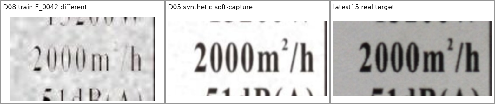
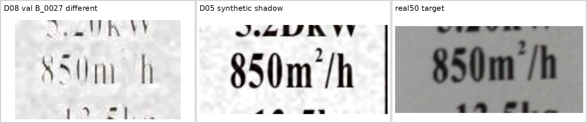

# 上标变化合成-实拍对应审计

> 后续修复与复现实验见：[D09 微小字符保真数据与 P4 复现实验](d09_micro_preservation_experiment.md)。D09 修复了 `B_0027` 的三 seed 稳定漏检，但真实集总体 F1 未提升，因此没有替换 D08 基线。

> 日期：2026-07-29  
> 模型：D08-P4，seed 20260710/11/12  
> 阈值：各 checkpoint 在 D08 synthetic validation 上按 Recall >= 0.95 冻结  
> 范围：`850m3/h -> 850m2/h` 与 `2000m3/h -> 2000m2/h`

## 1. 对应关系

这里的“对应”分成两个层次：

1. real 与 D05 synthetic 使用同一 PDF 模板、相同 review line、相同 `3 -> 2` mutation 和相同/近似候选框，可以比较模型是否在同一业务变化上犯同类错误；
2. 二者不是同一 source image 的逐像素配对。真实 target 来自相机，synthetic target 来自 PDF 渲染与增强，不能称为严格 paired capture。

| 业务值 | 实拍 pair | D05 同业务合成 pair | D08 原生精确 pair |
| --- | --- | --- | --- |
| 2000m3/h | `600004085656_20260701-150603-071461_600004085656__pair_005` | `600004085656_sample_0001__original/aug_01__pair_002` | `E_0042_different_symmetric_capture` |
| 850m3/h | `600004075219_20260712-164003-223444_600004075219__pair_004` | `600004075219_sample_0056__original/aug_01__pair_003` | `B_0027_different_symmetric_capture` |

2000 的 real 与 D05 synthetic 候选框均为 `[512,533,654,584]`，review box 均为 `[480,515,662,602]`。850 的 candidate box 均为 `[867,226,990,277]`，review box 只相差左边界 4 px。对应关系足以进行候选确认器的同业务对照。

## 2. 外观对照





D05 synthetic 和 real 都保留可辨认的上标 `2`。D08 的 `print_scan` 样本中，上标笔画几乎完全消失；`different` 和对应 `same` 在上标位置都缺少可靠视觉内容。这是数据生成问题，不是 RGB/灰度输入问题。

## 3. D08 全部 superscript 结果

D08 共 8 个 superscript source group，每组一正一负：train 4 组、val 3 组、test 1 组。P4 三个 seed 得到完全相同的离散结果：

| Precision | Recall | F1 | TP/FP/FN/TN | 稳定失败 |
| ---: | ---: | ---: | ---: | --- |
| 1.0000 | 0.8750 | 0.9333 | 7/0/1/8 | `B_0027` |

因此“合成 superscript 基本可以识别”成立，但不能据此认为问题已解决：唯一的 `B_0027` 在三个 seed 上都失败，而且概率只有 `0.00019-0.00087`，不是阈值轻微偏高。

两个精确 `3 -> 2` D08 pair：

| Pair | 所属 split | seed10 | seed11 | seed12 | 结果 |
| --- | --- | ---: | ---: | ---: | --- |
| E_0042 / 2000 | train | 0.999941 | 0.999886 | 0.999935 | 3/3 正确 |
| B_0027 / 850 | val | 0.000214 | 0.000867 | 0.000193 | 0/3 正确 |

E_0042 是训练样本，模型可能利用了增强残差或记忆该样本；它不能证明模型真正看到了已被 `print_scan` 抹掉的上标。B_0027 的跨 seed 稳定失败是更可信的泛化证据。

## 4. 同业务 synthetic-real 对照

冻结阈值分别为 `0.999378`、`0.999570`、`0.999630`。

### 4.1 2000m3/h -> 2000m2/h

| Seed | D05 original | D05 soft-capture | latest15 real | synthetic/real 是否同结论 |
| ---: | ---: | ---: | ---: | --- |
| 20260710 | 0.018024 / FN | 0.167809 / FN | 0.000367 / FN | 是，均失败 |
| 20260711 | 0.999924 / TP | 0.999935 / TP | 0.999878 / TP | 是，均正确 |
| 20260712 | 0.999863 / TP | 0.999754 / TP | 0.999531 / FN | 否，实拍略低于阈值 |

2000 的错误具有明显的模型 seed 成分：seed10 在清晰合成、增强合成和实拍上都失败；seed11 三者都正确。seed12 能识别合成，但实拍概率只比阈值低 `0.000098`，属于域偏移叠加极高阈值导致的边缘失败。

### 4.2 850m3/h -> 850m2/h

| Seed | D05 original | D05 shadow | real50 real | synthetic/real 是否同结论 |
| ---: | ---: | ---: | ---: | --- |
| 20260710 | 0.999965 / TP | 0.999973 / TP | 0.999960 / TP | 是，均正确 |
| 20260711 | 0.999969 / TP | 0.999981 / TP | 0.999965 / TP | 是，均正确 |
| 20260712 | 0.999963 / TP | 0.999969 / TP | 0.999934 / TP | 是，均正确 |

850 在 D05 synthetic 和 real50 上完全一致地正确。D08 原生 B_0027 失败，不是业务值本身更难，而是该 D08 `print_scan` 样本把细小上标抹掉了。

## 5. 结论

1. 合成数据中确实存在 `m3/h -> m2/h`，当前 P4 对全部 D08 superscript 的 Recall 为 0.875，不是全部正确。
2. 合成与实拍错误位置具有部分一致性。2000 的 seed10 在两域都失败，seed11 在两域都正确；850 三个 seed 在 D05 synthetic 和 real 上都正确。
3. 2000 漏检不能只归因于实拍颜色、模糊或分辨率。它同时包含模型 seed 不稳定、极高阈值和合成数据质量问题。
4. D08 的 `print_scan` 对小上标过强，已经破坏 semantic change。数据构建必须增加 mutation preservation gate：增强后 changed region 必须仍有足够前景对比，并且 positive 与 paired same 在 changed region 的差异必须超过下限。
5. superscript 应按 mutation subtype 单独报告 Recall，不能再被整体 synthetic F1 0.98 掩盖。
6. 修复数据后，应重建一组“单一上标变化、无其他 mutation”的 clean/soft/print-scan 强度阶梯，并在新 real final set 上验证。

## 6. 结果目录

```text
/home/jnu/projects/aa_clip_exp/results/label_pair/d08_all_superscript_p0_p4_20260729
/home/jnu/projects/aa_clip_exp/results/label_pair/superscript_exact_d08_p0_p4_20260729_v2
/home/jnu/projects/aa_clip_exp/results/label_pair/superscript_2000_synthetic_d08_p0_p4_20260729
/home/jnu/projects/aa_clip_exp/results/label_pair/superscript_850_synthetic_d08_p0_p4_20260729
```
