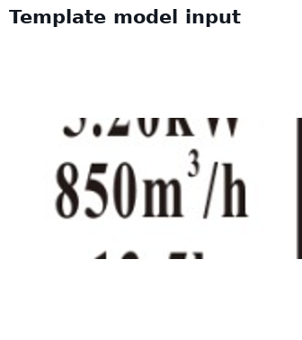
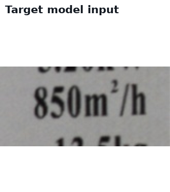
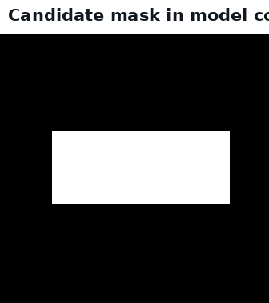
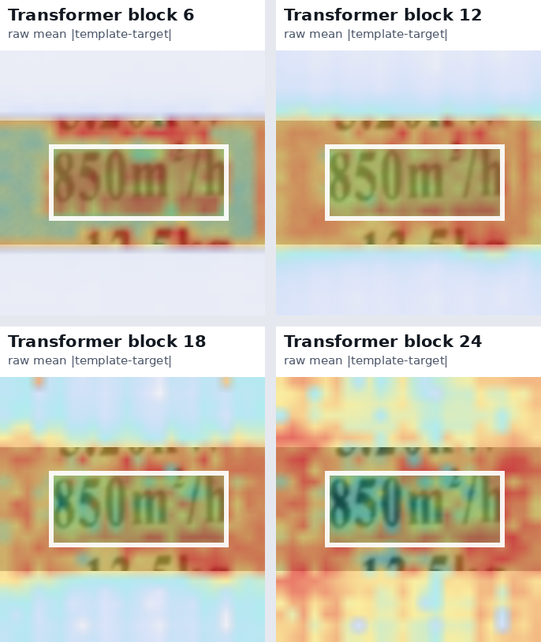
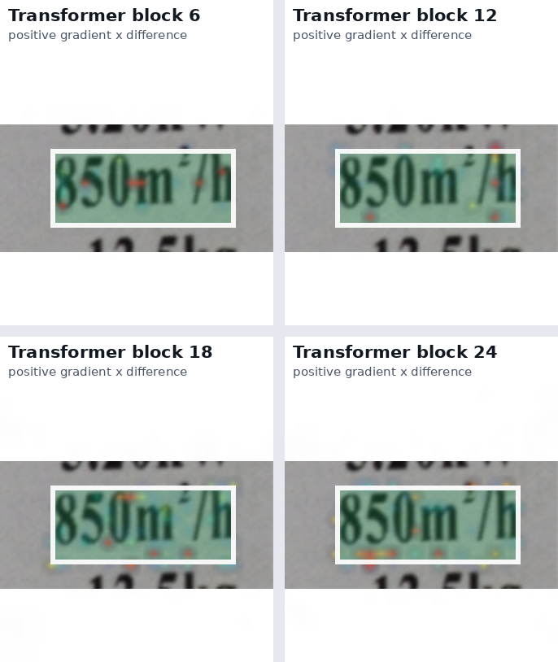
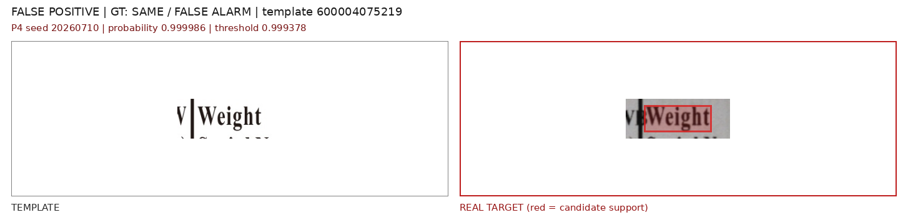
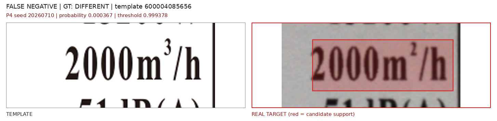
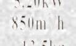
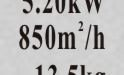

# 标签细粒度差异检测项目阶段总结

## 1. 项目要解决什么问题

我围绕工业标签的细粒度差异检测开展了这项工作。目标是：**拿一张标准标签模板和一张相机拍摄的标签进行比较，判断标签上是否真的有文字或图形内容被印错、漏印、多印或改动，同时忽略拍摄、打印、模糊和对齐造成的假差异。**

这项工作不是单纯做一套 OCR，也不是只做图片相似度判断，而是希望让系统在真实拍摄条件下可靠地找出标签内容本身的变化。

项目的实际输入是一张标准模板（主要是 PDF）和一张相机拍摄的标签。输出包括：是否存在内容差异、差异位置，以及最终是否通过检查。

目前已经完成了主流程、数据集、人工标注、候选确认模型和多轮对照实验。现在还没有把某个模型称为最终模型，因为真实盲测集和跨域校准还没有完成。

## 2. 先看一个具体例子

系统输入一张模板标签和一张实拍标签。两张图先经过对齐，再由传统图像差分产生“疑似有问题”的候选区域。模型需要判断这个候选是：

- `different / keep`：确实发生了内容变化，应保留；
- `same / discard`：只是模糊、阴影、印刷字重、局部错位等造成的假差异，应丢弃。

例如，模板中的 `850m³/h` 被拍摄标签印成 `850m²/h`。真正变化只有一个很小的上标字符，但整行中其他内容基本相同。模型既要看到这个小变化，也要避免把整行的拍摄噪声当成错误。







这也是本项目与普通“单张图片异常检测”的区别：这里不是判断一张图是否异常，而是**在明确参考模板的条件下，比较同一位置的两张局部图像**。

## 3. 系统流程，以及本项目改了哪里

原来的系统已经能够完成模板解析、实拍图对齐、文字/图形差异检测和结果输出，但最后的候选确认主要依赖 VLM，速度较慢。本项目保留前面的检测主线，重点改最后一步：把候选位置的模板和实拍图裁成一对输入，研究更快的成对判别器能否替代或辅助 VLM。

```text
模板 PDF/图片 + 实拍标签
        ↓
透视校正、特征匹配和 ECC 对齐
        ↓
传统容差差分，产生局部疑似候选
        ↓
将候选扩展到 PDF 预设的完整文字行/业务区域
        ↓
模板 crop + 实拍 crop 成对送入判别器
        ↓
keep/discard
        ↓
显示框 refine/merge
        ↓
最终检测框、结果 JSON 和可视化
```

这里有一个必须保持的评估纪律：传统差分最先产生的小框只是 `trigger candidate`，不是最终结果。最终指标要使用经过文字行映射、框修正和合并后的显示框。否则会把一个真实错误产生的多个中间小框错误地算成多个误报。

## 4. 数据集和评估准备

### 4.1 工程和评估准备

- 固定桌面端默认主流程为 `traditional_full_image_diff`；
- 统一模板、实拍图、候选框、review crop 和最终 display box 的坐标体系；
- 建立人工 GT 工作区和可视化评估脚本；
- 将候选阶段漏检与判别器漏检区分开；
- 对 PDF 型号主体和 `/I` 后缀进行整行合并；
- 修复合成数据中的错误透视/单应变换污染；
- 固定阈值规则：主要使用合成 validation 上满足 `Recall ≥ 0.95` 的阈值，真实开发集不调阈值。

### 4.2 数据准备

围绕 5 个固定模板建立了多代合成数据：

| 数据版本 | 实际作用 | 主要结论 |
| --- | --- | --- |
| D01–D04 | 打通合成样本、候选导出、正负 pair 和 split | 验证训练闭环，逐步增加困难变化 |
| D05 | 五模板 specialist 大样本 | 300 个独立 mutation、750 个 case、候选 pair 约 3 千级；后发现早期版本有配准污染 |
| D06 | 1000 个单变更样本 | 每个样本只改变一个字符或一个局部内容，并提供精确 `changed_bbox` / `value_bbox` |
| D07 | 只增强 same/negative 的真实风格数据 | 明确失败，暴露了增强与标签绑定造成的数据捷径 |
| D08 | different 和 same 对称真实风格增强 | 当前真实开发集上最好的训练数据策略 |
| D09 | 修复微小上标被增强抹除 | 数据语义修复成功，但总体真实 F1 尚未提升 |

D06 的 1000 个单变更样本中，变异类型包括易混字符、普通替换、插入、删除、重复、交换、大小写和上标。需要注意：上标只有 8 个唯一组合，因此它不是一个足以单独证明上标泛化的均衡数据集。

## 5. 模型结构和研究思路

### 5.1 将工业标签检查定义为参考条件下的成对差异确认

现有许多异常检测方法输入单张待测图，再与一个“正常/异常”概念比较。本项目利用了工业标签检查中天然存在的参考模板，将任务定义为：

> `template crop + target crop → same/different`

这样模型学习的是“同一位置的内容是否改变”，而不是笼统地学习“这张照片看起来是否异常”。

### 5.2 局部、成对、候选感知的视觉结构

模型不是只比较整张 crop 的一个全局向量，而是：

- 使用共享的 DINOv2 backbone 分别提取模板和目标的多层 patch token；
- 在对应位置或局部邻域内比较模板 token 与目标 token；
- 将候选区域作为有效搜索范围；
- 使用 Pair Interaction Adapter 在空间池化前进行模板—目标交互；
- 同时输出 `keep/discard` 判断和变化热图，支持字符级定位。


这比“直接计算两张图片的 cosine 距离”多利用了参考关系、空间位置和候选区域信息。

### 5.3 OCR 作为数值证据，而不是依赖提示词

实验表明，泛化的“same/different”文字提示以及 PDF 文本的 CLIP 文本嵌入没有带来稳定收益；更有用的是把模板 OCR 和目标 OCR 的关系编码为数值特征，例如：

- 是否读到了文字；
- 两侧文本是否严格相等；
- 编辑距离和序列相似度；
- 插入、删除、替换比例；
- 两侧 OCR 置信度；
- 与模板预期文字的相似度。

OCR 不是最终真值，因为真实拍摄中 OCR 也会出错；它被作为视觉特征之外的辅助证据，并显式保留 OCR 失败和低置信度情况。

### 5.4 精确的字符级变化监督

D06 之后的数据集不再只保存“这一行有变化”的粗框，而是同时保存：

- `changed_bbox`：实际变化字符的范围；
- `value_bbox`：完整业务值的范围，用于上下文输入；
- `mutation_strategy`：替换、插入、删除、重复、交换、大小写、上标等；
- 合成与真实数据的 split 和 case 级关系。

这使模型可以同时评估分类和定位，也能审计“模型是否真的关注了变化字符”。

## 6. 实验阶段和内部编号如何理解

内部编号并不都代表同等性质的“主实验”。可以分成三类：

| 类型 | 作用 | 例子 | 应如何解读 |
| --- | --- | --- | --- |
| 可行性/先导实验 | 判断一个想法是否值得继续 | E00 裸 CLIP、M01/M02 小样本 global head | 证明接口或机制可行，不作为最终结论 |
| 控制变量主实验 | 在相同数据、split、seed 下比较方法 | M03 patch、M06 OCR、M11 DINOv2+letterbox、P0–P4 | 可用于研究结论，但仍需看真实域迁移 |
| 负结果/诊断实验 | 排除错误方向、定位瓶颈 | M05 adapter、M12 candidate-only OCR、D07 单边增强、A2 合成正真实负 | 不是“白做”，而是说明哪些方向不能继续堆叠 |

因此，`M11`、`D08`、`P4` 并不是三个互相独立的模型类别：

- `M11`：早期 DINOv2 + letterbox + patch/OCR 的快速判别基线；
- `D08`：训练数据版本，表示标签对称的真实风格增强；
- `P4`：模型结构版本，表示矩形输入 + Pair Interaction Adapter + 定位监督。

例如“D08-P4”应读作：**用 D08 数据训练 P4 结构**，而不是一个神秘的新算法名称。

## 7. 关键实验进展（按研究节点而不是编号排列）

### 节点一：确认裸图像相似度不能直接完成任务

最早的裸 CLIP cosine 只把模板和目标压成两个全局向量，再用一个距离阈值判断。latest15 上：

| 方法 | TP | FP | FN | F1 | 典型速度 |
| --- | ---: | ---: | ---: | ---: | ---: |
| 裸 CLIP cosine | 3 | 4 | 12 | 0.2727 | 约 0.8 秒/图 |
| 同输入 VLM | 13 | 5 | 2 | 0.7879 | 约 23 秒/图 |

候选框和 review crop 已验证一致，因此这个结果主要反映判别器能力差异。结论是：速度快的全局 cosine 不能直接替代 VLM，需要监督式成对建模。

### 节点二：从全局特征转向局部 patch 和 OCR

在 D04/D05 合成数据上，局部 patch 成对特征优于全局特征。OCR 消融进一步显示，真正有效的是 OCR 数值差异特征，而不是 generic prompt。

| 方向 | 结果 | 结论 |
| --- | --- | --- |
| Global pair head | 比裸 cosine 更能利用特征交互 | 成对监督是有效方向 |
| Multi-layer patch pair | D04 三 seed 平均 F1 约 0.7009，高于 global 约 0.5191 | 局部对应适合字符级变化 |
| Generic/PDF CLIP text | 没有稳定提升 | 暂不继续 prompt engineering |
| OCR 数值分支 | D04 三 seed 平均 F1 从约 0.7345 提升到约 0.8333 | OCR 作为辅助证据保留 |

这些早期实验的正样本量较小，主要用于验证方向，不应单独作为论文最终表格。

### 节点三：DINOv2 + letterbox 成为快速基线

宽长文字行如果使用 center crop，可能把型号或单位两端裁掉；letterbox 可以保留完整候选。DINOv2 与 letterbox 联合时，在历史 real50 开发集上明显优于其他组合：

| 配置 | real50 三 seed 平均 F1 | 说明 |
| --- | ---: | --- |
| CLIP + center crop | 0.8310 | 边界误报较多 |
| CLIP + letterbox | 0.8158 | 单独换预处理无稳定收益 |
| DINOv2 + center crop | 0.8321 | 单独换 backbone 无稳定收益 |
| **DINOv2 + letterbox（M11）** | **0.9037** | 当前快速基线，召回较高 |

该结果来自已反复使用的 real50 开发集，不是最终盲测结果。M11 seed10 的历史最终框结果是 `48 TP / 6 FP / 2 FN，F1=0.9231`，速度约为 0.4 秒级/图。

### 节点四：修复候选规则和合成配准污染

后续审计发现两个重要问题：

1. 某些 PDF 型号主体和 `/I` 被拆成不同区域，候选没有覆盖完整业务值；
2. 旧合成样本中，条码局部匹配可能产生约 0.2 倍的错误单应缩放，把模板文字映射到了错误位置。

修复后形成干净的 D05v5/prealigned 数据，并将旧污染数据上的指标标记为过时。这个步骤不直接提高某个模型分数，但它保证后续实验不建立在错误训练数据上。

### 节点五：用 D06 把“能不能定位到字符”单独做成可验证问题

D06 只包含单一内容变更，并提供精确字符框。基于它构建的 P4 Pair Interaction Adapter 在合成测试上得到：

| 结构 | F1 | Pointing accuracy | IoU@0.5 |
| --- | ---: | ---: | ---: |
| P0：原 M11 统计池化 | 0.9784 | 不适用 | 不适用 |
| P4：成对交互 + 定位监督 | **0.9807** | **0.9044** | **0.5913** |

P4 的分类提升很小，但它多了字符级变化热图和定位能力。这个阶段的主要意义是验证结构机制，而不是宣称已经解决真实照片。

### 节点六：对真实风格增强进行对称化

D07 只给 same/negative 增加真实风格，造成模型把“真实风格”当成负标签线索，真实集几乎不保留正样本。这个失败促成了 D08：different 和 same 使用同分布、标签无关的增强。

D08-P4 的历史真实开发集结果：

| 数据集 | Candidate F1 | Box F1 | Recall | 说明 |
| --- | ---: | ---: | ---: | --- |
| real50 | 0.7497 | 0.7308 | 0.9679 | 相比 D06 明显改善 |
| latest15 | 0.8628 | 0.8628 | 0.9111 | 仍是开发集 |

相对 D06-P4，real50 框 F1 从 0.4782 提升到 0.7308。这是目前最有说服力的数据改进，但仍存在大量真实误报，不能直接部署。

### 节点七：修复上标增强损坏，但发现“局部修复不等于总体提升”

D08 的 print-scan 增强会抹掉约 2 像素宽的上标。D09 增加了 mutation preservation gate，保证增强后 changed region 仍有足够前景对比。

结果：`850m³/h → 850m²/h` 的合成稳定漏检被修复，但总体结果下降：

| 训练数据 | real50 Box F1 | latest15 Box F1 | 结论 |
| --- | ---: | ---: | --- |
| D08 | 0.7308 | 0.8628 | 当前总体基线 |
| D09 | 0.7065 | 0.8267 | 数据质量修复分支，不替换 D08 |

这说明不能只看某一个困难样本；需要同时报告总体指标、按变异类型的指标和真实域结果。

### 节点八：验证正常实拍参考和局部度量损失

正常实拍参考可以降低 PDF 与相机外观差异：

| 参考图 | real50 Box F1 | 平均 FP | Recall |
| --- | ---: | ---: | ---: |
| PDF | 0.7308 | 34.0 | 0.9679 |
| 正常实拍 donor | 0.7638 | 22.67 | 0.9038 |

方向有效，但召回下降，说明不能直接用一张正常实拍替换 PDF 参考，需要构建每模板 reference bank，并让模型学习“正常外观变化的范围”。

局部度量损失 A2 在 D06 合成集上将 F1 从 0.9711 提高到 0.9830、定位指标也提高，但 real50 框 F1 从 0.5237 降到 0.4477。这是典型的“合成正、真实负”：不能继续只在合成数据上调 margin 或叠加 adapter，必须先补真实训练分布。

## 8. 当前结果怎么理解

不要说“已经找到最终最优模型”。更准确的说法是：

### 生产对照

- **27B VLM V2.2**：当前精度最高，real50 框 F1=`0.9263`，latest15=`0.9286`，但单候选约 5 秒，整图约 27 秒；
- **DINOv2 M11 seed10**：速度快，历史 real50 最终框 F1=`0.9231`，但误报多于 VLM；
- **4B VLM LoRA**：real50 框 F1=`0.9053`，约 2.87 秒/候选，尚未替换 27B。

### 研究候选

- **D08-P4**：目前真实域训练策略和 Pair Interaction 结构的最佳组合，real50 框 F1=`0.7308`；
- **D09-P4**：上标数据质量修复分支，未超过 D08；
- **A2**：局部度量辅助损失，合成集有效但真实迁移变差；
- **C1 灰度 / C2 局部归一化 / C3 轮廓通道**：没有形成稳定收益，RGB 主干保留。

这些结果不能直接横向当成同一实验表，因为它们使用了不同的数据版本、训练结构和评估目的。论文中应按实验组分表，并说明哪些是机制验证、哪些是主比较、哪些是负结果。

## 9. 当前明确存在的限制

### 9.1 真实数据仍是开发集

real50 和 latest15 已经被用于观察错误、选择结构和判断下一步，不能再充当未触碰的最终测试集。当前文档和产物中尚未看到已经完成的独立 `real train / real validation / untouched final test`。

### 9.2 候选生成和判别器不能混为一谈

如果传统差分没有产生覆盖 GT 的 candidate，pair 判别器没有机会恢复它。这类错误属于候选召回或 PDF 行映射问题，不应计入模型 FN。

### 9.3 分数严重饱和，跨域阈值不稳定

许多 P4/A2 checkpoint 在合成 validation 上的阈值接近 0.999，真实样本的概率也挤在 0.99–1.00 附近。阈值轻微变化就可能造成多个 FP 或 FN，因此后续必须报告 PR-AUC、阈值方差、ECE/Brier 等校准指标，不能只报一个 F1。

### 9.4 上标和微小字符样本仍不足

上标变异的数量很少，而且真实上标差异会受到模糊、笔画和对齐误差影响。D09 修复了增强把上标抹掉的问题，但并不等价于“上标已经解决”。

### 9.5 部分旧文档存在版本叠加

主日志的开头状态表仍停留在较早阶段，例如仍把精确 mutation mask 写成 TODO；实际后续 D06/P4 已经完成了这部分工作。后续整理论文时，应以日期较新的 D06–D09 文档和结果目录为准，并把早期日志作为历史记录。

## 10. 下一步

### 10.1 建立真正独立的真实数据划分

按 case 或拍摄 session 分组采集：

- 内容不变的正常实拍；
- 真实字符变化实拍；
- 模糊、反光、透视、弯曲、打印纹理和局部配准残差；
- 主流程实际产生的 hard negative。

重点覆盖 `600001076226` 型号行、`600004075219` 的高误报区域、`m³/h` 上标、`/I` 后缀和 `I/1/l`、`O/0` 等易混字符。

切分必须是：

```text
real train / real validation / untouched final test
```

阈值在 validation 选择，final test 在配置冻结后只运行一次。

### 10.2 先审计前处理，再比较模型

逐例检查：

```text
trigger candidate
→ PDF 整行 review region
→ template/target crop
→ keep/discard
→ display box refine/merge
```

尤其核查上标覆盖、型号主体与 `/I` 合并，以及候选阶段漏检是否被误认为判别器漏检。

### 10.3 在新 validation 上冻结比较

建议至少比较：

1. 27B VLM V2.2；
2. M11 DINOv2-letterbox；
3. D08-P4；
4. A2 的低权重/低 margin 版本；
5. PDF reference 与正常实拍 reference bank。

只有新真实 validation 上的结果稳定后，才决定是否进入更复杂的置信度感知 correspondence 结构。

## 11. 论文整理方向

可以开始按论文方式整理，但目前更适合表述为**有明确问题定义和实验线索的初稿/工作稿**，还不能把“已经达到 CVPR 水平”作为当前结论。

潜在论文主线可以是：

1. 将工业标签检查形式化为 reference-conditioned pairwise fine-grained difference verification；
2. 提出候选感知、多层局部成对交互和字符级定位的轻量模型；
3. 构建单变更、精确 mask、真实风格对称增强的数据与评估协议；
4. 系统分析合成到真实的域差距、正常实拍参考、上标保真和阈值校准。

论文中必须诚实保留负结果：

- 裸 cosine 失败；
- generic prompt 失败；
- 单边增强 D07 失败；
- 复杂 adapter 不稳定；
- A2 局部度量损失合成有效、真实退化；
- D09 修复局部上标但总体未提升；
- 灰度/轮廓直接替换 RGB 没有稳定收益。

这些负结果反而可以构成论文的实验分析价值，但前提是增加独立真实 final set，并把所有主比较放在统一数据、统一阈值和完整 replay 口径下。

## 12. 代表性实例图

前面各节的结论都来自实际运行结果。这一节把最能说明问题的几张图直接放出来，并说明每张图证明了什么。

### 12.1 模型看到的差异：原始逐层差异与学习到的归因

下面两张图用的是同一个 `850m³/h → 850m²/h` 样本，取 DINOv2 的第 6、12、18、24 个 transformer block，白框是候选区域。



直接对每层的 patch token 取绝对差再平均，整片区域都是高响应：文字边缘、背景底色和光照变化的差异强度和真正变化的上标处于同一量级，浅层尤其明显。这说明只靠原始特征距离无法区分内容变化和拍摄噪声。



改用训练后的正梯度乘差异做归因，响应收缩到少数位置，背景和整行文字边缘基本消失。这是加入成对交互和定位监督之后才出现的效果，也是 P4 能给出字符级热图的依据。

### 12.2 字符级定位结果


四联图从左到右是模板、实拍目标、标注的 `changed_bbox` 和 P4 输出的热图。这一例把 `Connection Pipes :1/4"/1/2"` 改成了 `1/A"/1/2"`，整行只有一个字符不同。模型给出 `p=0.9998` 判为 different，热点也落在被改的字符上，说明分类结果不是靠整行的整体差异蒙对的。

### 12.3 合成数据的样子


D06 的每个样本都是一张完整标签，只改一处内容。这一例改的是 Air Flow Volume 行的 `850m³/h`，橙色虚线框是记录下来的变化位置。变化范围只有两像素左右宽，而整张标签有大量与之无关的文字、条码和图形，这正是任务的难点所在。

### 12.4 D08-P4 在真实照片上的两类典型错误

以下两例来自同一个 checkpoint（P4 seed 20260710，阈值 0.999378），说明真实域的主要问题不是模型完全不工作，而是分数分布和真实变化不匹配。



模板 `600004075219`，人工 GT 是 same。模板与实拍在 `Weight` 这一处只有拍摄清晰度和裁切范围的差别，模型却给出 `0.999986`，高于阈值，判成内容变化。这类误报是真实域 precision 上不去的主要来源。



模板 `600004085656`，人工 GT 是 different，`2000m³/h` 被印成 `2000m²/h`。模型只给出 `0.000367`，远低于阈值，完全漏掉。同一个 checkpoint 一边把无差异判成差异、一边把真实上标变化判成无差异，说明分数在真实域上没有校准好。

### 12.5 增强抹掉上标，以及 D09 的修复





这是同一个样本 B_0027 经过两代增强后的实拍风格 crop。D08 的 print-scan 增强把两像素宽的上标整个抹掉，训练时这个样本实际上退化成了“内容相同”，模型自然学不到上标差异；D09 加入 mutation preservation gate 之后上标清晰保留。但如第七节所述，这个修复只解决了数据语义问题，真实开发集的总体指标并没有因此提升。

