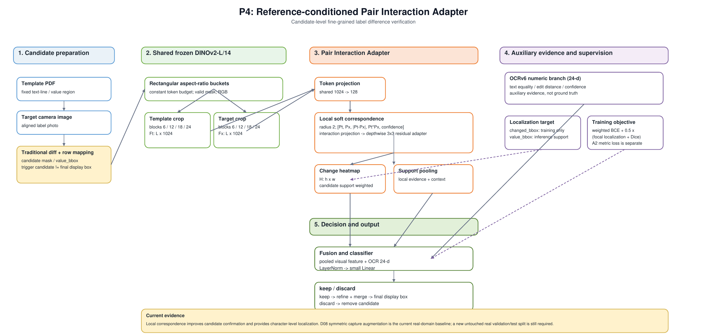

# 标签细粒度差异检测实验进展报告（以 D06 为分界）

> 整理日期：2026-09-01  
> 范围：从任务定义到 D09 / C3 / A2 为止的实验进展与结论。  
> 与其他文档的关系：本文档是**按研究脉络重新组织的进展报告**，重点展开 D06 数据集之后的数据制作与模型结构实验。
> 跨实验的基线综述仍以 [`project_research_summary.md`](../project_research_summary.md) 为准；每一节引用的单轮原始记录见各节末尾的“原始记录”。
> 本文档只写已经跑完的实验进展和由此得到的结论，不写后续计划。

---

## 第一部分：背景

### 1.1 这个系统要解决什么问题

拿一张标准标签模板和一张相机拍摄的标签进行比较，判断标签上的**印刷内容本身**是否发生了变化——印错、漏印、多印、字符替换——同时忽略模糊、光照、印刷墨量、透视、弯曲和轻微错位造成的假差异。

这件事的性质需要说清楚，因为它决定了后面所有实验的设计：

- 它**不是单图异常检测**。不是"判断这张照片看起来是否异常"，而是"在明确参考模板的条件下，比较同一位置的两张局部图像"。
- 它**不是纯 OCR**。真实拍摄下 OCR 自己也会读错，不能作为判定真值。
- 它**不是整图相似度判断**。真正的变化可能只有一个字符、一个上标、一个小数点。

因此本项目把任务形式化为：

> **参考条件下的成对细粒度差异确认**：`template crop + target crop → same / different`

### 1.2 输入与输出

| | 内容 |
| --- | --- |
| 输入 | 一张标准模板（主要是 PDF）＋一张相机拍摄的标签照片 |
| 输出 | 是否存在内容差异、差异位置（最终检测框）、是否通过检查；以及结果 JSON 和可视化 |

### 1.3 一个具体例子

模板中的 `850m³/h` 被印成 `850m²/h`。真正的变化只有一个很小的上标字符，整行其余内容基本相同。模型既要看到这个小变化，也不能把整行的拍摄噪声当成错误。


### 1.4 系统流程，以及本项目改的是哪一步

原系统已经能完成模板解析、实拍对齐、差异检测和结果输出，但最后的候选确认依赖 VLM，速度慢。本项目保留前面的检测主线，重点改**最后一步的判别器**：

```text
模板 PDF/图片 + 实拍标签
        ↓
透视校正、SIFT 特征匹配和 ECC 对齐
        ↓
传统容差差分，产生局部疑似候选（trigger candidate）
        ↓
将候选扩展到 PDF 预设的完整文字行 / 业务区域（review region）
        ↓
模板 crop + 实拍 crop 成对送入判别器      ← 本项目的研究对象
        ↓
keep / discard
        ↓
显示框 refine / merge
        ↓
最终检测框、结果 JSON 和可视化
```

### 1.5 贯穿全部实验的评估口径

后面每一个数字都要按这三条读，否则会得出错误结论：

1. **trigger candidate 不是最终结果。** 传统差分最先产生的小框只是触发候选。最终指标要用经过文字行映射、框修正和合并之后的**显示框**。否则一个真实错误产生的多个中间小框会被算成多个误报。
2. **候选生成的召回和判别器的质量是两件事。** 如果传统差分根本没有产生覆盖 GT 的候选，判别器没有机会补回来。这类漏检属于候选召回或 PDF 行映射问题，不能计入模型的 FN。
3. **`real50` 和 `latest15` 是开发集，不是未触碰的最终测试集。** 它们已经被反复用于观察错误、选择结构和判断方向，因此其上的任何提升都不能当作部署结论，也不能用它们回头挑 seed。

还有一条与横向比较相关的口径差异，必须单独强调：

> 研究线（P0–P4 / A / C 系列）报告的 **Box F1 是 display refinement/merge 之前的候选框指标**，用于比较判别器；生产线（VLM / M11）报告的是**桌面端最终显示框指标**。两者数值不能直接横向相减。

---

## 第二部分：D06 之前的实验进展

这一部分建立了任务的可行性边界和第一个可用的快速基线。

### 2.1 确认裸图像相似度不能完成任务

最早的裸 CLIP cosine 把模板和目标各压成一个全局向量，再用一个距离阈值判断。latest15 上：

| 方法 | TP | FP | FN | F1 | 典型速度 |
| --- | ---: | ---: | ---: | ---: | ---: |
| 裸 CLIP cosine | 3 | 4 | 12 | 0.2727 | 约 0.8 秒/图 |
| 同输入 VLM | 13 | 5 | 2 | 0.7879 | 约 23 秒/图 |

候选框和 review crop 已验证一致，因此这个差距主要反映判别器能力，不是前处理差异。

**结论：** 快速的全局 cosine 不能直接替代 VLM，必须做监督式的成对建模。

### 2.2 从全局特征转向局部 patch，并确定 OCR 的正确用法

| 方向 | 结果 | 结论 |
| --- | --- | --- |
| Global pair head | 比裸 cosine 更能利用特征交互 | 成对监督是有效方向 |
| Multi-layer patch pair | D04 三 seed 平均 F1 约 0.7009，高于 global 约 0.5191 | 局部对应适合字符级变化 |
| Generic / PDF CLIP text prompt | 没有稳定提升 | 停止 prompt engineering 方向 |
| OCR **数值差异**分支 | D04 三 seed 平均 F1 从约 0.7345 提升到约 0.8333 | OCR 作为辅助证据保留 |

有效的不是把 "same/different" 写进文字提示，而是把模板 OCR 和目标 OCR 的**关系编码成数值特征**：是否读到文字、两侧是否严格相等、编辑距离与序列相似度、插入/删除/替换比例、两侧置信度、与模板预期文字的相似度。

**结论：** OCR 是视觉特征之外的辅助证据，不是判定真值；OCR 失败和低置信度必须显式保留。

### 2.3 DINOv2 + letterbox 成为快速基线（M11）

宽长文字行如果用 center crop，会把型号或单位的两端裁掉；letterbox 能保留完整候选。


历史 real50 开发集，三 seed 平均：

| 配置 | real50 三 seed 平均 F1 | 说明 |
| --- | ---: | --- |
| CLIP + center crop | 0.8310 | 边界误报较多 |
| CLIP + letterbox | 0.8158 | 单独换预处理无稳定收益 |
| DINOv2 + center crop | 0.8321 | 单独换 backbone 无稳定收益 |
| **DINOv2 + letterbox（M11）** | **0.9037** | 成为快速基线 |

M11 seed10 的历史最终显示框结果：real50 `48 TP / 6 FP / 2 FN，F1=0.9231`；latest15 `15 TP / 1 FP / 0 FN，F1=0.9677`；速度约 0.4 秒级/图。

**结论：** backbone 和预处理必须联合更换才有收益，单独换任一项都没有。这是第一个在速度上真正可用的判别器。

### 2.4 修复候选规则和合成数据的配准污染

审计发现两个会让后续结论失效的问题：

1. 某些 PDF 型号主体和 `/I` 后缀被拆成不同区域，候选没有覆盖完整业务值；
2. 旧合成样本中，条码局部匹配可能产生约 0.2 倍的错误单应缩放，把模板文字映射到了错误位置。

修复后形成干净的 D05v5 / prealigned 数据，旧污染数据上的指标标记为过时。

**结论：** 这一步不提高任何模型分数，但它保证后面所有实验不是建立在错误训练数据上。

### 2.5 D06 之前留下了什么

- 一个确定的任务形式：参考条件下的成对差异确认；
- 一个可用的快速判别器基线：M11（DINOv2 + letterbox + patch 统计 + OCR 数值特征）；
- 一套评估纪律：区分 trigger candidate 与显示框、区分候选召回与判别器质量；
- 一个明确的未解问题：**模型只能回答"这一行有没有变化"，不能回答"变的是哪个字符"**，而且合成数据的监督框是粗的 PDF span，不是变化字符本身。

D06 就是为了把这个未解问题变成可验证问题而做的。

**原始记录：** [`clip_pair_experiment_recovery_20260713.md`](../experiments/clip_pair_experiment_recovery_20260713.md)、[`clip_pair_experiment_report_20260721.md`](../experiments/clip_pair_experiment_report_20260721.md)、[`clip_pairwise_label_verification_research_plan.md`](clip_pairwise_label_verification_research_plan.md)

---

## 第三部分：D06 数据集——把"能否定位到字符"做成可验证问题

### 3.1 为什么要做 D06

D06 之前的数据有三个限制：一个样本里可能有多处改动，无法做错误归因；监督框是 PDF span，不是变化字符；变异类型没有可统计的分布。这些都让"模型是不是真的看到了变化字符"无法验证。

D06 的设计目标就是消除这三点：**每个样本严格只有一处改动，并提供精确的字符级框**。

### 3.2 D06 是怎么造的

生成项目在 `/home/jnu/projects/dataset`，推荐版本 `D06_single_mutation_1k_v2_boxes`。

**模板映射**（`A`–`E` 是五个模板域的别名，不是模型的输出类别；模型输出始终是 keep/discard 二分类）：

| 别名 | 原模板 ID |
| --- | --- |
| A | `600001076226` |
| B | `600004075219` |
| C | `600004078454` |
| D | `600004083205` |
| E | `600004085656` |

**数量与切分：**

| 项目 | 数量 |
| --- | ---: |
| 模板 | 5 |
| 每模板样本 | 200 |
| 总样本 | 1000 |
| Train / Val / Test | 700 / 150 / 150（每模板 140 / 30 / 30） |
| 每样本改动数 | 1 |

唯一性由"模板、位置、原文、改后文本、策略"共同确定。生成种子 `20260727`。

**变异策略分布：**

| 策略 | 数量 |
| --- | ---: |
| `confusable` 易混字符 | 247 |
| `substitute` 普通替换 | 166 |
| `insert` 插入 | 139 |
| `delete` 删除 | 115 |
| `duplicate` 重复 | 111 |
| `swap` 交换 | 109 |
| `case` 大小写 | 105 |
| `superscript` 上标 | **8** |

**最关键的改动是双框：**

```json
{
  "changed_bbox": "实际新增、删除或替换字符的字符级范围",
  "value_bbox":   "变化字符所属的完整业务值范围",
  "legacy_span_bbox": "旧 PDF span 框，只用于追溯，不再作为训练定位框"
}
```

`changed_bbox` 用于精确定位监督和错误审计，`value_bbox` 用于完整业务值裁剪和推理时的候选支持范围。全部 1000 条已验证满足 `changed_bbox` 非空、`value_bbox` 非空、且 `changed_bbox ⊂ value_bbox`。

### 3.3 数据实例

预览图中红色实线是 `changed_bbox`，黄色虚线是 `value_bbox`。

`C_0033`，数字重复 `590 → 5590`。黄框把数字、`m`、上标和 `/h` 合并成一个完整业务值：


`B_0027`，上标变化 `3 → 2`（即 `850m³/h → 850m²/h`）。`changed_bbox` 只覆盖上标，变化范围只有约两像素宽，而整张标签有大量与之无关的文字、条码和图形——这就是任务的难点：


`A_0006`，易混字符 `I → 1`：


`C_0142`，字符交换 `Weight → Weihgt`：


### 3.4 从 D06 到可训练的 pair 数据

D06 的 1000 个样本**全部是 `different` 正样本**，不能单独训练二分类。派生出平衡 pair 数据集 `D06_pair_training_v1`：

| Split | Different | Same | 合计 |
| --- | ---: | ---: | ---: |
| Train | 700 | 700 | 1400 |
| Validation | 150 | 150 | 300 |
| Test | 150 | 150 | 300 |

每条 D06 样本产生两个 pair：`different` 是模板 value crop 对变更后的 value crop；`same` 是模板 value crop 对**独立光度增强后的同内容模板 crop**。正负使用同分布的亮度、对比度、轻度高斯模糊和 JPEG 增强，增强不改变几何位置。同一 `source_sample_id` 的正负 pair 固定在同一个 split。

### 3.5 D06 自身的已知边界

这两点后面反复出现，必须先记住：

1. **上标只有 8 个唯一组合。** 源模板中可变上标位置有限。D06 不是上标均衡数据集，不能用它证明上标泛化。
2. **negative 太简单。** `same` 只是同模板的光度增强，不包含真实印刷扫描形变、拍摄透视、弯曲、配准残差和主流程 hard negative。这直接导致后面合成 test 接近饱和。

**原始记录：** [`d06_single_mutation_dataset.md`](../datasets/d06_single_mutation_dataset.md)

---

## 第四部分：D06 之后的模型结构实验

### 4.1 结构改了什么

M11 的做法是：取四层 patch token 的绝对差 → 统计池化 → 128 维 MLP。它把空间信息在池化时丢掉了，所以只能输出一个整体分数。

P4 / Pair Interaction Adapter 的改动是**在空间池化之前先做模板—目标交互**，并让模型输出变化热图：

```text
共享 1024→128 projection
→ 双向局部 soft correspondence（半径 2）
→ [Pt, Px, symmetric residual, Pt*Px, confidence]
→ 1×1 interaction projection
→ depthwise 3×3 residual adapter
→ change heatmap
→ heatmap / support 加权池化
→ LayerNorm + Linear(1) → keep/discard
```

训练目标：

```text
L = weighted BCE + 0.5 × (focal localization + Dice)
```

`changed_bbox` 只作为训练定位目标，**不作为推理输入**；`value_bbox` 提供推理时的候选 support。



> 该图是工作区根目录 `P4_final_pair_interaction_adapter.drawio` 的渲染副本；改图时以 `.drawio` 为可编辑源。

### 4.2 A0 / A1：定位能力出现，但分类没有超过基线

首轮只回答"新结构能否同时完成二分类和字符级定位"。输入 336 letterbox，冻结 DINOv2-L/14，三 seed（20260710/11/12）。为公平比较，A0 也用与 A1 相同的 `validation Recall ≥ 0.95` 阈值规则重算。

| 方法 | Test Precision | Test Recall | Test F1 | Pointing accuracy | IoU@0.5 |
| --- | ---: | ---: | ---: | ---: | ---: |
| A0 M11 统计池化 | 1.0000 ± 0.0000 | 0.9511 ± 0.0038 | 0.9749 ± 0.0020 | — | — |
| A1 Pair Adapter | 1.0000 ± 0.0000 | 0.9444 ± 0.0454 | 0.9711 ± 0.0243 | **0.7756 ± 0.1118** | **0.5125 ± 0.0858** |

定位输出示例（依次为模板、目标、绿色 `changed_bbox`、A1 seed20260710 的红色热图）。`A_0004` 把 `Connection Pipes :1/4"/1/2"` 改成 `1/A"/1/2"`，整行只有一个字符不同，模型给出 `p=0.9998` 判为 different，热点落在被改的字符上：


**结论：**

1. A1 **没有**超过 A0 的分类基线，且跨 seed 波动明显更大。
2. A1 确实获得了 M11 不具备的字符级定位能力，测试 peak 落入 `changed_bbox` 的比例平均 77.6%。分类结果不是靠整行整体差异蒙对的。
3. 分数严重饱和：A1 三个阈值都约 0.999；A0 的阈值跨 seed 从 0.0014 到 0.7867，校准同样不稳定。
4. 合成 negative 太简单（见 3.5），这个 test 不能用来判断生产效果。

**原始记录：** [`d06_pair_interaction_a0_a1_experiment.md`](../experiments/d06_pair_interaction_a0_a1_experiment.md)

### 4.3 P0–P4：输入形状与池化消融

这一轮回答三个问题：336 正方形 letterbox 的白边是否干扰 DINO 特征；无效 padding token 是否稀释统计池化；在近似相同 token 数下把 token 从无效高度重新分配到标签宽度是否有利。

| 实验 | 输入与结构 | 目的 |
| --- | --- | --- |
| P0 | 336×336 白色 letterbox + M11 统计池化 | 基线 |
| P1 | 336×336 ImageNet 均值填充 + valid mask | 分离白边**像素值**影响 |
| P2 | 336×336 白色 letterbox + valid-aware pooling | 分离 padding 的**池化稀释** |
| P3 | 宽高比分桶 + 均值填充 + valid mask + M11 head | 检查有效横向分辨率收益 |
| P4 | P3 输入 + Pair Interaction Adapter | 矩形 token 上的空间交互与定位 |

矩形分桶保持约 576 个 token 的恒定预算，只把 token 从无效高度移到标签宽度：

| 输入尺寸（宽×高） | Token 网格 | Token 数 |
| --- | --- | ---: |
| 336×336 | 24×24 | 576 |
| 476×238 | 34×17 | 578 |
| 672×168 | 48×12 | 576 |
| 952×112 | 68×8 | 544 |

图像、candidate mask、mutation mask 和 valid mask 使用同一套缩放与居中偏移，防止监督错位。P0 与 P2 复用完全相同的 DINO 前向特征，只改池化是否用 valid mask，因此能干净隔离池化影响。

三 seed 独立 test 结果：

| 实验 | Precision | Recall | F1 | ROC-AUC | PR-AUC | Pointing | IoU@0.5 |
| --- | ---: | ---: | ---: | ---: | ---: | ---: | ---: |
| P0 | 1.0000 | 0.9578 ± 0.0038 | 0.9784 ± 0.0020 | 0.99929 | 0.99931 | — | — |
| P1 | 1.0000 | 0.9578 ± 0.0077 | 0.9784 ± 0.0040 | 0.99993 | 0.99993 | — | — |
| P2 | 1.0000 | 0.9578 ± 0.0038 | 0.9784 ± 0.0020 | 0.99904 | 0.99907 | — | — |
| P3 | 1.0000 | 0.9444 ± 0.0038 | 0.9714 ± 0.0020 | 0.99976 | 0.99977 | — | — |
| P4 | 1.0000 | 0.9622 ± 0.0154 | **0.9807 ± 0.0080** | **0.99999** | **0.99999** | **0.9044 ± 0.0192** | **0.5913 ± 0.0199** |

**结论：**

1. **白边像素值不是瓶颈。** P1 与 P0 的 F1 都是 0.9784。均值填充提高了 AUC，但没有形成稳定的分类收益。
2. **padding 对池化的稀释也不是瓶颈。** P2 与 P0 的 Recall/F1 均值完全相同。原因是 M11 的候选统计已经受 `value_bbox` mask 约束，valid mask 只进一步修正全局均值项。
3. **单独提高横向 token 分辨率对原 M11 head 没有帮助。** P3 的 F1 比 P0 低约 0.0070。只能说"P3 + 原统计头"无收益，不能推出矩形输入本身无效。
4. **P4 是本轮均值最优，但优势很小。** 比 P0 高约 0.0023，相当于 300 条 test 中少漏约 1 条，且三 seed 中只有 seed11 明显高于基线。它更明确的收益是 90.4% pointing accuracy 和 59.1% IoU@0.5。
5. 三个验证阈值都接近 0.999，部署前必须重新校准。

**原始记录：** [`d06_padding_ablation_p0_p4_experiment.md`](../experiments/d06_padding_ablation_p0_p4_experiment.md)

### 4.4 把 P0 / P4 冻结迁移到真实开发集

合成 test 已接近饱和，所以必须检查收益能否迁移。**没有训练、微调、温度缩放或真实阈值搜索**，每个 checkpoint 用自己在 D06 validation 上按 `Recall ≥ 0.95` 得到的原始阈值。

评估前的数据审计：

| 数据集 | 实拍 case | Pair | Different | Same / false alarm |
| --- | ---: | ---: | ---: | ---: |
| real50 | 50 | 264 | 52 | 212 |
| latest15 | 15 | 73 | 15 | 58 |

337 个 `pair_id` 全部唯一，两集合之间没有重复 case 或相同 target crop 哈希，1011 个文件全部存在且尺寸一致；D06 / real50 / latest15 的 candidate mask 平均覆盖率分别为 43.7% / 47.3% / 48.0%，support 语义可直接复用。真实 manifest 没有字符级 `changed_bbox`，所以本轮**不能**评价 P4 的定位指标。

候选级三 seed 结果：

| 数据 | 方法 | Precision | Recall | F1 | ROC-AUC | PR-AUC |
| --- | --- | ---: | ---: | ---: | ---: | ---: |
| real50 | P0 | 0.2674 ± 0.0014 | 0.9615 | 0.4184 ± 0.0018 | **0.8753** | **0.6362** |
| real50 | P4 | **0.3369 ± 0.0931** | 0.9231 ± 0.1332 | **0.4902 ± 0.1092** | 0.8362 | 0.5889 |
| latest15 | P0 | 0.2634 ± 0.0092 | **1.0000** | 0.4169 ± 0.0116 | 0.9207 | 0.8290 |
| latest15 | P4 | **0.4999 ± 0.2052** | 0.9556 ± 0.0385 | **0.6392 ± 0.1599** | **0.9579** | **0.8860** |

框级（`overlap coefficient ≥ 0.3` 贪心匹配，**refine/merge 之前**的候选框）：

| 数据 | 方法 | TP | FP | FN | F1 |
| --- | --- | ---: | ---: | ---: | ---: |
| real50 | P0 | 48.0 ± 0.0 | 139.0 ± 1.0 | 2.0 ± 0.0 | 0.4051 ± 0.0017 |
| real50 | P4 | 46.3 ± 6.4 | 101.0 ± 33.5 | 3.7 ± 6.4 | **0.4782 ± 0.1049** |
| latest15 | P0 | 15.0 ± 0.0 | 42.0 ± 2.0 | 0.0 ± 0.0 | 0.4169 ± 0.0116 |
| latest15 | P4 | 14.3 ± 0.6 | 17.3 ± 10.7 | 0.7 ± 0.6 | **0.6392 ± 0.1599** |

真实误报实例。模板 `600004075219` 的 `Air Flow Volume`，实拍存在模糊、字重变化和局部对齐残差，但业务内容没变，P4 seed10 输出 0.999974：


模板 `600001076226` 的条码数字，实拍发生垂直位移和模糊，没有字符内容变化：


真实漏检实例。`5.60kW → 5.60kWW`，差异明显，但 P4 seed12 只输出 0.998219，低于其 0.999827 阈值：


latest15 中 `2000m³/h → 2000m²/h`，小面积上标变化，seed10 输出 0.998168，低于 0.999165 阈值：


**结论：**

1. **P4 确实比 P0 更能过滤真实假候选。** latest15 平均 FP 从 42.0 降到 17.3，real50 从 139.0 降到 101.0。
2. **但收益不稳定。** P4 real50 F1 在 0.4145–0.6154 之间，latest15 在 0.5385–0.8235 之间；合成 test 最好的 seed11 并不是实拍最好的 seed。
3. **real50 的排序能力反而变差。** P4 的 ROC-AUC 和 PR-AUC 都低于 P0，说明平均 F1 的提升主要来自冻结阈值下的决策位置，不是正负样本整体分离更好。
4. **错误高度集中。** P4 seed10 的 65 个 real50 FP 中有 48 个来自模板 `600004075219`。D06 每模板 200 个合成变更和简单光度 same pair 没有覆盖该模板真实拍摄中的主要配准/纹理残差。
5. FN 里既有上标小变化，也有肉眼明显的删除和追加字符，所以问题不能只归因于输入分辨率；**分数饱和和跨域阈值失配同样关键**。

这一轮直接决定了下一步做数据而不是继续改结构。

**原始记录：** [`d06_padding_ablation_real_development_evaluation.md`](../experiments/d06_padding_ablation_real_development_evaluation.md)

### 4.5 A2：局部度量辅助损失——合成正、真实负

在 A1 结构上（336 letterbox，不改 backbone、输入尺寸、对应半径、热图和分类头）增加一张无参数的 token 距离图：

```text
D = max(1 - cos(target, matched_template),
        1 - cos(template, matched_target))

L_metric = unchanged_distance² + max(margin - changed_distance, 0)²
L = L_BCE + 0.5 L_localization + 0.25 L_metric      margin = 0.4
```

这是"P4 结构 + 局部度量辅助损失"，不是纯对比学习，也没有删除二分类决策头。

D06 合成测试：

| 方法 | Precision | Recall | F1 | Pointing | IoU@0.5 |
| --- | ---: | ---: | ---: | ---: | ---: |
| A1（Adapter + BCE） | 1.0000 | 0.9444 ± 0.0371 | 0.9711 ± 0.0198 | 0.7756 ± 0.0913 | 0.5125 ± 0.0700 |
| A2（+ 局部 metric） | 1.0000 | 0.9667 ± 0.0144 | **0.9830 ± 0.0074** | **0.8644 ± 0.0175** | **0.5644 ± 0.0050** |

real50 冻结迁移（合成验证集固定阈值，real50 不调参）：

| 方法 | 候选 F1 | 框级 F1 |
| --- | ---: | ---: |
| A1 | 0.5412 ± 0.0754 | 0.5237 ± 0.0732 |
| A2（+ 局部 metric） | 0.4616 ± 0.1096 | 0.4477 ± 0.1072 |

**结论：**

1. 结构方向合理：在 P4 上加局部距离图和辅助度量损失不需要把系统改成纯对比学习。
2. **典型的"合成正、真实负"。** A2 在合成上明显优于 A1，在 real50 反而下降。
3. 度量约束没有学到真实拍摄下的缺陷距离：A2 seed20260712 在 real50 上 same / different 支持区域的距离均值分别为 `0.1041` 和 `0.1008`，**几乎没有可分性**。
4. margin 对当前特征尺度偏高：三 seed 的 changed token 平均距离约 `0.277`、same token 约 `0.066`，只有约 `17.4%` 的 changed token 超过 `0.4`。
5. 因此不能靠继续降 margin 或叠加 adapter 解决；瓶颈在训练分布缺少真实 same pair、印刷扫描、配准残差和 hard negative。

> 注意：A1/A2 使用 336 letterbox 输入，与 4.3/4.4 的 P4（矩形分桶）不是同一配置；A2 这一轮的 A1 基线数字（real50 框 F1 `0.5237`）来自 2026-08-01 的运行，不能与 4.4 中 P4 的 `0.4782` 直接相减。

**原始记录：** [`d06_local_metric_a2_experiment.md`](../experiments/d06_local_metric_a2_experiment.md)

### 4.6 C0–C3：灰度与轮廓输入消融

标签原图接近灰度，所以有一个自然的问题：既然只关心文字和图形轮廓，是否应该把 RGB 换成灰度或轮廓输入？先做通道统计（candidate support 内的模板/目标差异）：

| 数据 | 平均亮度差 Y | 平均色度差 | 原图平均 RGB 通道间差 |
| --- | ---: | ---: | ---: |
| D06 same | 13.42 | 0.95 | 2.096 |
| D08 same | 34.08 | 1.15 | 1.956 |
| real50 same | 79.39 | 1.59 | 1.909 |
| latest15 same | 77.25 | 1.76 | 2.559 |

真实域的 same pair 亮度差约为色度差的 45–50 倍。四组实验只改输入表示，数据、分桶、P4 网络、损失、epoch、seed 和阈值规则全部一致（训练数据为 D08）：

| 实验 | DINO 输入 | Adapter 输入 |
| --- | --- | --- |
| C0 | RGB | DINO token（= D08-P4 基线） |
| C1 | 灰度复制为 3 通道 | DINO token |
| C2 | 灰度除以局部高斯背景后复制为 3 通道 | DINO token |
| C3 | 同 C2 | DINO token + ink + gradient |

合成测试与真实开发集：

| 方法 | 合成 F1 | 合成 Pointing | real50 Box F1 | real50 FP 均值 | real50 Recall | latest15 Box F1 |
| --- | ---: | ---: | ---: | ---: | ---: | ---: |
| C0 RGB | 0.9807 | 0.8089 | 0.7308 | 34.0 | **0.9679** | **0.8628** |
| C1 灰度 | 0.9760 | 0.8133 | **0.7437** | **23.3** | 0.8718 | 0.8593 |
| C2 文档灰度 | 0.9783 | **0.8244** | 0.7420 | — | 0.8526 | 0.8094 |
| C3 灰度 + 轮廓 | **0.9819** | 0.7711 | 0.7363 | — | 0.8590 | 0.8369 |

灰度仍然漏检的例子（`12VDC,2W` 在实拍中明显模糊，C1 概率 `0.998023`，低于冻结阈值 `0.998792`）：


灰度仍然误报的例子（同内容 `Weight` 在裁剪、对齐和字重变化下仍被判 different）：


**结论：**

1. **颜色不是当前的主要域差异。**
2. **但不能把 RGB 全面换成灰度。** C1 减少 real50 误报（框级 FP 34.0 → 23.3，Precision 0.6121 → 0.6848，ROC/PR-AUC 同时提高），代价是 real50 Recall 从 0.9679 降到 0.8718、框级 TP 从 48.3 降到 43.3；latest15 总 F1 没有超过 RGB。灰度会进一步压低模糊、小面积、低对比度的真实字符变化。
3. **C2、C3 按当前形式停止。** C2 的局部背景除法改变了合成与真实的绝对分数标定；C3 直接拼接 ink/gradient 没有收益，反而使 Pointing 和 IoU 下降、IoU seed 标准差增至 0.0333。
4. 部署候选保留 **C0 RGB**：它的召回更符合缺陷检测的优先级。

**原始记录：** [`c0_c3_shape_input_ablation_experiment.md`](../experiments/c0_c3_shape_input_ablation_experiment.md)

### 4.7 结构实验小结

| 改动 | 合成集 | 真实开发集 | 判定 |
| --- | --- | --- | --- |
| Pair Interaction Adapter（A1 / P4） | 分类持平，获得字符级定位 | 平均 F1 提升但方差大、real50 排序退化 | **方向保留**，不能部署 |
| 均值填充（P1）、valid-aware pooling（P2） | 无稳定收益 | — | 排除为瓶颈 |
| 矩形分桶 + 原统计头（P3） | F1 略降 | — | 单独无收益 |
| 局部度量辅助损失（A2） | 明显提升 | real50 明显下降 | **负结果** |
| 灰度 / 文档灰度 / 轮廓（C1–C3） | 差异 < 0.006 | 精度升、召回降，总 F1 未超 RGB | **负结果**，保留 RGB |

一句话：**结构实验在合成数据上已经饱和，真实域的瓶颈不在结构，而在训练分布和分数校准。**

---

## 第五部分：D06 之后的数据实验

第四部分的结论把重点推到数据侧。这一部分的每一轮都只改训练数据，网络、训练参数、D06 的 group split 和三个 seed 保持不变；每个 checkpoint 的阈值只由自身合成 validation 按 `Recall ≥ 0.95` 确定，真实集不调阈值。

### 5.1 D07：单边增强的失败

D07 保留 1000 个 D06 `different` 不变，只把 1000 个 `same` 换成更强的真实风格变体（`soft_capture`、`print_scan`、`shadow`、`geometry`、`mixed`，各 200 个）。

D07 合成 test 仍近乎满分，P4 F1 为 `0.9795 ± 0.0125`。但这是假象——冻结阈值后在两个真实开发集上，三个 seed **一个正候选都没有保留**：

| 数据 | 方法 | Precision | Recall | F1 | ROC-AUC | PR-AUC |
| --- | --- | ---: | ---: | ---: | ---: | ---: |
| real50 | D07-P0 | 0 | 0 | 0 | 0.8616 | 0.6574 |
| real50 | D07-P4 | 0 | 0 | 0 | 0.5745 | 0.3117 |
| latest15 | D07-P0 | 0 | 0 | 0 | 0.8483 | 0.7429 |
| latest15 | D07-P4 | 0 | 0 | 0 | 0.5916 | 0.2899 |

**根因是类别泄漏：** 强真实风格只出现在 `same`，清晰的 D06 风格只出现在 `different`，模型可以靠成像风格判断标签，完全不必判断字符内容。P0 还保留一定排序能力，P4 连排序能力也明显退化。

**结论：** 不能只增强 negative，更不能让增强 profile 与标签绑定。D07 废弃。

### 5.2 D08：标签对称的真实风格增强

D08 从 D06 的正负目标图分别出发，给同一 source group 的两个标签分配**同一种 profile 但独立随机参数**，数量按标签严格平衡：

| Profile | Different | Same |
| --- | ---: | ---: |
| soft_capture | 334 | 334 |
| print_scan | 333 | 333 |
| shadow | 333 | 333 |

增强包括亮度、对比度、模糊、传感器噪声、JPEG、阴影和轻度笔画膨胀/收缩。**有意排除旋转、平移和透视**，因为当前 mutation/candidate mask 没有同步几何变换能力，排除后 `changed_bbox`、`value_bbox` 和两个 mask 仍与目标图严格对齐。

构建后审计：2000 pair 正负各 1000；1000 个 group 均为一正一负且 split 一致；8000 个引用文件全部存在；template 与 target 尺寸全部一致；没有哈希完全相同的退化样本；抽查确认 `different` 保留原字符变化、`same` 只改变成像风格。

真实开发集三 seed 均值：

| 数据 | 方法 | Precision | Recall | Candidate F1 | ROC-AUC | PR-AUC | Box F1 |
| --- | --- | ---: | ---: | ---: | ---: | ---: | ---: |
| real50 | D08-P0 | 0.6211 ± 0.0189 | 0.8077 | 0.7021 ± 0.0121 | 0.9240 | 0.7244 | 0.6800 |
| real50 | D08-P4 | 0.6121 ± 0.0252 | **0.9679 ± 0.0111** | **0.7497 ± 0.0175** | **0.9381** | **0.7269** | **0.7308** |
| latest15 | D08-P0 | 0.7802 ± 0.0095 | 0.7111 ± 0.0385 | 0.7438 ± 0.0256 | 0.9575 | 0.8783 | 0.7438 |
| latest15 | D08-P4 | **0.8216 ± 0.0520** | **0.9111 ± 0.0770** | **0.8628 ± 0.0484** | **0.9778** | **0.9132** | **0.8628** |

相对原 D06-P4 的变化：

| 数据 | 指标 | D06-P4 | D08-P4 | 变化 |
| --- | --- | ---: | ---: | ---: |
| real50 | Candidate F1 | 0.4902 | 0.7497 | **+0.2595** |
| real50 | ROC-AUC | 0.8362 | 0.9381 | **+0.1019** |
| real50 | Box F1 | 0.4782 | 0.7308 | **+0.2526** |
| latest15 | Candidate F1 | 0.6392 | 0.8628 | **+0.2236** |
| latest15 | Box F1 | 0.6392 | 0.8628 | **+0.2236** |

**关键点：D08 不只是移动了阈值。** real50 的 ROC-AUC 和 PR-AUC 也提高，三个 seed 的 F1 方差显著小于 D06，说明标签对称的真实风格增强确实改善了真实正负分离。

代价出现在合成定位上：D08-P4 的 Pointing 从 D06 的 `0.9044` 降到 `0.8089`，IoU@0.5 从 `0.5913` 降到 `0.4721`。重度成像增强有助于分类域泛化，但会模糊小字符的定位监督。

真实误报仍然存在。模板 `600004075219` 的 `Weight` 内容一致，但实拍字重、裁剪边界和对齐存在差异：


最明显的失败样本是 latest15 的 `2000m³/h → 2000m²/h`，概率仅 `0.000367`——这不是轻微阈值问题，而是小面积上标差异被真实模糊和笔画增强完全压制：


**结论：** D08 是当前真实开发集上最好的训练数据方案，也是这一整条研究线**最有说服力的一次改进**（real50 框 F1 0.4782 → 0.7308）。但它仍有大量真实误报和上标漏检，不能直接部署。

**原始记录：** [`d07_d08_symmetric_capture_augmentation_experiment.md`](../experiments/d07_d08_symmetric_capture_augmentation_experiment.md)

### 5.3 上标审计：发现增强把语义抹掉了

上一节的 `2000` 失败促成了一轮定向审计，把同一业务变化在"清晰合成 / 增强合成 / 实拍"三种条件下对比。

D08 共 8 个 superscript source group（train 4 / val 3 / test 1），P4 三个 seed 得到完全相同的离散结果：`7/0/1/8`，Precision 1.0000、Recall 0.8750、F1 0.9333，稳定失败样本是 `B_0027`，概率只有 `0.000214 / 0.000867 / 0.000193`——不是阈值轻微偏高。


D05 合成和实拍都保留了可辨认的上标 `2`，但 D08 的 `print_scan` 样本中上标笔画几乎完全消失。`different` 和它配对的 `same` 在上标位置都缺少可靠视觉内容——**训练时这个样本实际上退化成了"内容相同"**。

同业务对照还显示错误有明显的 seed 成分：

| 业务值 | seed10 | seed11 | seed12 |
| --- | --- | --- | --- |
| `2000m³/h → 2000m²/h` | 清晰合成、增强合成、实拍**全部失败** | 三者**全部正确** | 合成正确，实拍 `0.999531` 比阈值 `0.999630` 低 `0.0001` → FN |
| `850m³/h → 850m²/h` | D05 合成与 real50 全部正确 | 全部正确 | 全部正确 |

**结论：** `2000` 漏检不能只归因于实拍颜色、模糊或分辨率，它同时包含模型 seed 不稳定、极高阈值和**合成数据质量问题**。数据构建必须增加 mutation preservation gate。superscript 必须按 subtype 单独报告 Recall，不能被整体合成 F1 0.98 掩盖。

**原始记录：** [`superscript_synthetic_real_matched_audit.md`](../experiments/superscript_synthetic_real_matched_audit.md)

### 5.4 D09：mutation preservation gate

根因很具体：D08 的 `print_scan` 会随机使用 3×3 `MaxFilter/MinFilter`，对只有约 2 px 宽的上标字符，`MaxFilter` 会直接擦除暗色笔画。

| 样本 | D08 changed contrast | D09 changed contrast | D09 foreground fraction |
| --- | ---: | ---: | ---: |
| `B_0027`（`850m³/h → 850m²/h`） | 15.2 | **137.2** | 0.319 |
| `E_0042`（`2000m³/h → 2000m²/h`） | 15.0 | **144.8** | 0.361 |

D09 对 250 个微小 changed region 使用**相同的 label-symmetric 策略**：错误图和配对正确图都禁用 3×3 stroke filter，并把 blur、noise、JPEG 范围分别收紧为 `0.05–0.25`、`2–6`、`78–92`。增强策略由 source group 决定、不由 label 决定，因此没有引入 D07 式的标签泄漏。

可见性门禁只用于 8 个 `superscript` positive（局部前景对比度 ≥ 60、前景面积比例 ≥ 0.15，8/8 通过）。删除字符的 changed region 合法地没有前景，不能用同一门禁。

修复前后的同一样本 `B_0027`：

| 模板 | D08 增强后（上标被抹掉） | D09 增强后（上标保留） |
| --- | --- | --- |
|  |  |  |

定向结果：`B_0027` 从 **0/3 变成 3/3**（概率 0.999960 / 0.999783 / 0.999932），稳定漏检修复。

但总体指标没有提升：

| 训练数据 | 合成 F1 | 合成 Pointing | real50 Cand F1 | real50 Box F1 | latest15 Cand F1 | latest15 Box F1 |
| --- | ---: | ---: | ---: | ---: | ---: | ---: |
| D08-P4 | **0.9807** | **0.8089** | **0.7497** | **0.7308** | **0.8628** | **0.8628** |
| D09-P4 | 0.9783 | 0.8067 | 0.7279 | 0.7065 | 0.8267 | 0.8267 |

D09 在两个真实集上都是 **Precision 上升、Recall 明显下降**（real50 Recall 0.9679 → 0.8462，latest15 0.9111 → 0.8000），最终 F1 下降。而且总体波动并非都来自上标：最不稳定的类型是 `confusable`，三个 seed 分别检出 37/39、32/39、34/39。

**结论：**

1. mutation preservation gate 是**必要的数据质量约束**，它修复的是真实的语义损坏，不是靠换颜色空间掩盖问题。
2. **但"局部修复"不等于"总体提升"。** 不能只根据 `B_0027` 被修复就把 D09 当作新默认。
3. 只有 8 个 superscript source group、test 中只有 1 个，样本量不足以稳定学习该 subtype；**D09 不能证明上标问题已解决**。
4. 阈值普遍在 0.998–0.9996，许多 false negative 与阈值只差 `1e-4–1e-3`。
5. D08 保持总体基线，D09 作为数据修复分支保留。

**原始记录：** [`d09_micro_preservation_experiment.md`](../experiments/d09_micro_preservation_experiment.md)

### 5.5 正常实拍参考：缩小 PDF 与相机的域差异

前面所有实验的模板一侧都是 PDF 渲染图，而目标一侧是相机照片。这一轮只把判别器的**模板参考 crop** 换成同模板的正常实拍 crop，其余全部不变（目标 crop、candidate mask、标签、候选坐标、冻结的 P4-D08 模型和阈值都不动）。

donor 规则很严格：必须来自同模板、同固定文本行、**不同 real50 case**；从 donor 已配准的 `annotation_base.jpg` 按当前候选原有的 `review_box_final` 裁切，而不是把小文本行 crop 拉伸到候选框；donor 的 review box 与其人工 GT 扩展 2 px 后必须零相交。264 个候选全部找到合格 donor，无 PDF 回退。

| 参考 | Precision | Recall | Candidate F1 | ROC-AUC | PR-AUC | Box F1 | 平均 FP | 平均 FN |
| --- | ---: | ---: | ---: | ---: | ---: | ---: | ---: | ---: |
| PDF | 0.6121 | **0.9679** | 0.7497 | 0.9381 | 0.7269 | 0.7308 | 34.0 | **1.67** |
| 正常实拍 donor | **0.6949** | 0.9038 | **0.7846** | **0.9602** | **0.8227** | **0.7638** | **22.67** | 5.0 |

seed 20260712 的逐样本变化：修正 19 个 `FP → TN`，新增 4 个 `TN → FP`；恢复 1 个 `FN → TP`，但新增 2 个 `TP → FN`。

代价很具体：`850m³/h` 候选在 seed 20260712 下，概率从 PDF 参考的 `0.999923` 掉到实拍参考的 `0.259953`——**真实的上标差异被两侧共有的实拍噪声一起掩盖了**。

**结论：** 缩小 PDF/实拍域差异这个方向有效（Precision、F1、ROC-AUC、PR-AUC 全部提高）。但不能直接用一张正常实拍替换 PDF 参考：P4-D08 只在 PDF/合成参考分布上训练，换成 photo-to-photo 输入后召回下降且阈值未校准。

**原始记录：** [`real50_photo_reference_p4_experiment.md`](../experiments/real50_photo_reference_p4_experiment.md)

### 5.6 数据实验小结

同一个 P4 结构、同一套阈值规则下，只换训练数据的真实开发集表现：

| 训练数据 | real50 Cand F1 | real50 Box F1 | latest15 Cand F1 | latest15 Box F1 | 判定 |
| --- | ---: | ---: | ---: | ---: | --- |
| D06（光度增强 same） | 0.4902 | 0.4782 | 0.6392 | 0.6392 | 起点 |
| D07（单边真实风格） | 0 | — | 0 | — | **失败**，标签泄漏 |
| **D08（对称真实风格）** | **0.7497** | **0.7308** | **0.8628** | **0.8628** | **当前基线** |
| D09（微小字符保真） | 0.7279 | 0.7065 | 0.8267 | 0.8267 | 数据修复分支 |

外加两个不改训练数据的变体：D08 + 灰度输入（C1）real50 Box F1 `0.7437`；D08 + 正常实拍参考 real50 Box F1 `0.7638`。两者都是"精度升、召回降"。

一句话：**数据侧的一次改动（D06 → D08）带来的真实提升，超过了这一阶段所有结构改动的总和。**

---

## 第六部分：与生产判别器的对照

研究线的 P4 尚未接近生产线判别器的水平。下表是目前有记录的对照，**注意口径差异**：

| 判别器 | real50 | latest15 | 速度 | 口径 |
| --- | --- | --- | --- | --- |
| 27B VLM V2.2 | `44/1/6`，F1=**0.9263** | `13/0/2`，F1=0.9286 | ~5.15 s/候选 | 最终显示框 |
| DINOv2 M11 seed10 | `48/6/2`，F1=0.9231 | `15/1/0`，F1=0.9677 | ~0.4 s 级/图 | 最终显示框 |
| 4B VLM LoRA | 框 F1=0.9053 | — | ~2.87 s/候选 | 最终显示框 |
| Qwen3.8-27B-NVFP4（2026-08-30） | `43/2/7`，F1=0.9053 | `12/0/3`，F1=0.8889 | ~27.0 s/图 | 最终显示框 |
| **研究线 D08-P4** | 框 F1=**0.7308** | 框 F1=0.8628 | — | **refine/merge 前的候选框** |

两点必须说清楚：

1. **D08-P4 的 0.7308 与 VLM 的 0.9263 不能直接相减。** 前者是 refine/merge 之前的候选框指标，后者是最终显示框指标。即便如此，差距的量级也说明研究线还没有追上生产线。
2. Qwen3.8-27B-NVFP4 那一轮使用 `VLM_SKIP_TARGET_OCR=1`（纯视觉对比提示词，不向提示词注入目标 OCR），OCR 请求数为 0。

**原始记录：** [`clip_pair_experiment_report_20260721.md`](../experiments/clip_pair_experiment_report_20260721.md)、`results/evaluation/qwen35_4b_lora_candidatefocus_report_20260717.md`、[`qwen38_nvfp4_real_photo_evaluation_20260830.md`](../experiments/qwen38_nvfp4_real_photo_evaluation_20260830.md)

---

## 第七部分：模型到底看到了什么

前面的指标说明了"行不行"，这一节说明"为什么行"。以下三张图用的是同一个 `850m³/h → 850m²/h` 样本，取 DINOv2 的第 6、12、18、24 个 transformer block，白框是候选区域。

直接对每层的 patch token 取绝对差再平均：


整片区域都是高响应——文字边缘、背景底色和光照变化的差异强度和真正变化的上标处于同一量级，浅层尤其明显。**这解释了为什么裸特征距离方法（2.1 节）必然失败。**

改用训练后的正梯度乘差异做归因：


响应收缩到少数位置，背景和整行文字边缘基本消失。**这是加入成对交互和定位监督之后才出现的效果**，也是 P4 能给出字符级热图的依据。

---

## 第八部分：当前明确存在的限制

这些限制是上面实验本身暴露出来的，不是推测。

### 8.1 真实数据仍然只是开发集

`real50` 和 `latest15` 已被用于观察错误、选择结构和判断方向，不能再充当未触碰的最终测试集。目前尚未建立独立的 `real train / real validation / untouched final test` 划分。因此上面所有真实数字都是开发证据，不是部署结论；也不能用它们回头挑 seed（4.4、5.2、4.6 三轮都明确出现过"合成最好的 seed 不是实拍最好的 seed"）。

### 8.2 分数严重饱和，跨域阈值不稳定

许多 P4 / A2 checkpoint 在合成 validation 上的阈值接近 0.999，真实样本的概率也挤在 0.99–1.00 附近。具体后果已经反复出现：

- P4 seed12 的 real50 阈值 0.999827 导致 12 个 FN；seed10 阈值 0.999165 时 Recall 为 1.0，但仍有 65 个 FP；
- `2000` 上标在 seed12 上实拍概率只比阈值低 `0.000098`；
- D09 许多 false negative 与阈值只差 `1e-4–1e-3`。

只报一个 F1 不足以描述这种状态。

### 8.3 合成饱和掩盖真实问题

合成 test 的 F1 长期在 0.97–0.98，C0–C3 四组差异不足 0.006。在这种饱和状态下，结构差异容易被一两个样本和随机种子放大，A2 的"合成正、真实负"就是直接后果。

### 8.4 上标和微小字符样本仍然不足

只有 8 个 superscript 唯一组合，test 中只有 1 个。D09 修复了增强抹掉上标的问题，但这不等于上标问题已解决。

### 8.5 定位指标只在合成集上可评

真实 manifest 没有字符级 `changed_bbox`，因此 P4 的 pointing accuracy 和 IoU 只能在合成数据上报告，无法在真实照片上验证。

### 8.6 几何增强尚未可用

D08 有意排除旋转、平移和透视增强，因为 mutation/candidate mask 还没有同步几何变换能力。而真实误报中恰恰有大量整行错位和透视残差。这是当前训练分布与真实分布之间一个已知的、尚未填补的缺口。

---

## 第九部分：结论

**关于任务定义。** 把工业标签检查形式化为"参考条件下的成对细粒度差异确认"是有效的。裸全局相似度（F1 0.2727）无法完成任务，监督式成对建模是必需的。

**关于结构。** Pair Interaction Adapter 带来了 M11 不具备的字符级定位能力（合成 Pointing 0.9044、IoU@0.5 0.5913），并且逐层归因图证明这个能力来自成对交互和定位监督，而不是整行整体差异。但在分类上，结构改动在合成集上已经饱和（P0–P4 差异 ≤ 0.0093），迁移到真实域后收益不稳定，甚至出现排序能力退化。P1/P2/P3 排除了白边像素值、padding 池化稀释和横向分辨率作为瓶颈；A2 和 C1–C3 是明确的负结果。

**关于数据。** 这一阶段最有效的改进来自数据而不是结构：D06 → D08 使 real50 框 F1 从 0.4782 提升到 0.7308、latest15 从 0.6392 提升到 0.8628，而且 ROC-AUC/PR-AUC 同时提高、seed 方差显著减小，说明改善的是真实正负分离本身，不只是阈值位置。关键原则是**增强必须与标签无关且分布对称**——D07 违反这条原则后，在真实集上一个正候选都保不住。

**关于数据质量。** 增强可以在不改变标签的情况下破坏样本语义：D08 的 `print_scan` 把 2 px 宽的上标整个抹掉，使正样本实际退化成"内容相同"。D09 的 mutation preservation gate 修复了这个语义损坏，但总体真实 F1 反而下降（Precision 升、Recall 降）。**局部数据修复不等于总体提升**，必须同时报告总体指标、按变异类型的指标和真实域结果。

**关于当前状态。** 目前没有"最终最优模型"。生产线上最准的仍是 27B VLM V2.2（real50 最终显示框 F1 0.9263），最快的是 M11（0.9231，0.4 秒级/图）；研究线的最佳组合是 D08-P4（real50 refine 前候选框 F1 0.7308），尚未追上生产线。研究线真正确立的成果是：一个可验证的任务形式、一个能做字符级定位的结构、一套单变更精确 mask 的数据与评估协议，以及一批有明确根因的负结果。

**关于负结果的价值。** 裸 cosine 失败、generic prompt 无效、D07 单边增强失败、A2 局部度量损失合成有效真实退化、灰度/轮廓直接替换 RGB 无收益、D09 修复局部但总体未提升——这些结果各自排除了一条方向，并把瓶颈定位到了训练分布和分数校准，而不是网络容量。
